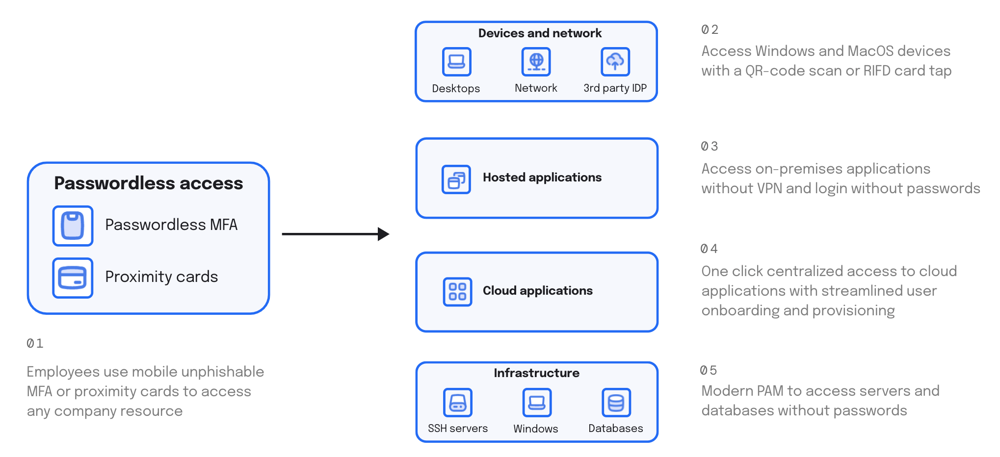

# Welcome to idemeum

## What is idemeum?

idemeum is a zero-trust platform that offers the easiest way to manage access to devices, applications, and infrastructure all without passwords. 

Employees can pick a mobile device, existing RFID badge, or security key and access any company resource without passwords - Windows or Mac computers, cloud or on-premises applications, SSH and RDP servers, and more.

Instead of deploying a *VPN* to access your private applications, *Single Sign-On (SSO)* to access your cloud applications, *Privileged Access Management (PAM)* solution to access your infrastructure, and *Multi-Factor Authentication (MFA)* to secure access, idemeum combines all of that in one platform.

idemeum is SaaS hosted on AWS. We try to minimize the footprint of on-premises components that our customers need to deploy. We architected idemeum based on [micro-services architecture](https://blog.idemeum.com/microservice-scalability/) to offer high availability and security.

You can deploy and leverage the power of the whole platform, or choose the components that you need. Check our [pricing and licensing](https://idemeum.com/pricing) page to see what product tiers we offer today. 

## idemeum products

There are several products that idemeum offers today as part of its platform:

1. [RFID Single Sign-On](./rfid/rfid-overview.html) - with a simple tap of a RFID badge your employees can access workstations and applications without passwords. For example, in healthcare clinicians can access Windows workstations with a tap of a badge, and then login into EHR system without the need to enter any passwords.
2. [Passwordless MFA](./mfa/mfa-overview.html) - eliminate passwords and allow your employees access any company resource with mobile biometrics (.i.e FaceID or fingerprint scanner on a mobile device). idemeum supports integrations with applications, desktops, Wi-Fi, VPNs, and infrastructure resources.
3. [Zero Trust Network Access (ZTNA)](./remote-access/secure-remote-access-overview.html) - replace legacy VPN and offer your employees one-click access to hosted resources, including on-premises apps, SSH servers, RDP desktops, and more.
4. [Password Vault](./password-vault-overview.html) - securely store, share, and autofill credentials into web applications. idemeum password vault does not require a master password and leverages zero-knowledge architecture, so your data is never visible to attackers.