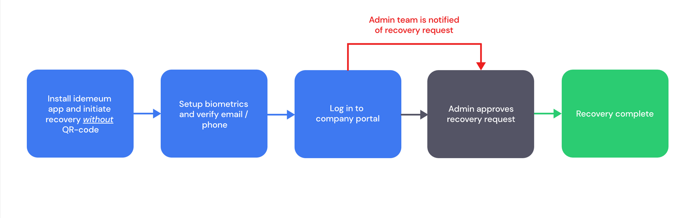
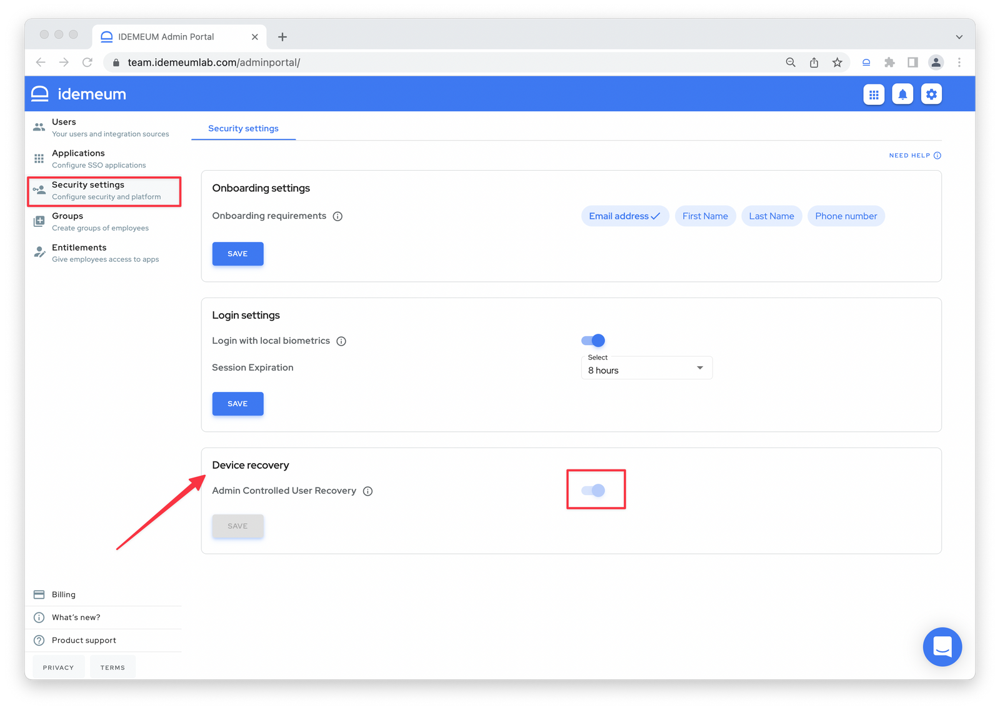
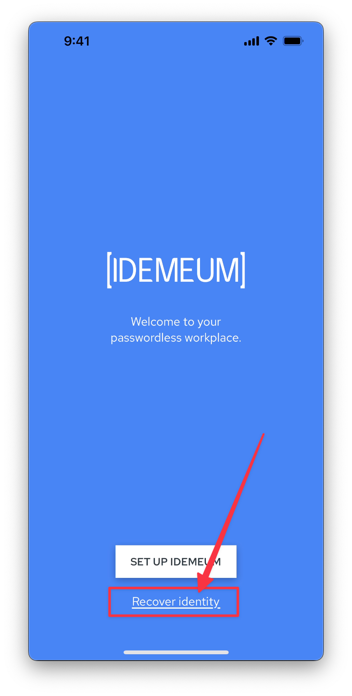
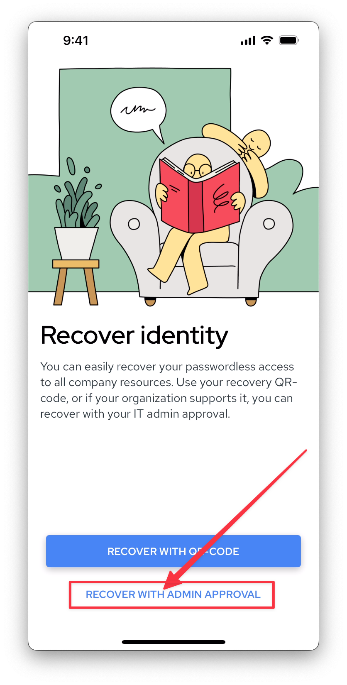
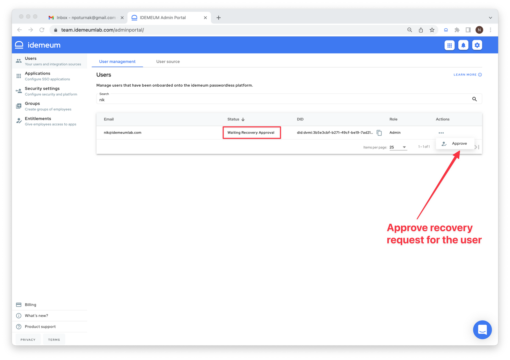

# How to recover - user guide

## Overview

::: danger Enable admin controlled user recovery

Admin controlled recovery is not enabled for your tenant by default. Navigate to `Security settings` to enable admin recovery for your organization.

:::

While idemeum offers seamless and secure [self-service user recovery](./self-service-user-recovery.html), we realize that there might be situations when users loose or do not store recovery codes. For this purpose we offer a functionality where users can request new device recovery without secure QR-code and wait until admins of the organization approve it.

Here is the high level overview of the process.

## How to enable admin controlled recovery

Navigate to your idemeum admin portal and choose `Security settings` -> `Device recovery`. You can now toggle the switch to enable device recovery for your tenant.

## User experience

* User loses a mobile device with idemeum installed. A new instance of the mobile app is installed and the user chooses `Recover identity` from the welcome screen.

* On the next screen user chooses the option to recover without secure QR-code.

* User will then enable biometrics and verify email address and phone number.
* Once the process is complete user will navigate to a company portal and attempt a login. At this time admin team will be notified of the recovery request.
* Any admin of the organization can approve the recovery request by navigating to user management section of the admin portal.

* Once admin team approves the device recovery request, the user will be able to log in and recover access to all applications and resources.

## Admin controlled recovery demo

<iframe src="https://www.loom.com/embed/aaeb8bf62c404b7e87f68254644184d8" frameborder="0" webkitallowfullscreen mozallowfullscreen allowfullscreen style="position: absolute; top: 0; left: 0; width: 100%; height: 100%;"></iframe>

