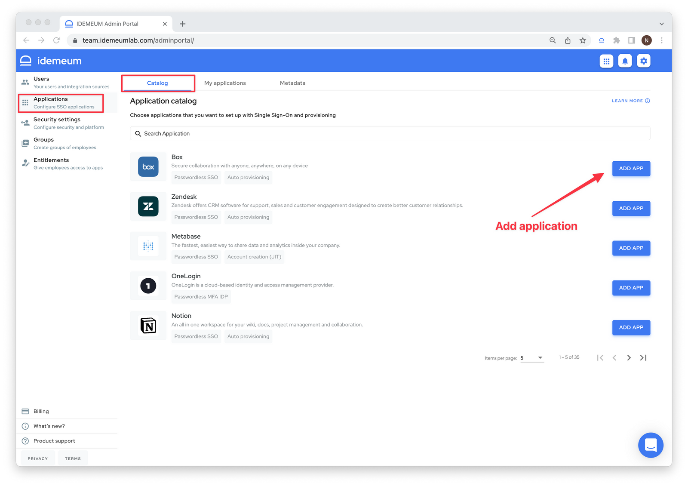
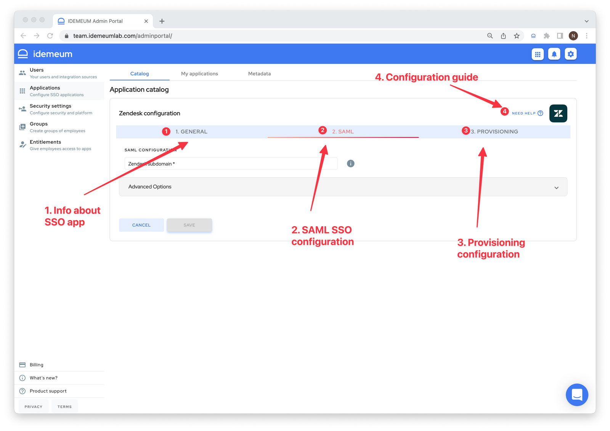
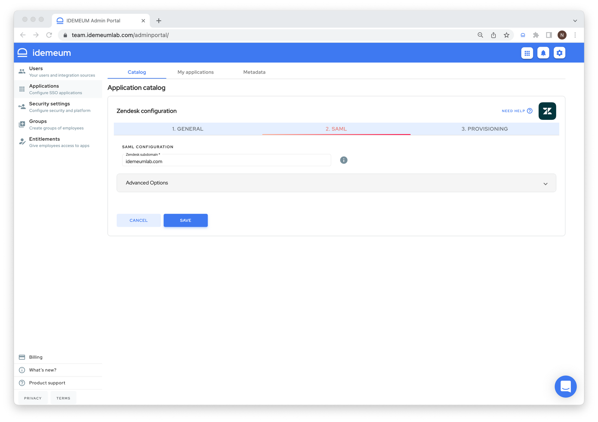

# Single Sign-On overview

## Overview

idemeum offers fully-featured Single Sign-On identity provider. You can integrate most SaaS applications with idemeum using SAML protocol in order to offer your employees one-click access to all applications. When paired with [Passwordless MFA](./mfa-overview.html), idemeum offers true passwordless experience - employees access application catalog with [Passwordless MFA](./mfa-overview.html) and then seamlessly launch any integrated application without typing any passwords or one time codes. 

## Supported applications

idemeum supports a number of SaaS applications for provisioning and Single Sign-On. We pre-configure applications so it is very easy to set up integration even for non-technical people. Moreover, we provide detailed instructions on how to integrate applications with idemeum over SAML. 

Check out [integrations portal](https://integrations.idemeum.com) to see what applications we support and navigate across detailed integration guides.

## How to configure Single Sign-On

* Navigate to `Applications` -> `Catalog` to choose the application you want to integrate using SAML. You can search for applications, and we also tag them to reflect supported capabilities.

* Now you can add SaaS application. Once you do you will be redirected to an app specific configuration section that consists of 3 sections: `General` - provides you information about applications, `SAML` - this is where you will configure SSO integration, and `Provisioning` - this is where you will configure application provisioning.

* If you click on `Need help?` link you will be redirected to integration guide for that specific application. We provide step by step instructions on how to set up SAML both in idemeum and target application.
* We truly preconfigure SaaS applications on our side. Therefore often times you will need to enter minimal configuration parameters to setup SAML integration. You can always expand Advanced options and make changes as necessary, but when we certified and application we made sure all necessary configuration are done on our side.

* Once you configure SAML application and click `Save` the application will be moved from `Catalog` tab into `My applications` tab. You can always go back and edit or delete application.