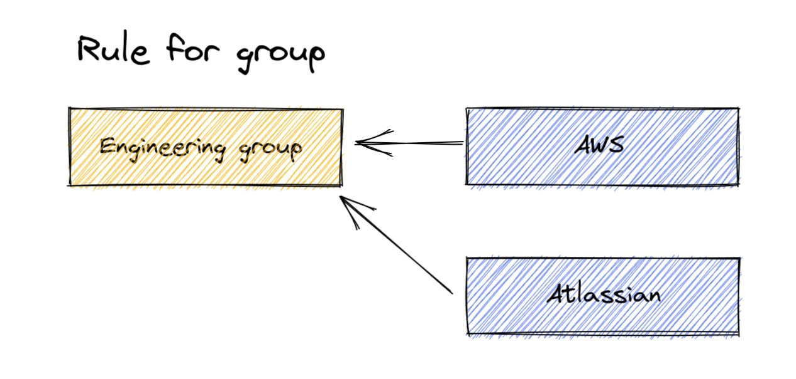
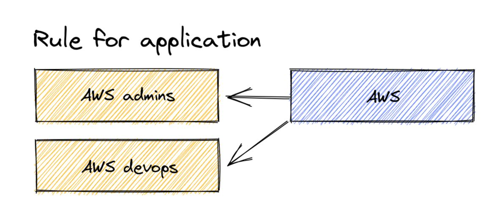
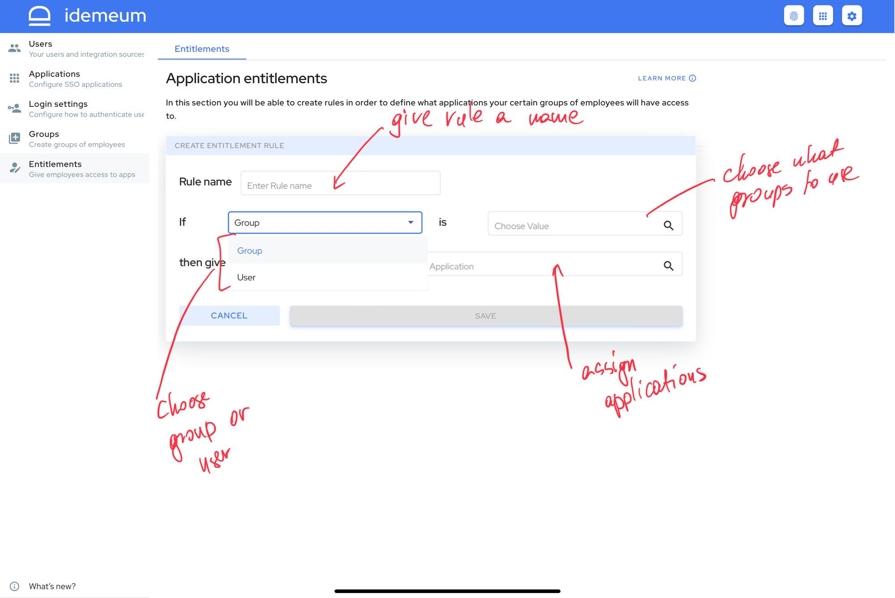

# Application entitlements :electric_plug:

## Overview

idemeum offers you simple yet very powerful framework to control who has access to what applications. You can leverage [groups](./group-management.html) to entitle applications, or you can entitle applications directly to users.

As we follow `if/then` statements to create entitlements, you have a lot of flexibility in how you can structure your rules. However we find it useful to keep things simple and either choose **rule for group** or **rule for application**.

## Rule for group

With this rule you are taking a group of users and are entitling several applications to it. For instance, you can take your engineering group and assign all necessary applications to your engineers. This type of rule works best if you want simplicity and if group provisioning is enabled, all applications will get provisioned with the same groups.

## Rule for application

With this rule you are creating separate groups for your specific application. For instance you can take AWS and create AWS admins and AWS devops groups. This type of rule works best if you want more granular application control and you want specific groups to be provisioned into each application.

## How to configure entitlements

* Access your idemeum admin portal
* Navigate to `Entitlements` on the left menu
* Click `Add rule`

* First give rule a name (i.e. `Engineering apps`)
* Then choose if you want to use group or user for assigning applications
* Depending on your choice you can select available groups or users
* Assign applications
* Hit `Save`
