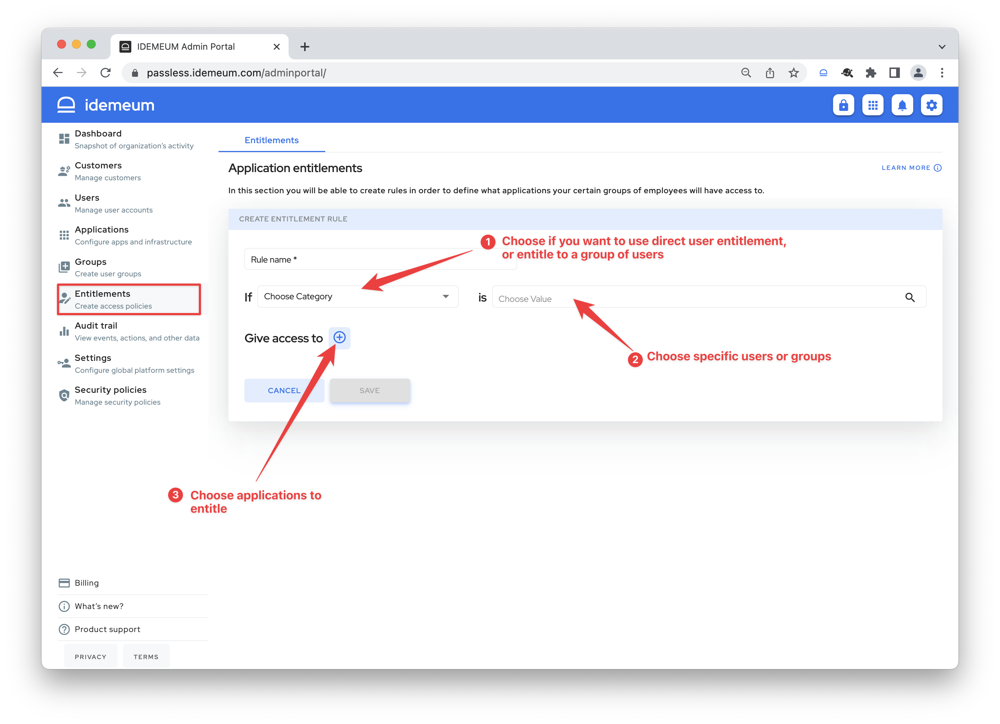

# Application entitlements

## Overview

idemeum offers you simple yet very powerful framework to control who has access to what applications. You can leverage [groups](./group-management.html) to entitle applications, or you can entitle applications directly to users.

Here are the ways you can perform application entitlements with idemeum:

1. **Direct user entitlement** - choose a user or a set of users and entitle one or more applications directly to users.
2. **Entitlement for a group** - with this rule you are taking a group of users and are entitling several applications to it. For instance, you can take your `engineering` group and assign all necessary applications to your engineers. This type of rule works best if you want simplicity and if group provisioning is enabled, all applications will get provisioned with the same groups.
3. **Entitlement for application** - with this rule you are creating separate groups for your specific application. For instance you can take `AWS` and create `AWS admins` and `AWS devops groups`. This type of rule works best if you want more granular application control and you want specific groups to be provisioned into each application.

## How to configure entitlements

* Access your idemeum admin portal
* Navigate to `Entitlements` on the left menu
* Click `Add rule`

* First give rule a name (i.e. `Engineering apps`)
* Then choose if you want to use `group` or `user` for assigning applications
* Depending on your choice you can select available groups or users
* Assign applications
* Click `Save`