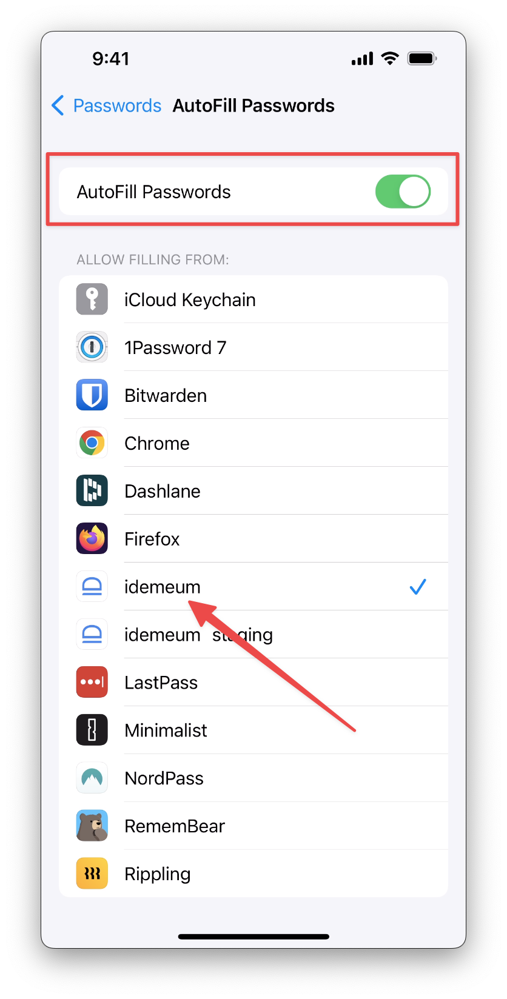
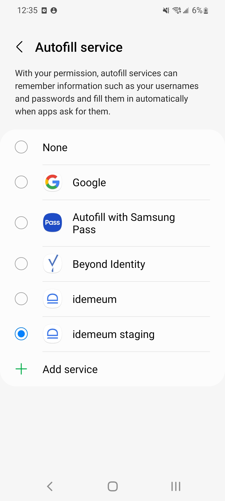
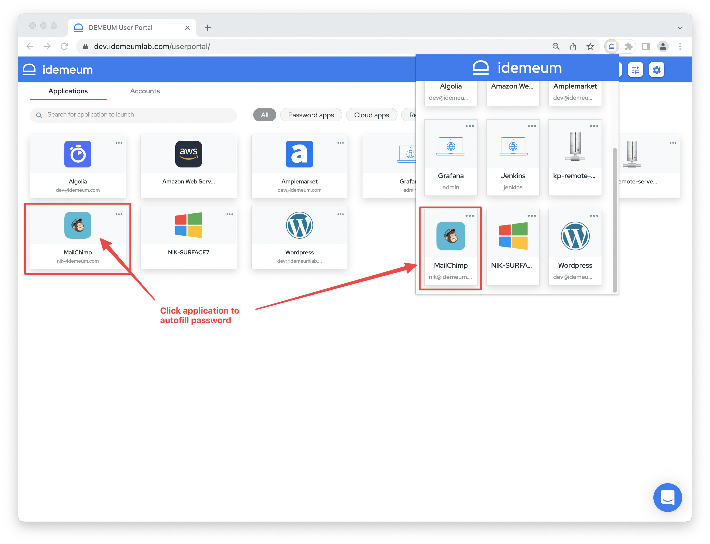
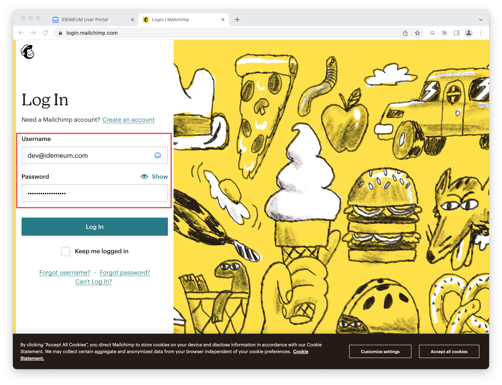
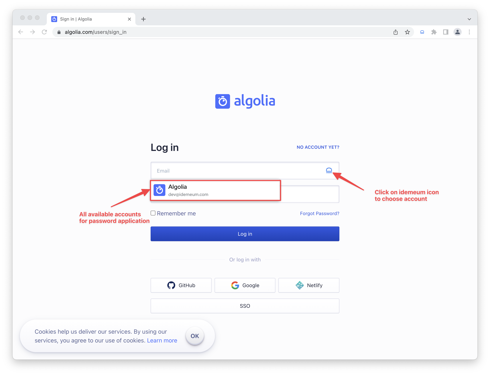
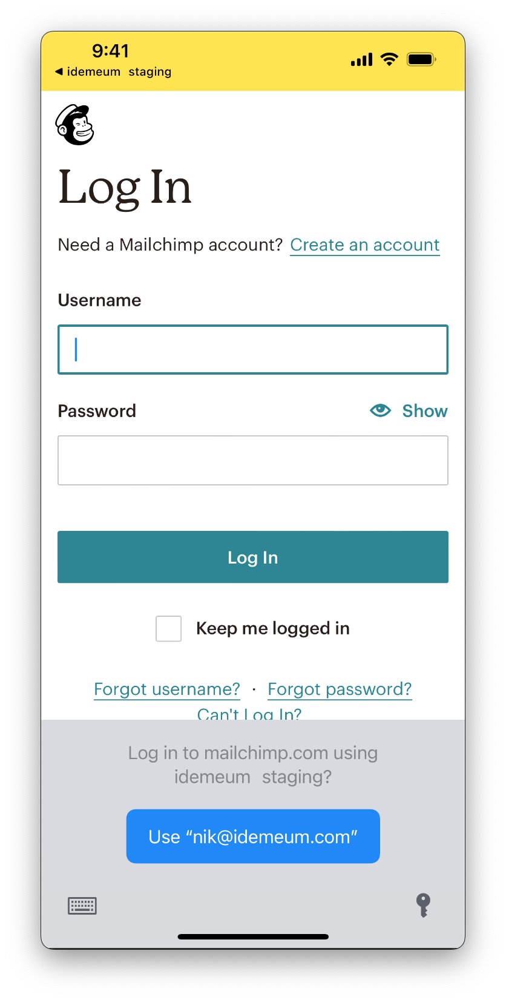
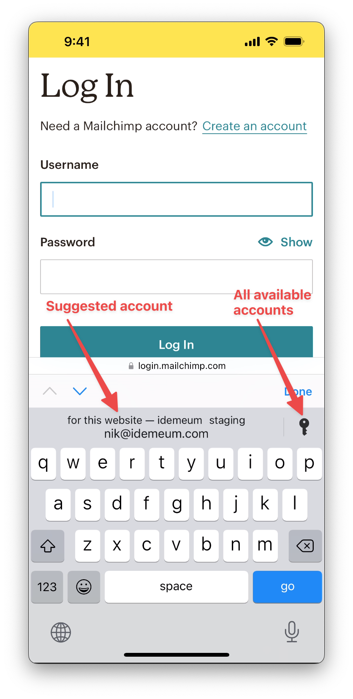
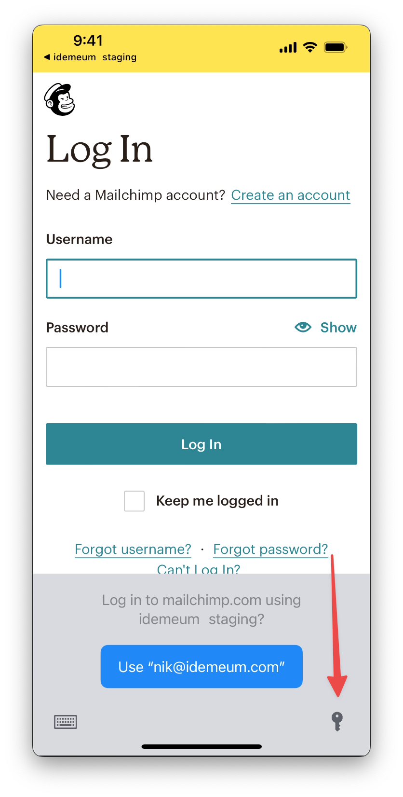
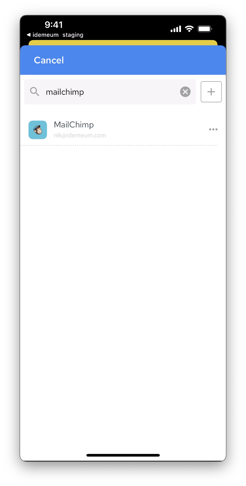
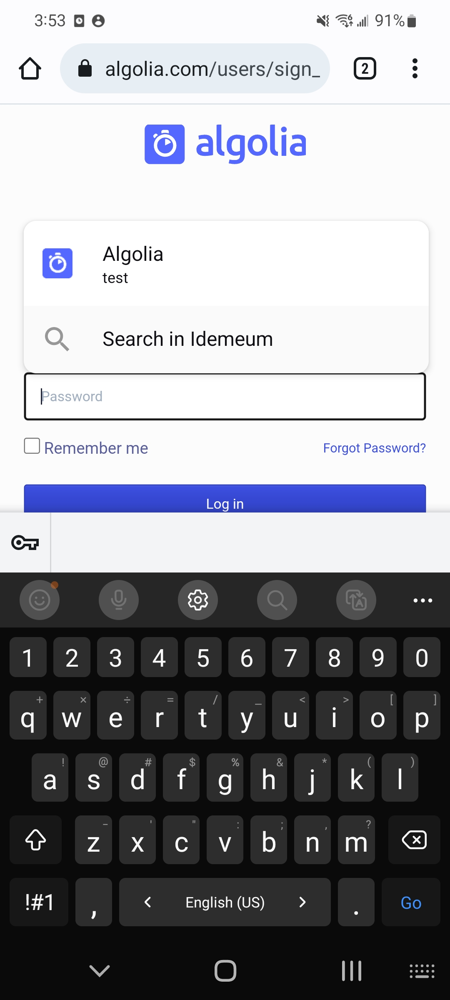

# Password autofill

[[toc]]

## Overview

Autofill is a feature that gives you the option to automatically enter your saved passwords in public SaaS as well as private cloud web applications. Normally, you would have to manually type your login information into each box. Autofill speeds up the experience by securely retrieving and submitting the relevant password from your idemeum vault. 

You can autofill password in web application in two ways, depending on where you launch the application from:

1. **Launch from idemeum portal** - You launch application from idemeum portal, browser extension, or mobile catalog. New browser tab will open, and credentials will be automatically filled. *This type of launch is called IDP-init*. 
2. **Launch application directly** - You navigate to an application URL directly, click into the username or password field, and you will see idemeum inline pop up suggesting credentials that you can use for autofill. *This type of launch is called SP-init*.

<iframe src='https://www.youtube.com/embed/-B2V1ZW51qA' frameborder='0' allowfullscreen></iframe>

## Prerequisites to enable autofill

::: warning Requirements

* **Desktop autofill** - in order to launch and autofill credentials on desktop you need to install idemeum browser extension.
* **Mobile autofill** - once you install idemeum mobile application, you need to enable idemeum as credential provider. 

:::

### Install idemeum browser extension
We support extensions for various browsers.

Navigate to our [download](https://idemeum.com/download) section to download necessary extension for your browser.

### Enable autofill on  iOS
* Install idemeum mobile application on your iPhone
* Open `Settings`
* Choose `Passwords`, then `AutoFill Passwords`
* Make sure autofill feature is enabled
* Select idemeum as credential provider

### Enable autofill on Android
* Install idemeum mobile application on your Android phone
* Open `Settings`
* Click `Search`, and search for `Passwords and autofill`
* Click `Autofill service`
* Select idemeum as credential provider

## Autofill on desktop

* Navigate to your idemeum portal or use browser extension
* Click on the password application tile that you wan to launch

* The new browser tab will open. If you do not land directly on the login page for that application, you can proceed by navigating to the appropriate login page.
* Credentials will get autofilled, including [one-time code (TOTP)](./totp-mfa.html) if that is configured for an application.

* If you navigate to application directly, you can click on idemeum icon and choose from the suggested accounts that are available in your vault. idemeum icon will be visible in both `username` and `password` fields.

## Autofill on mobile

### iOS

* Open your idemeum application
* Launch the password application you want to access
* New browser tab will open and you will be suggested an account to autofill

* If account is not suggested automatically, you can always click on the "key" icon to request available accounts from idemeum. 

* If you are accessing an application with one-time code enabled (TOTP), the code will be automatically copied into clipbord, so you can just paste it as necessary. 
* By clicking on the "key" icon on the keyboard, you can access idemeum and choose the account to autofill. This is useful if you have multiple accounts for the same application, and you need to choose the correct one.

::: warning View password manually

If for some reason the account is not autofilled, you can always access password manually and fill it by copying and pasting. Documentation for how to [view password manually](./edit-password-application.html) is here. 

:::

### Android

* Open your idemeum application
* Launch the password application you want to access
* New browser tab will open and you will be suggested an account to autofill

* If you have multiple accounts or would like to search for specific account, you can click `Search in idememeum` option

::: warning View password manually

If for some reason the account is not autofilled, you can always access password manually and fill it by copying and pasting. Documentation for how to [view password manually](./edit-password-application.html) is here. 

:::