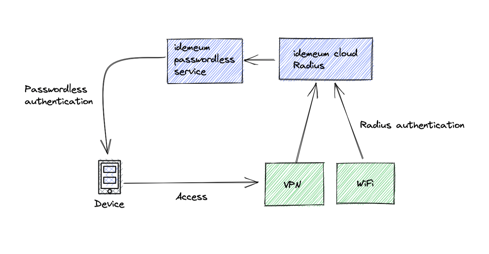

# Cloud Radius overview

## Overview

idemeum offers Cloud Hosted Radius service to help you protect your network and wireless infrastructure with passwordless access. Integrating with idemeum cloud Radius offers a new horizon of use cases - VPN control, MFA enforcement, VLAN segmentation, group based access control, no more shared passwords for WiFi and more.

There is nothing to set up for you - no servers, no configuration, and no service or maintenance effort. We take care of that. Simply point your VPN and WiFi to our idemeum Cloud Radius and offer employee access to infrastructure protected by idemeum [Passwordless MFA](./mfa-overview.html).

With idemeum you can offer employees unified and secure login experience. Whether they access SaaS applications, SSO portal, password applications, VPN, or WiFi, they can simply login with idemeum mobile app and passwordless MFA.

<iframe src='https://www.youtube.com/embed/Q0V94hbUOh0' frameborder='0' allowfullscreen></iframe>

## How it works

idemeum maintains cloud hosted, redundant, and secure Radius infrastructure that can be leveraged by each idemeum customer.

You connect your infrastructure to a Cloud Radius server, and the communication is protected by complex shared secrets dedicated for your tenant. When your employees access VPN or WiFi they receive a familiar push notification to perform a passwordless multi-factor authentication. This way every connection is secure and offers seamless user experience for any resource that employees access in your organization.

## What is supported?

* **Addresses**: only IPv4 addresses are supported. You can configure multiple IP addresses or CIDR block from which connections to Radius server will be allowed.
* **Port supported**: 1812
* **Supported protocols**: EAP-TTLS, EAP-TLS, EAP-PEAP/MSCHAP2
* **Encryption mode**: WPA2 Enterprise