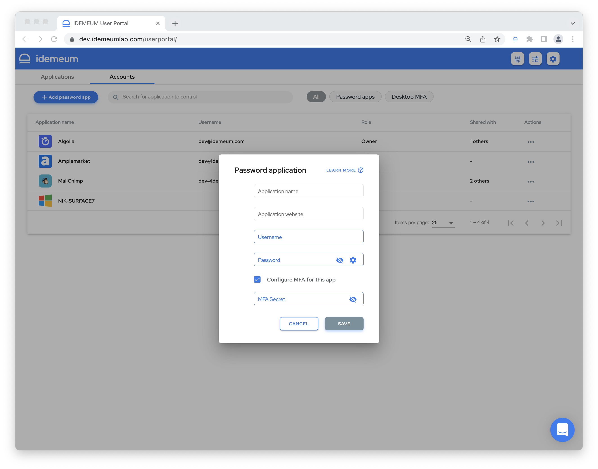
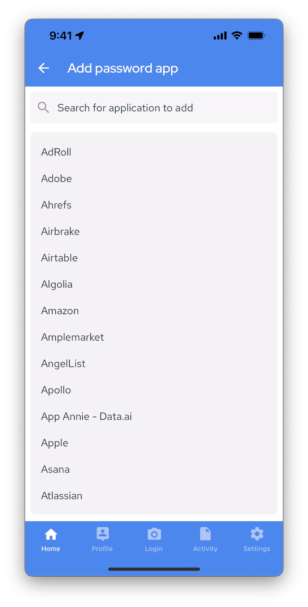
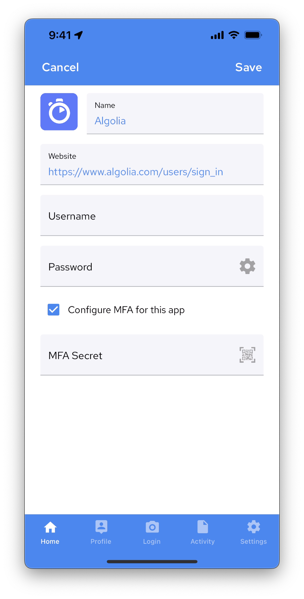

# Create password application

## Overview

::: tip How to create password app? 

There are several ways to create a password application in idemeum. 

1. Desktop application portal
2. Mobile app

:::

## Desktop application portal
* Login to idemeum application portal by navigating to your company URL, i.e. `company.idemeum.com`
* Navigate to `Accounts` tab
* Click `Add password app`

* For `Application name` you can enter any application name you like.
	* If the application name is found, idemeum will populate the application website and logo
	* If the application name is not found, you will need to enter application website yourself
* Enter `Application website` in the form or URL or domain name, i.e. `idemeum.com`
* Enter your `username` and `password`
* You can also configure [One-time-code (TOTP)](https://en.wikipedia.org/wiki/Time-based_one-time_password) for an application for additional level of security. You will need to enter the secret code that the applications provides you with. 
* Click `Save`

::: tip Learn more about one-time codes

You can learn more about TOTP MFA in the following [section](./totp-mfa.html). 

:::

Once the application is saved, it will show up in your catalog, and you will be able to start launching it and filling credentials on desktop and mobile. 

## Mobile app

* Open idemeum mobile application
* Click `+` on the home screen

* You can choose among the pre-configures applications, or you can type any name of the application you like

* If you chose the pro-configured app, the logo and `website` will be populated automatically
* If you entered custom application, you will need to enter the `website` in the form of URL or domain name, such as `cisco.com`
* Enter your `username` and `password`
* Check the box if you want to configure [One-time-code (TOTP)](https://en.wikipedia.org/wiki/Time-based_one-time_password) based MFA for this application
* You can enter the secret that application provides manually, or you can click the QR-code icon to scan the TOTP QR code using idemeum mobile app.

::: tip Learn more about one-time codes

You can learn more about TOTP MFA in the following [section](./totp-mfa.html). 

:::
