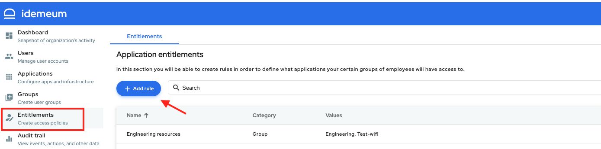
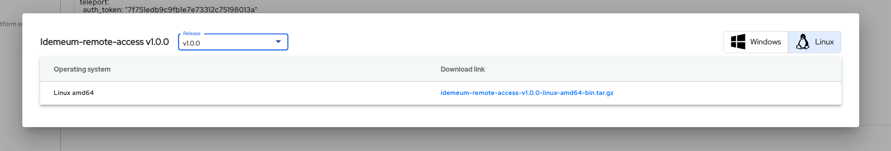

# Remote Server

## Definition
A Remote Server is any computer, physical or virtual, running any operating system, Linux, Windows, MacOS that resides on a company's private network and that can be accessed over ssh protocol. One such example might be a RabbitMq messaging broker server that runs on a company's private network. The private network can be on-premises as well as in the cloud: AWS, Azure, Google Cloud etc.

## Prerequisites
Your tenant has to have the Remote Access feature enabled. See [here](./secure-remote-access-overview.md) how to enable Remote Access.

## Use case
We will use the following setup in order to showcase how to add a remote server in idemeum.

Let's assume that a company ACME, Inc has some infrastructure used for testing of an application and a part of this testing infrastructure is a RabbitMq messaging broker that is installed on a virtual machine running Linux operating system. This machine can be accessed over ssh protocol but the users accesing it must be on the company's private network.

The administrator wants to allow some users to access the messaging broker server over the internet without forcing the users to use a VPN: a DevOps engineer who might be on call and off company's premises. The administrator also wants to control which users have access to the RabbitMq server: DevOps engineers and QA engineers should be able to access it, while the people in the Finance and Accounting should not be allowed access.

## Add a remote server
The administrator will log into the idemeum admin portal and will select Applications from the left side navigation menu and then select the Catalog tab.

Clicking the ***Add app*** button will open a dropdown menu and the administrator will select *Remote server*.

On the General tab the administrator will have to provide the following information:
+ **Server name** - the name of the application that will show on the end user portal for the users that have access to this server. It can contain any characters up to a maximum of 256 chars.
+ **Hostname** - this name will show when the user logs in to the server. If the login username is root and the hostname is rabbitmq-testlab-server then on ssh console it will show root@rabbitmq-testlab-server so the user knows what server is using. It can contain only characters that are allowed in a domain: [a-z], [A-Z], 0-9 and '-' (dash) up to a maximum of 63 characters.  '-' (dash) cannot be the first character.

Click ***SAVE*** to save the application. If all the values are correct, then the application will be created.

## Find a remote server
You can find your Remote Server from the admin portal by selecting Applications from the left side naviation and then going to My Applications tab. If you know the application name for the server then you can search for it in the search bar.

If you don't know the name of the remote server application you can filter based on the application type from the Type dropdown.

## Edit a remote server
See [here](#find-a-remote-server) how to find the remote server application.

Clicking the ***Edit*** button will allow editing of the remote server.

## Delete a remote server
See [here](#find-a-remote-web-application) how to find the remote server application.

Clicking the ***Remove*** button will remove the remote server application.

## Provide access to Remote Servers
In order for users to be able to use this remote server application the administartor needs to create an entitlement for the users or groups of users that should have access to it.

You can either add a new rule or edit an existig rule.
To add a new rule from the admin portal select Entitlements from the left side navigation and then click ***Add Rule***.

In the example below we have a group defined as AWS DevOps and we will give this group access to the RabbitMq server application. All the users belonging to that group will automaticatlly get the RabbitMq server application access.

We have also configured what username(s) will be used when accessing the RabbitMq server. In the example above we have created 2 usernames: root and ec2-user. When launching the remote server application the user will select which username it wants to use for the connection to the RabbitMq server machine. This means that these usernames has to exist on the machine where the RabbitMq server is running.

Click ***Save*** to save the rule. This will trigger the entitlement engine to process the rule and to give the users from AWS   DevOps group access to the RabbitMq server application.

## Configure idemeum remote access agent
RabbitMq server runs on the private network. In order to provide access to the outside network, for the users that should have access to the server - in our example above the AWS DevOps group, we need to install and run the idemeum remote access agent on a node on the private network. This node can be a different machine than the machine where the actual RabbitMq server runs but the RabbitMq server must be accessible from this other node.

### Download the configuration file
First we need to download a configuration yaml file for the RabbitMq application. Open the Edit application form for the RabbitMq server and then select the second tab ***Config File***.

You can either download the yaml file locally by clicking the ***Download YAML*** button from the top right corner or you can click the copy icon to copy the content of the file to the clipboard.

> NOTE: Each remote server has its own configuration file so you need to download the config file for the server you want to start the agent for.

### Download the idemeum agent
The second step is to download the idemeum remote access agent and run it on one node on your private network that has access to the machine where the RabbitMq server application runs.

Clicking the ***Download agent*** will bring up a screen from where you can select which version of idemeum remote agent you want to install depending on your node's operating system.

Select and download the release version that is suitable for you or copy the download link.

### Install the idemeum agent
See here the instructions on how to install the agent. (TO BE FILLED OUT)

### Start the RabbitMq server idemeum remote agent
You need to copy the [configuration file](#download-the-configuration-file) for the RabbitMq on the node where the idemeum agent will run.

Assuming that you named the configuration file RabbitMq.yaml, then you can start the idemeum agent for the RabbitMq server using the following command
> ./idemeum start --config \<path to RabbitMq.yaml>

When the idemeum remote access agent for a remote server is not running then the administrator will see a red exclamation mark on the Applications page.

There will also be a notification sent when the remote server is not up and running.

The users that are entitled to the RabbitMq application will also see a warning on the end-user portal when the remote server is not available.

After starting the idemeum remote access agent for the RabbitMq remote server, this should be available for launch to the users who are entitled to it.

## Launching remote servers

### From end-user portal
Users will launch remote servers that are entitled to them from the end-user portal in the same way they would launch any other type of application by clicking on its tile.

If the administrator has configured the entitlement for the user with multiple usernames, then when clicking the tile to launch RabbitMq a dialog will be presented to select which username to use for the connection to the RabbitMq server.

The example below shows how the browser ssh console looks like when the user connects to the RabbitMq server using the root username. It shows also that the user can ran some commands in the console.

### From browser extension
Users can launch the remote servers from the browser extension, by clicking on its tile and, in case there are multiple usernames configured, selecting the username to use in the ssh connection to the remote server.

### From mobile app
Users can launch the remote servers from the mobile application, by clicking on its tile and, in case there are multiple usernames configured, selecting the username to use in the ssh connection to the remote server.

## Audit Events
The administrator can see in the Audit trail which users launched which remote servers and which usernames were used for the connection. There will be a session recording of the commands that were executed on the remote server while the user was connected.

There will be an audit event for when the remote server session was started and one audit event for when the session was ended. The recording is available by clicking the play button from the Recordings column.
