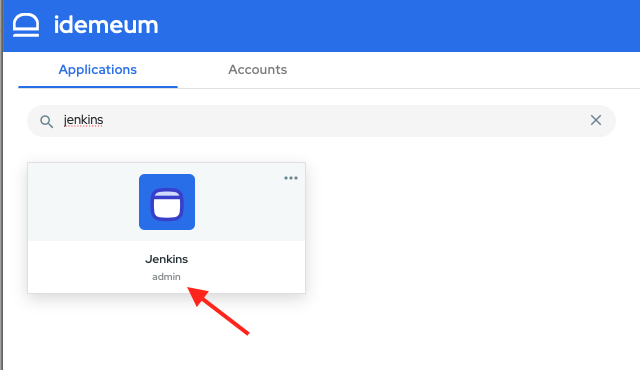

# Remote Web Application

## Definition
A Remote Web Application is any application that is servered over https, or http protocol that reside on a private network. One such example might be a Jenkins application that runs on a company's private network. If a DevOps engineer wants to access the Jenkins web console, they must connect to the private network either using a VPN or being physically in the office. The private network can be on-premises or in the cloud: AWS, Azure, Google Cloud etc.

## Prerequisites
Your tenant has to have the Remote Access feature enabled. See [here](./secure-remote-access-overview.md) how to enable Remote Access.

## Use case
We will use the following setup in order to showcase how to add a remote web application in idemeum.

Let's assume that a company ACME, Inc has some web application that should only be available on their private network. We will use the popular CI/CD web application Jenkins. When the DevOps engineers are on the company's private network they will access Jenkins by going to this URL: *https://jenkins.acme.com*.

The administrator wants to allow some users to access Jenkins over the internet without having to use a VPN: a DevOps engineer who might be on call and off company's premises.

## Add a remote web application
The administrator will log into the idemeum admin portal and will select Applications from the left side navigation menu and then select the Catalog tab.

Clicking the ***Add app*** button will open a dropdown menu and the administrator will select *Remote web app*

On the General tab the administrator will have to provide the following information:
+ **Display name** - this name will be the name of the application that will show on the end user portal for the users that have access to this application. It can contain any characters up to a maximum of 256 chars.
+ **Application Name** - this name will be part of the host name for accessing the Jenkins application. Thus it can contain only characters that are allowed in a domain: [a-z], [A-Z], 0-9 and '-' (dash) up to a maximum of 63 characters.  '-' (dash) cannot be the first character.
* **Internal URL** - this is the URL that idemeum will redirect the call once we authenticate and authorize that the user has access to the application. In our example this would be: *https://jenkins.acme.com*. http protocol is also supported and if the application is using a different port that can be also specified: *http://jenkins.acme.com:8081* is a valid internal URL.

Click ***SAVE*** to save the application. If all the values are correct the application will be created.

## Find a remote web application
You can find your Remote Web Applications from the admin portal by selecting Applications from the left side naviation and then going to My Applications tab. If you know the application name then you can search for it in the search bar.

If you don't know the name of the remote application you can filter based on the application type from the Type dropdown.

## Edit a remote web application
See [here](#find-a-remote-web-application) how to find the remote web application.

Clicking the ***Edit*** button will allow editing of the Remote Web Application.

## Delete a remote web application
See [here](#find-a-remote-web-application) how to find the remote web application.

Clicking the ***Remove*** button will allow removing of the Remote Web Application.

## Provide access to Remote Web Application
In order for users to be able to use this remote web application you need to create an entitlement for the users or groups that should have access to it.

You can either add a new rule or edit an existig rule to add the application for the selected users.
To add a new rule from the Admin portal select Entitlements from the left side navigation and then click ***Add Rule***

In the example below we have a group defined as AWS DevOps and we will give the Jenkins application to that group. All the users belonging to that group will automaticatlly get the Jenkins application access.

Click ***Save*** to save the rule. This will trigger the entitlement engine to process the rule and users that are part of the AWS DevOps group will get access to the Jenkins application.

## Configure idemeum remote access agent
Jenkins web application runs on the private network. In order to provide access to the outside network, for the users that should have access to the application - in our example above the AWS DevOps group, we need to install and run the idemeum remote access agent on a node on the private network.

### Download the configuration file
First we need to download a configuration yaml file for the Jenkins application. Open the Edit application page for the Jenkins application and then select the second tab ***Config File***.

You can either download the yaml file locally by clicking the ***Download YAML*** button from the top right corner or you can click the copy icon to copy the content of the file to the clipboard.

> NOTE: Each remote application has its own configuration file so you need to download the config file for the application you want to start the agent for.

### Download the idemeum agent
The second step is to download the idemeum remote access agent and run it on one node on your private network that has access to the Jenkins application.

Clicking the ***Download agent*** will bring up a dialog box from where you can select which version of idemeum remote agent you want to install depending on your node operating system.

Select and download the release version that is suitable for you or copy the download link.

### Install the idemeum agent
See here the instructions on how to install the agent. (TO BE FILLED OUT)

### Start the Jenkins idemeum remote agent
You need to copy the [configuration file](#download-the-configuration-file) for the Jenkins remote web application on the node where the idemeum agent will run.

Assuming that you named the configuration file Jenkins.yaml, then you can start the agent by using the following command:
> ./idemeum start --config \<path to Jenkins.yaml>

When the idemeum remote agent for a remote web application is not running then the administrator will see a red exclamation mark on the Applications page.

There will also be a notification sent when the remote web application is not up and running.

The users that are entitled to the Jenkins application will also see a warning when the remote web application is not available.

After starting the idemeum agent for the Jenkins remote application, this should be available for launch to the users who are entitled to it.

## Launching of a remote web application
### From end-user portal
Users will launch remote web applications that are entitled to them from the end user portal in the same way they would launch any other type of application by clicking on its tile.

Launching Jenkins application should open a new browser tab and should display the login screen into the Jenkins application. The user can enter their username and password on the login form and click Sign In. idemeum has the capability of capturing the username/password combination for this application so it can autofill it for the user next time the application is launched.

To save these credentials in idemeum the end user needs to click on the idemeum logo from the username or password fields. A  small dialog box will open with the option ***SAVE IN IDEMEUM***.

The user needs to have the idemeum extension installed in order for the idemeum icon to show up in the login fields and also to be able to save the credentials. After clicking ***SAVE IN IDEMEUM*** a dialog box will show up in the top corner of the browser to confirm the username and password that will be saved.

The next time the user will open the idemeum portal the Jenkins web application will show the username that was saved in the previous step under the name of the application.

When the user launches the Jenkins application again, the idemeum extension will now autofill the username and password that the user has saved thus making the login process simpler.

### From browser extension
The remote web applications can also be launched from the browser extension. The user has to open the extension, find the application and click on its respective tile.

### From mobile application
The remote web applications can be launched from the mobile applications as well.

## Audit Events
The administrator can see in the Audit trail which users launched which remote web application.

