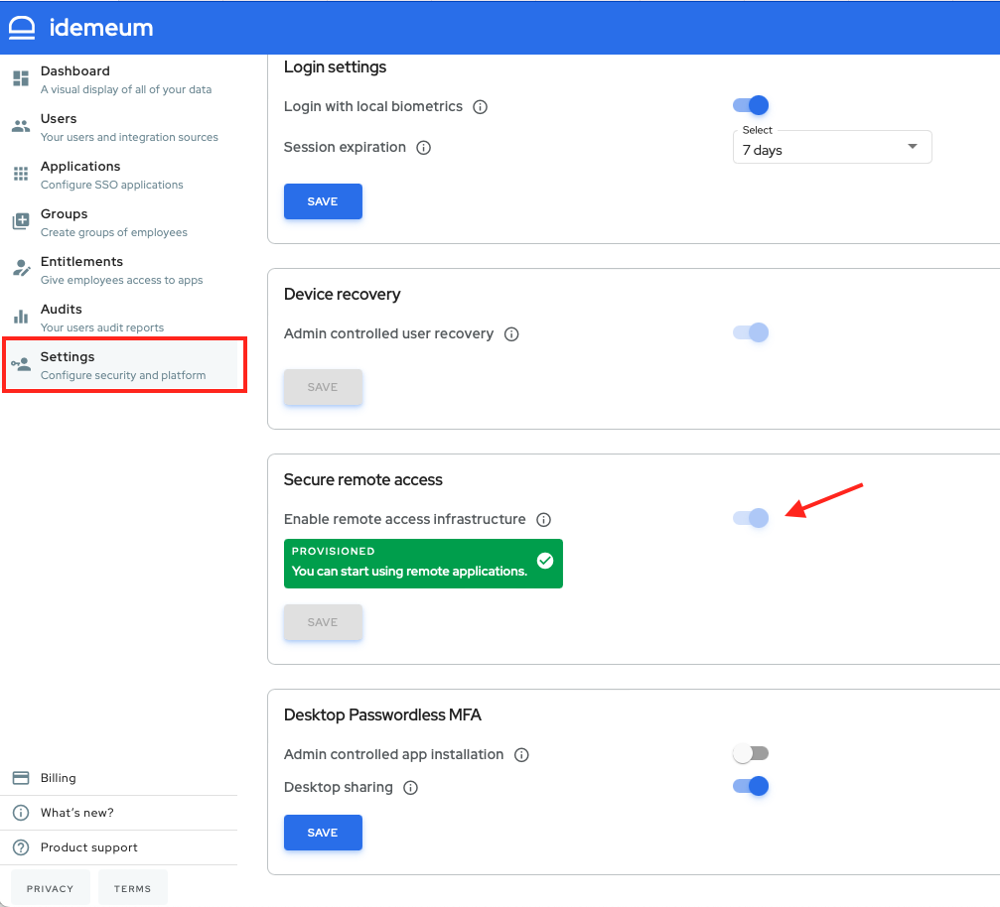

# Secure Remote Access overview

What is more idemeum offers a proxy agent to connect to your infrastructure asserts without passwords - on-premises applications, SSH servers, RDP workstations, and databases. When proxy agent is installed, no ports need to be exposed in order to reach the resource, as proxy agent is utilizing the outbound channel to connect to idemeum cloud.

## Enable Remote Access feature
This feature requires some infrastructure provisioning on idemeum side so it is not enabled by default. The administrator user has to request access to this feature by logging in to the idemeum portal and going to the Settings page.

idemeum will start provisioning the infrastructure needed for your tenant. When all infrastructure is provisioned your administrator user will receive an email notification as well as an notification in the admin portal that the Remote Access feature is ready to be used. 

::: warning Early access

This feature is in early access.

Please, contact us for more details at [support@idemeum.com](mailto:support@idemeum.com)

:::
