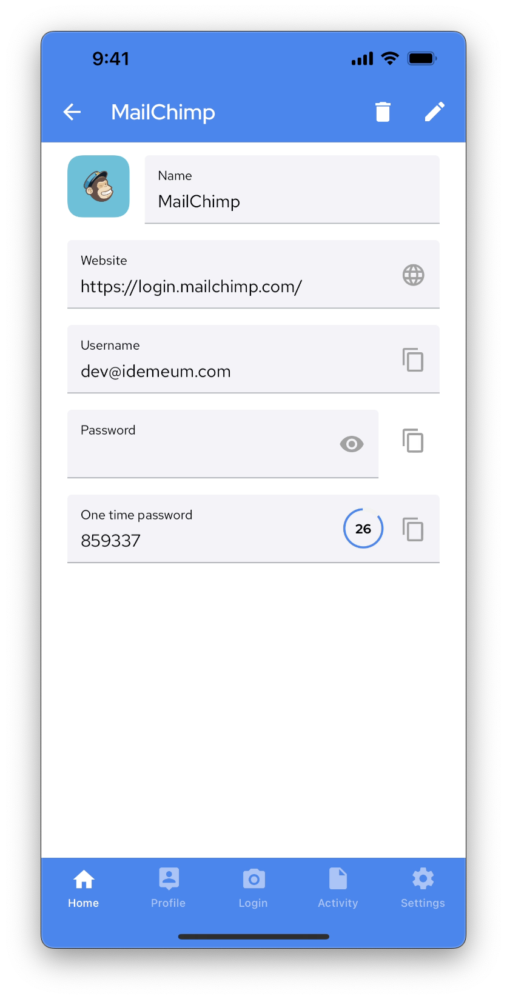

# View / edit / delete password application

## Overview

::: tip How to view, edit, or delete password app? 

There are several ways to manage a password application in idemeum. You can use:

1. Desktop application portal
2. Browser extension
2. Mobile application

:::

Here is the table that shows what operations are supported in each of the product areas. 

|                   | View password | Edit application  |Delete application  |
| ----------------- |:-------------:| -----------------:|-------------------:|
| Desktop portal    | Yes           | Yes               |Yes                 |
| Browser extension | Yes           |   -               |  -                 |
| Mobile application| Yes           | Yes               |                Yes |

## 1. Desktop application portal

### View application password

* Login to idemeum application portal by navigating to your company URL, for example `company.idemeum.com`
* Choose the application you need, click `...`, and choose `View credentails`

### Edit application

We have created `Accounts` section where you can edit all applications that you control. 

* Login to idemeum application portal by navigating to your company URL, for example `company.idemeum.com`
* Navigate to `Accounts` tab
* Search for application you want to edit in the application table
* Click on `...` in the `Actions` section and choose `Edit application`

* You can now enter the new credentials for the chosen application

### Delete application

* Login to idemeum application portal by navigating to your company URL, for example `company.idemeum.com`
* Navigate to `Accounts` tab
* Search for application you want to edit in the application table
* Click on `...` in the `Actions` section and choose `Delete application`
* Type application name and confirm deletion

## 2. Browser extension 

### View application password

* Open idemeum browser extension
* Search for application that you need to view the password for
* Click on the `...` and choose `View credentails`

* You will now be shown the application credentials as well as TOTP code if configured

### Edit application

* Open idemeum browser extension
* Search for application that you need to edit
* Click on the `...` and choose `Edit application`
* The browser page will open and you will be redirected to `Accounts` section where you will be able to edit application

* Click `Save` to save new application parameters

## 3. Mobile application

### View application password

* Open idemeum mobile application
* Search for the application that you want to view the password for
* Click on `...` to view application password

* Now you can view the application password and copy any value that you need

### Edit application
* Open idemeum mobile application
* Search for the application that you want to edit
* Click on `...` to view application
* Now click on `Edit` button

* You can now edit application and save it with new credentials

### Delete application

* Open idemeum mobile application
* Search for the application that you want to delete
* Click on 3 dots to view application
* Now click on `Delete` button

