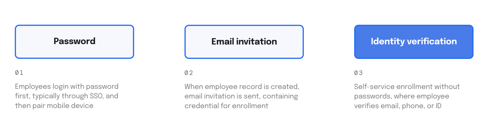
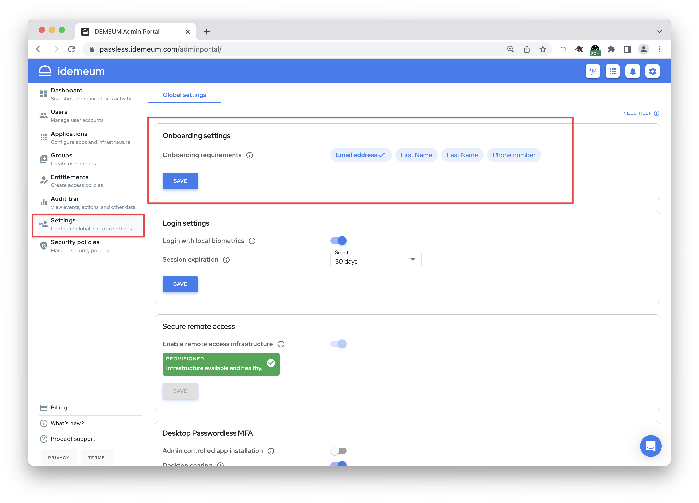
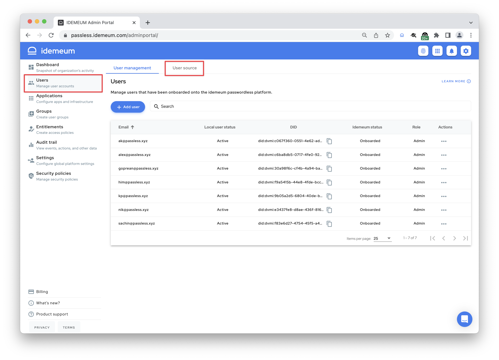

# Employee Onboarding

## Overview

In the industry there are several ways for how users can enroll into Passwordless Authentication. Users can onboard leveraging existing password, use email invitation from the admin, or go with a completely passwordless onboarding with identity verification. 

At idemeum we made a decision to focus on completely passwordless, self-service MFA onboarding that relies on employee verifying her identity. New hire installs idemeum mobile application, verifies personal email / phone number, navigates to a company portal and scans a QR code. From then on idemeum picks it up - we match a personal claim to a company user record, assign corporate email address, provision SaaS apps, assign infrastructure resources, and more - pretty much everything to give an employee access to all she needs from a single place.

## Onboarding configuration

### Identity verification

As a first step you need to decide **what employees need to verify** to onboard into your organization. idemeum supports email address, phone number, or government document verification. 

Navigate to `Admin portal` -> `Settings` -> `Onboarding settings` and choose what you want employees to verify in the mobile application to onboard. 

Here is how verification will be done:

| Email address| Phone number|ID document|
| :------------- |:-------------|:-----------|
| One time code | SMS | Liveness detection |

### User source configuration

As a second step you will need to integrate your user source with idemeum. For example, if employees will be onboarding with verified phone number, idemeum needs to connect to a user source where employee phone number will be mapped to corporate email address. Let's look at the onboarding example. 

::: details New employee onboarding example
   
1. Organization hires new employee Alex Jones
2. Alex installs idemeum mobile application and verifies his phone number
3. Alex navigates to a company portal and scans a QR-code
4. At this point idemeum will get verified phone number, look up user record in the user source, and if found will onboard Alex, assign corporate email address to him, and associate mobile device and crypto keys with his identity
5. From now on Alex can start accessing resources without passwords

:::

As for the user source, you have two options - you can leverage idemeum **built-in cloud directory**, where you can create users, or you can **connect to external user source** such as Azure Active Directory. 

Access idemeum `Admin portal` and navigate to `Users`. In the `User source` section you can choose whether you want to leverage idemeum cloud directory (`local` option) or integrate with any of the available user sources. If you decide to integrate with external user source, it needs to have a mapping between a personal claim employees will verify and a corporate email address.

If you decide to use local directory, you can start creating users by simply clicking `Add user`. You will need to make sure you enter corporate email address and personal identity claim that will be used for onboarding. 

## Employee onboarding experience

Employees go through 3 simple steps to onboard into company passwordless access. 

### Install idemeum mobile application

idemeum is available for both iOS and Android phones. Use the following links to download latest idemeum application from the app store - [IOS App Store](https://apps.apple.com/us/app/idemeum/id1552180449) or [Android Play Store](https://play.google.com/store/apps/details?id=com.idemeum.dvmi).

### Verify identity

Right from the mobile app employee verifies personal identity information, such as phone number, personal email address, or government ID.

If document verification is performed, users take a photo of document (driver's license or passport) and do a face scan to perform liveness detection. Then idemeum performs document validation and matches liveness detection scan with the photo on the document. If successful, document is verified and stored on the mobile device.

### Scan QR-Code to onboard

Once idemeum application is set up, users can navigate to a company idemeum portal (i.e. `company.idemeum.com`) and scan the login QR-code. Once onboarded employee has access to everything she needs in the same portal (SaaS applications, password vault, and infrastructure).
