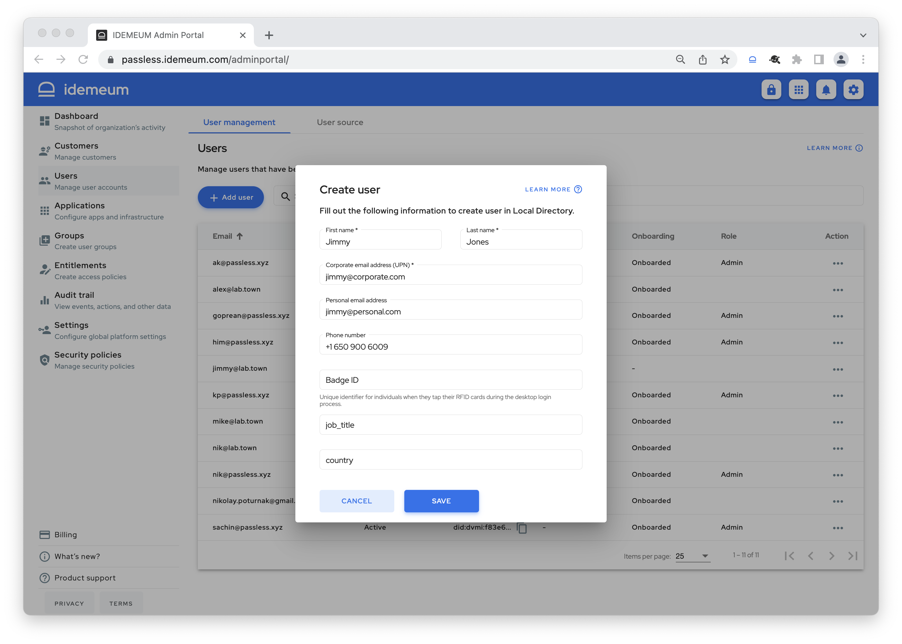
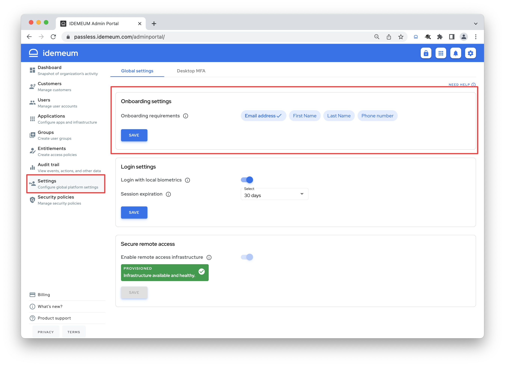
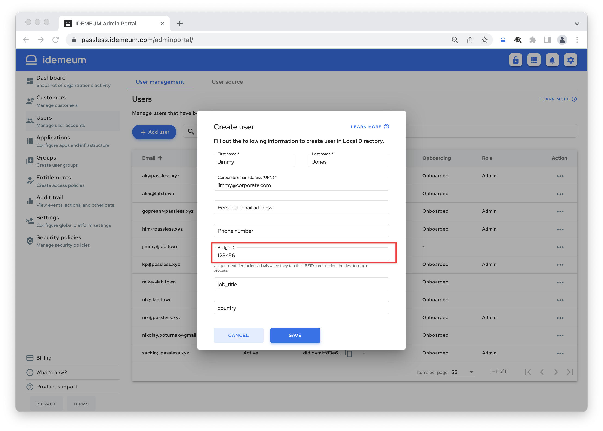

# Employee onboarding

[[toc]]

## Overview

Today there are two primary ways to login into idemeum protected resources - with a mobile app or an RFID badge. idemeum provides onboarding for these login methods:

1. **Self-service mobile onboarding** - employee is not using any links or passwords to onboard. All that is needed is to install idemeum mobile application, verify phone number or email address in the application and scan the login QR-code to access company resources. 
2. **Manual onboarding with RFID badge** - admin creates a user record in the idemeum cloud directory along with the badge ID number. When employee taps the badge to access the workstation, badge number is verified and employee is onboarded. 
3. **Password onboarding with RFID badge** - admin does not need to create any user records, as RFID onboarding is done with user credentials. Employee taps the badge, idemeum authenticates the employee with the domain password, and upon success user is onboarded and badge ID is associated with the user record.

## Onboarding examples

### Self-service mobile onboarding

Let's say we hire Jimmy Jones, a new employee, and we want Jimmy to use Passwordless MFA to access company resources securely. Here is what we need to do to onboard Jimmy: 

*  Admin navigates to idemeum admin portal `Users` -> `User Management`
*  Admin creates a record for Jimmy, specifies corporate email address as well as personal email address and phone number

* Jimmy will receive an invitation to his email addresses to onboard into idemeum
* Jimmy installs idemeum mobile application and verifies his personal email address or phone number
* Jimmy navigates to a company portal and scans the login QR-code with idemeum application
* Jimmy now has access to all company resources

::: tip What needs to be verified?

What you want employees to verify in the mobile application is configurable. You can choose email address or phone number. Navigate to `Admin portal` -> `Settings` -> `Onboarding settings` and choose what you want employees to verify in the mobile application to onboard.

:::

### Manual onboarding with RFID badge

Let's say we hired Jimmy Jones and issued him a proximity card to access company offices and printers. Now we want to onboard Jimmy into RFID Single Sign-On. Here is what we need to do to onboard Jimmy:

* Admin navigates to idemeum admin portal `Users` -> `User Management`
* Admin creates a record for Jimmy and specifies the RFID badge ID in decimal format

* Jimmy walks to a domain-joined Windows workstation and taps the badge
* Jimmy is successfully logged in with RFID badge

### Password onboarding with RFID badge
Let's say we hired Jimmy Jones and issued him a proximity card to access company offices and printers. Now we want to onboard Jimmy into RFID Single Sign-On. Here is what we need to do to onboard Jimmy:

* Jimmy walks to a domain-joined Windows workstation and taps the badge
* idemeum desktop client prompts Jimmy to enter domain credentials
* Upon successful authentication user record is created in idemeum, badge ID is associated with Jimmy's account, and Jimmy can access all company resources
