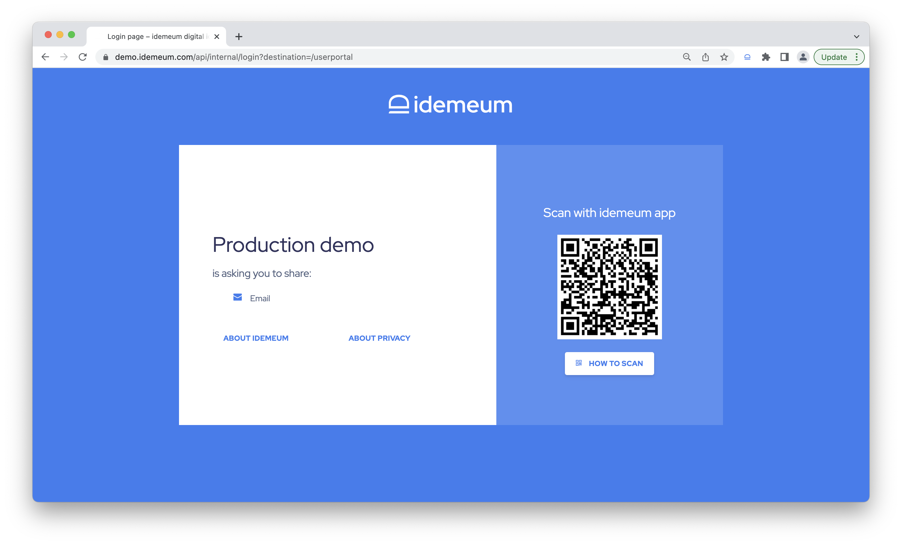
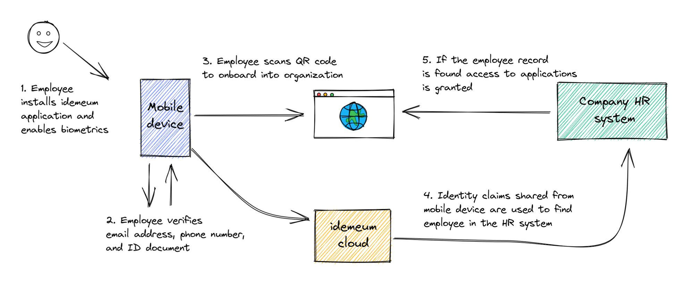
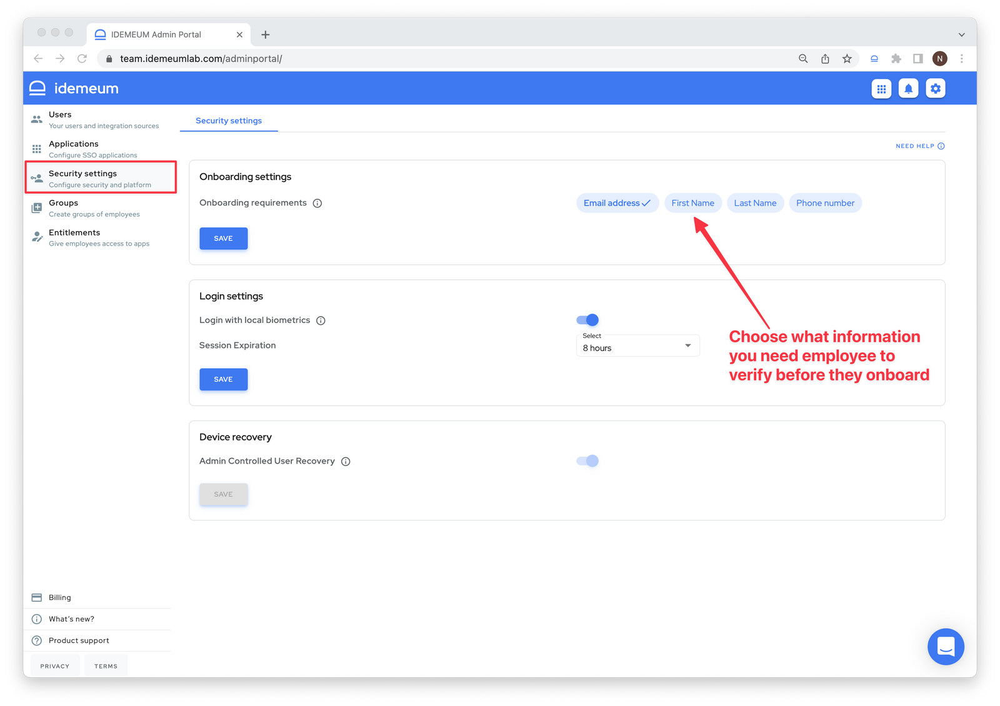

# Employee onboarding :key:

## Overview

Traditional MFA onboarding is not cutting it today - send credentials over email, ask the employee to reset password, install TOTP or push MFA app, perform separate enrollment for MFA, enable MFA for various resources and more.

When we sat down as a team at idemeum, we wanted to make enrollment process simple, intuitive, yet secure for organization of any size. And since we are building a passwordless platform, we **did not want to rely on any passwords** for enrollment. 

::: tip Onboarding summary

We decided to leverage employees' personal identity claims, such as email address and phone number. This something everyone has, and typically we share this information with an organization when we get a job offer. We build the product around a simple idea - a person verifies personal identity claim in the mobile app, and during onboarding idemeum will map this personal identity claim to a corporate email using a [user source](./integration-with-hr-system.html) system such as HR or Payroll system. This way we are removing a need to use passwords, achieve high level of assurance, and automation.

:::

## Employee experience
Let's take a look at what employees need to do when they onboard into an organization with passwordless access. 

1. **Install** idemeum mobile app 
2. **Verify** personal identity
3. **Scan QR-code** in the company portal

#### 1. Install idemeum mobile app

idemeum is available for both iOS and Android phones. Use the following links to download latest idemeum application from the app store - [IOS App Store](https://apps.apple.com/us/app/idemeum/id1552180449) or [Android Play Store](https://play.google.com/store/apps/details?id=com.idemeum.dvmi).

#### 2. Verify personal identity
Right from the mobile app employee can verify personal identity information, such as phone number, personal email address, or government id.

Here is how verification is done: 

| Email address| Phone number| ID document|
| ------------- |:-------------:| -----------:|
| One time code | SMS | Liveness detection |

If document verification is performed, users take a photo of document (driver's license or passport) and do a face scan to perform liveness detection. Then idemeum performs document validation and matches liveness detection scan with the photo on the document. If successful, document is verified and stored on the mobile device.

#### 3. Scan login QR-code

Once idemeum application is set up, users can navigate to a company idemeum portal (i.e. `company.idemeum.com`) and scan the login QR-code.

This is when idemeum looks up an employee using a **personal identity claim** and assigns a **corporate email address**. Typically an HR system can be used as a [user source](./integration-with-hr-system.html), but idemeum also supports [local user source](./integration-with-hr-system.html#local-user-source) when admins can create manual personal to corporate claims mappings.

## Deeper look into how it works

Let's say an employee verifies a personal email address in idemeum app. This personal email address will be used to onboard an employee into an organization. What idemeum will need to do is to map this personal email address to a corporate email address assigned to this employee. This can be done in two ways:

1. **Manual mapping using** [**local user source**](./integration-with-hr-system.html#local-user-source) - admins can manually create a user record in idemeum and map personal claim to company email address.
2. **Automated mapping using** [**external user source**](./integration-with-hr-system.html#external-user-source) - idemeum can connect to an external user source, such as an HR system, or payroll provider, to search for the user by personal claim and convert that to a company email address. 

Here is a quick diagram of how identity verification can work with HR system.

* IT admin / HR team sends a new employee a welcome email that among other things invites employee to enroll into passwordless experience to access all company resources.
* Employee downloads idemeum app and goes through a 2 min set up process: enable biometrics, verify email address, phone number, or ID document. Information required to verify identity is configurable by company admin. Some companies might choose to only require employee to verify phone number. Some companies might be more strict and require remote ID document verification.
* Employee navigates to company application portal and scans idemeum QR code. Login will need to be approved with biometrics.
* Upon approval, information from mobile device is used to search for employee record in company HR system (HRMS) or idemeum cloud directory. Employee record can be searched by email address, phone number, or first name / last name.
* If the employee record is found, employee is onboarded, assigned corporate email address, and granted access to all necessary company applications, including SaaS applications, VPN access, and more.

## How to configure onboarding

In the admin portal you can choose what information you want your new hires to verify before they can access company resources. You can choose email, phone number, first name / last name, or any combination of them.

