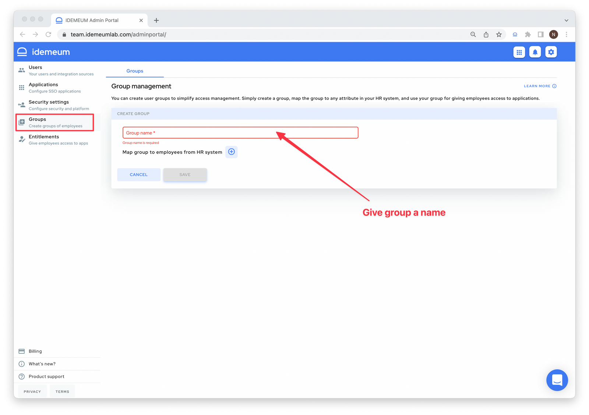
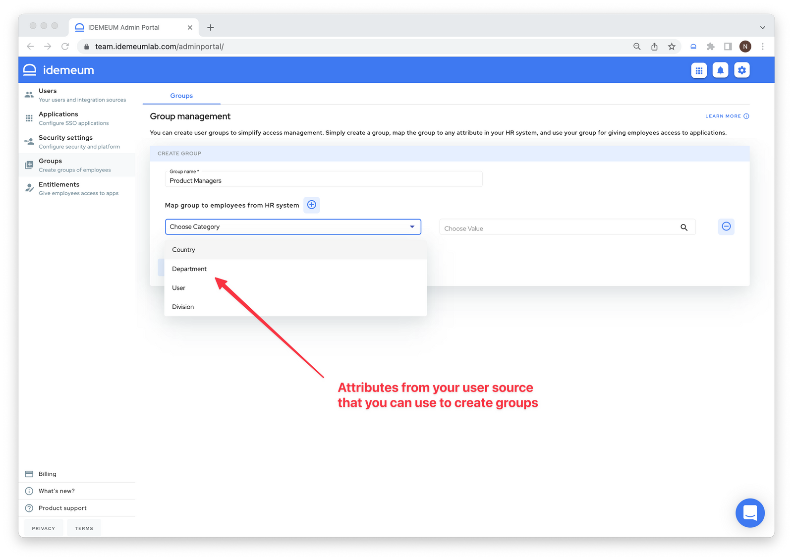
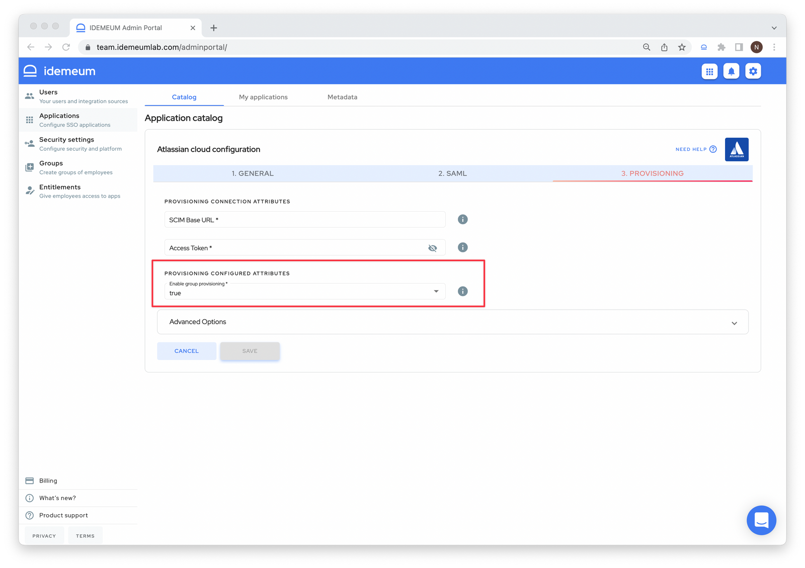

# Group management

## Overview

idemeum allows you to create groups and put employees into them.

::: tip Local user source
When you leverage [local user source](integration-with-hr-system.html#local-user-source) in idemeum you can simply define groups as logical entities and assign employees to these groups manually.

:::

::: tip External user source

If you integrate idemeum with [external user source](integration-with-hr-system.html#external-user-source), such as HR system, you can define group based on various attributes present in external source, such as country, department, etc. 

* For example, all my employees who are part of an **Engineering** department in HRMS will become part of **Engineering** group in idemeum.

:::

Groups are an important concept in idemeum and can be used for the following capabilities:

1. **Application entitlements** - you can use groups to **entitle applications** to employees. For instance, your **Engineering** group will have access to 3 applications (Atlassian, Slack, and AWS).
2. **Group provisioning** -  you can use groups to provision to integrated applications. For instance, once you create group **Admins** you can configure idemeum to push this group into AWS so that you can assign certain permission sets to it. Therefore, every new user of **Admins** group will be provisioned into **Admins** group in AWS.

## How to create groups

* Navigate to idemeum admin portal and choose `Groups`
* Click `Add group`
* Give your group a name

* Now you can create **Rules** based on which employees will become part of this group. With external user source you can leverage attributes in your external user source, or you can assign users directly to your group.

* In the image above you have Country, Department, and Division coming from HRMS. Each HRMS we integrate with will support different attributes. Consult our documentation to see what is currently supported.
* You can also add user to groups directly by choosing User attribute and then choosing what users you want to assign to groups.
* Once you configure the group hit `Save`

### Provision groups into applications

idemeum also supports pushing groups to applications and assigning users to these groups in applications. Please, check our [integrations catalog](https://integrations.idemeum.com) to see what applications support group management.

Enabling group provisioning for an application is very easy.

* Navigate to application configuration
* Choose `Provisioning` section
* Make sure you have `group provisioning `set to `True`

::: warning How group provisioning works

* If an application is assigned to a user that is part of the group, idemeum will first provision the group to application and then will assign the user to that group.
* If the user changes groups, idemeum will automatically update all information in target applications.

:::
