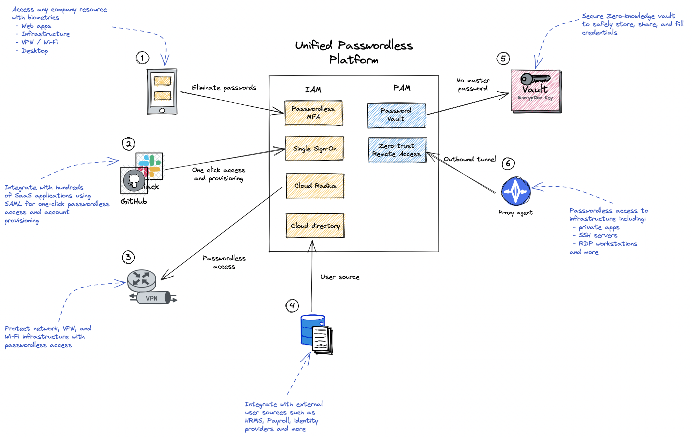

# How it works 🤔
## Overview

idemeum is a unified platform. What that means is that we have combined privileged access management with workforce identity management into one product and made everything employees access passwordless.

Our platform is modular and allows customers to choose what services they would like to deploy and integrate with existing identity infrastructure. 

idemeum is hosted on AWS and is a SaaS product only. We try to minimize the footprint of on-premises components that our customers need to deploy. idemeum is architected as a microservices-based application, and offers high availability and security.

::: tip Security whitepaper
You can learn more about our security principles [here](./security-whitepaper.md). 
:::

## Platform components
Here is a high level overview of idemeum platform components:

### [1. Passwordless MFA](/mfa-overview.html)

**Passwordless Multi-Factor Authentication (MFA)** is a mobile app that allows to replace password with biometrics.

* **Multi-factor:** it is multi-factor as for each authentication two factors are used: *something you have* - certificate that is provisioned on a mobile device, and *something you are* - mobile biometric sensors such as Face ID. 
* **Universal:** employees can access pretty much any resource with idemeum passwordless MFA, including SSO web apps, password vault, VPN. Wi-Fi, infrastructure servers, desktop workstations and more. 
* **Self-service:** users can enroll into MFA right from the mobile app, and in case the mobile device is lost we offers self recovery option, as well as recovery with admin approval. 

::: tip Deployment options
Passwordless MFA can be deployed: 
1. With idemeum Single Sign-On Identity Provider and infrastructure access, as it is deeply integrated into our platform. This way you have one platform to manage workforce and privileged access.
2. With your own Identity Provider such as Okta or Azure AD. We support various SAML [integrations](https://integrations.idemeum.com/tag/identity-providers/) today.
:::

### [2. Single Sign-On](/application-catalog.html)
idemeum offers a fully featured Single Sign-On Identity Provider (SAML & OIDC).

* **Integrations:** you can integrate [hundreds of SaaS applications](https://integrations.idemeum.com) using SAML in order to offer one-click centralized access. 
* **Passwordless access:** idemeum SSO works with **Passwordless MFA** to offer passwordless access to applications. Users login to application catalog with Passwordless MFA and then can click on any application to launch it without needing to type any passwords. 
* **Unified catalog:** all applications and resources and centralized in one catalog: password apps, SAML apps, SSH servers, desktops, and more.
* **Automated account provisioning:** idemeum supports various protocols such as SCIM in order to automatically create accounts when employees join, and remove them when employees leave. 
* **Various features:** RBAC, group management, auditing, local biometrics and more. 

Navigate to [Single Sign-On](/application-catalog.html) section to learn more about idemeum Identity Provider.

### [3. Cloud Radius](/cloud-radius-overview.html)
idemeum offers Cloud Radius instance so that you can control access to you VPN, Wi-Fi, and network resources. Paired with **Passwordless MFA** users can access any network resource such as VPN without needing to have passwords. Just use mobile application to approve login with biometrics. 

Deploy managed Radius authentication in your organization without building, maintaining, or monitoring physical servers.

Check our [integrations portal](https://integrations.idemeum.com/) to see what Radius integrations we support today. Our platform is quite flexible, so if certified integration is missing, we are happy to add it. 

### 4. Cloud Directory
idemeum offers various ways to manage users and onboarding. 

* **Local user management:** you can manually create users in idemeum and specify email address along with various personal identity claims. When users will be onboarding with Passwordless MFA this user data will be used. 
* **External user sources:** idemeum can integrate with external user sources such as HRMS systems, payroll providers, or existing identity providers. 

Again, check our integrations catalog to see what [user sources](https://integrations.idemeum.com/tag/user-source/) we support today. 

### [5. Secure Password Vault](/password-vault-overview.html)
idemeum offers a secure cloud vault to store passwords for your employees and privileged accounts. 

* **Zero knowledge:** each user gets access to password vault, and the credentials are encrypted with the keys that are kept on user mobile devices. What that means is that we do not have access to your passwords. And if our cloud gets compromised, none of your passwords wil ever get leaked. Decryption happens on the client side, i.e. your browser, mobile app, and browser extension. 
* **Sharing:** idemeum offers secure way to share credentials across the organization. With a simple click, you can share accounts with your team.
* **Auto-fill:** with the help of a browser extension, idemeum can auto-fill credentials on desktop and mobile browsers.

::: warning We don't see your passwords
Even though our password vault is cloud based, we do not see your password as they are encrypted on the client side. Check our [security white paper](./security-whitepaper) to learn more about our security and encryption principles.
:::

### [6. Zero-trust remote access <badge type="warning" text="Early access"/>](/zero-trust/zero-trust-overview.html)
idemeum offers a simple and secure way to access your infrastructure from the same platform. 

* **Passwordless:** you access infrastructure resources without passwords. Users leverage Passwordless MFA to login to an idemeum portal and then access various applications or servers. 
* **Universal:** we support access to on-premises applications, SSH servers, workstations and more. 
* **Simple:** nothing for you to deploy or manage. idemeum abstracts all the complexity, and the only thing you need is to connect idemeum to your resources. We offer a simple proxy agent that you install on-premises, and it will securely connect to our cloud using outbound channel - no ports to open or firewall rules to change. 