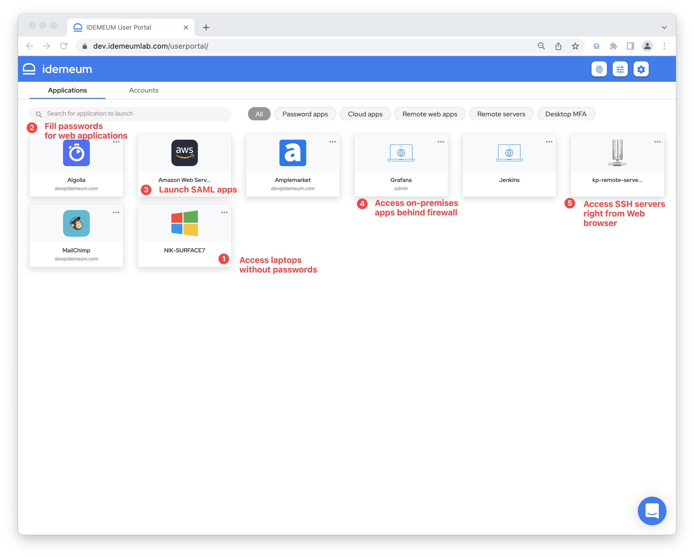

# How it works
## Overview

For your employees idemeum can automatically create SaaS accounts and offer one-click centralized access to applications, regardless if they are public SaaS or in your private cloud behind a firewall. For your engineers, idemeum offers unified passwordless access to your infrastructure, including servers, RDP desktops, databases, and more.

idemeum is SaaS hosted on AWS. We try to minimize the footprint of on-premises components that our customers need to deploy. We architected idemeum based on [micro-services architecture](https://blog.idemeum.com/microservice-scalability/) to offer high availability and security.

We combined products from several identity categories to offer unified app and infrastructure access experience. We sit at the intersection of Privileged Access Management (PAM), Workforce Identity (IAM), and Passwordless Technology. You can deploy and leverage the power of the whole platform, or choose the components that you need. Check our [pricing and licensing](https://idemeum.com/pricing) page to see what product tiers we offer today. 

## Platform components

### [Passwordless Single Sign-On](./passwordless-single-sign-on-overview.html)

Single Sign-On (SSO) is the entry door to access your company resources. Typically, SSO is centered around accessing SaaS Web applications, which are integrated using SAML / OIDC protocols. Companies are deploying products such as Okta, Azure AD, and others to manage access to SSO applications. 

idemeum goes beyond just SaaS web applications. We unify access to any company resource, including SAML SaaS applications, on-premises applications, SSH servers, RDP desktops, databases, and more. Pretty much you can access anything you need in your organization from a single unified catalog.

idemeum acts as a fully-featured Identity Provider offering features such as:

* **Integrations:** you can integrate [hundreds of SaaS applications](https://integrations.idemeum.com) using SAML in order to offer one-click centralized access. 
* **Passwordless access:** idemeum SSO works with **Passwordless MFA** to offer passwordless access to applications. Users login to application catalog with Passwordless MFA and then can click on any application to launch it without needing to type any passwords. 
* **Unified catalog:** all applications and resources and centralized in one catalog: password apps, SAML apps, SSH servers, desktops, and more.
* **Automated account provisioning:** idemeum supports various protocols such as SCIM in order to automatically create accounts when employees join, and remove them when employees leave. 
* **Various features:** ABAC, group management, auditing, local biometrics and more. 

### [Passwordless MFA](./mfa-overview.html)

idemeum Passwordless MFA allows you to login to any company resource with biometrics. It is multi-factor as for each authentication two factors are used: *something you have* - certificate that is provisioned on a mobile device, and *something you are* - mobile biometric sensors such as Face ID.

You can integrate idemeum Passwordless MFA with:

* **You existing SSO provider such as Okta or Azure AD** - you can use idemeum MFA to make every employee login into SaaS applications passwordless. 
* **VPN and Wi-Fi** - idemeum offers cloud based Radius so that you can integrate with your existing Wi-Fi and VPN infrastructure. When employees connect to Wi-Fi or access VPN, they no longer need to use password, but rather approve access with Passwordless MFA. 
* **Windows and Mac desktops** - we offer idemeum desktop application to make logins to your desktops / laptops passwordless. You can install idemeum desktop application, pair it with you mobile device, and start logging with biometrics. 

### [Secure Password Vault](./password-vault-overview.html)
idemeum offers a secure cloud vault to store passwords for your employees and privileged accounts. 

* **Zero knowledge:** each user gets access to password vault, and the credentials are encrypted with the keys that are kept on user mobile devices. What that means is that we do not have access to your passwords. And if our cloud gets compromised, none of your passwords wil ever get leaked. Decryption happens on the client side, i.e. your browser, mobile app, and browser extension. 
* **Sharing:** idemeum offers secure way to share credentials across the organization. With a simple click, you can share accounts with your team.
* **Auto-fill:** with the help of a browser extension, idemeum can auto-fill credentials on desktop and mobile browsers.

### [Secure Remote Access](./zero-trust/zero-trust-overview.html)
idemeum offers a cloud identity-aware proxy so that you can connect to you private cloud infrastructure. 

idemeum Secure Remote Access offers:

* **Passwordless infrastructure access:** you access infrastructure resources without passwords. Users leverage Passwordless MFA to login to an idemeum portal and then access various applications or servers. idemeum eliminates static credentials such as passwords and SSH keys.
* **Universal:** we support access to on-premises applications, SSH servers, workstations and more. 
* **Simple:** nothing for you to deploy or manage. idemeum abstracts all the complexity, and the only thing you need is to connect idemeum to your resources. We offer a simple proxy agent that you install on-premises, and it will securely connect to our cloud using outbound channel - no ports to open or firewall rules to change. 
* **End to end access control:** covers connectivity, authentication, authorization, and auditing.