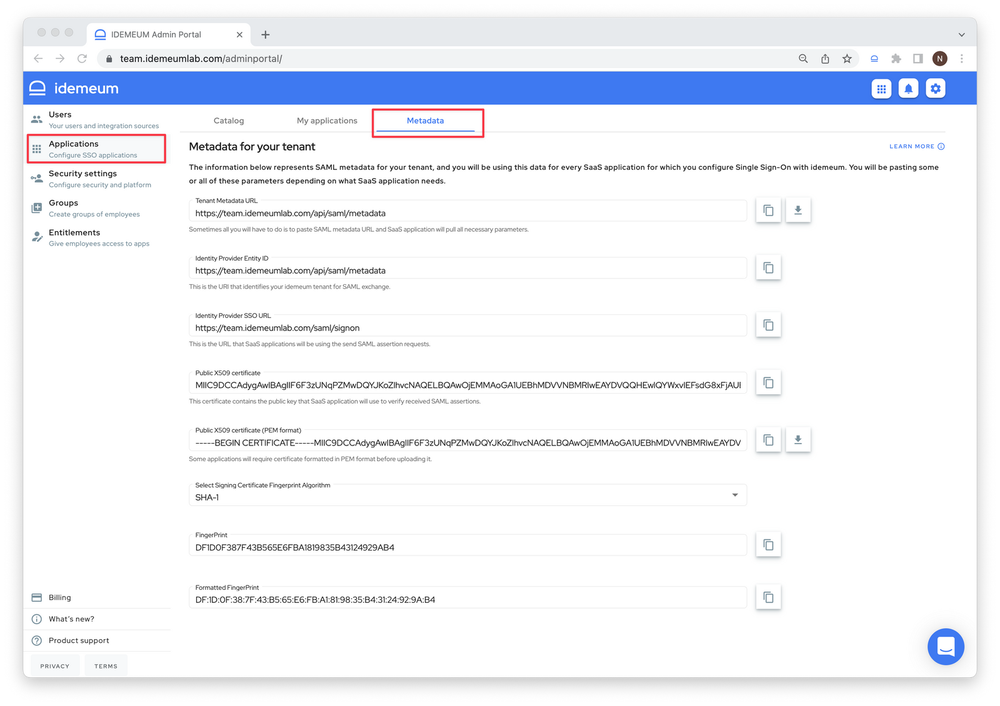

# How to obtain SAML metadata for idemeum

## Overview

[SAML metadata](https://en.wikipedia.org/wiki/SAML_metadata) is the data that describes the information needed to communicate between your SaaS application and idemeum in order to enable Single Sign-On. Based on SAML terminology SaaS application is called a **Service Provider (SP)** and idemeum will be an **Identity Provider (IDP)**.

Typically you will be asked to provide idemeum SAML metadata when you are configuring SaaS application to connect to idemeum using SAML.

## idemeum SAML metadata

To access SAML metadata for your tenant:

* Navigate to your idemeum admin portal at `https://[your domain].idemeum.com/adminportal`
* Click `Applications` in the left menu
* Click `SAML Metadata` in the top menu

The page will include all SAML configuration parameters that you will need to connect SaaS applications.

* **Tenant Metadata URL** - sometimes you can just paste the metadata URL and Service Provider will be able to parse all necessary information.
	* What is more, you can click on the arrow next to the form and download metadata XML file.
* **Identity Provider Entity ID** - this is the URI that identifies your idemeum tenant in SAML exchange
* **Identity Provider SSO URL** - this is the URL that SaaS application will use to send SAML requests to your idemeum tenant
* **Public X509 certificate** - public certificate of your idemeum tenant that applications will use to verify SAML assertions
* **Public X509 certificate in PEM** - PEM formatted certificate as some SaaS applications require certificate to be uploaded in this format.
	* You can click on the arrow next to the form and download public certificate in PEM format.
* **Algorithm** - you can choose what algorithm to use to generate hash / fingerprint for your certificate. We support SHA1 and SHA256. Some applications prefer to use certificate fingerprint instead of actual certificate value.
* **Fingerprint** - generated fingerprint based on chosen algorithm
* **Formatted fingerprint** - fingerprint formatted based on ASN.1 binary (DER) form.

You can conveniently copy the values right from the UI.

