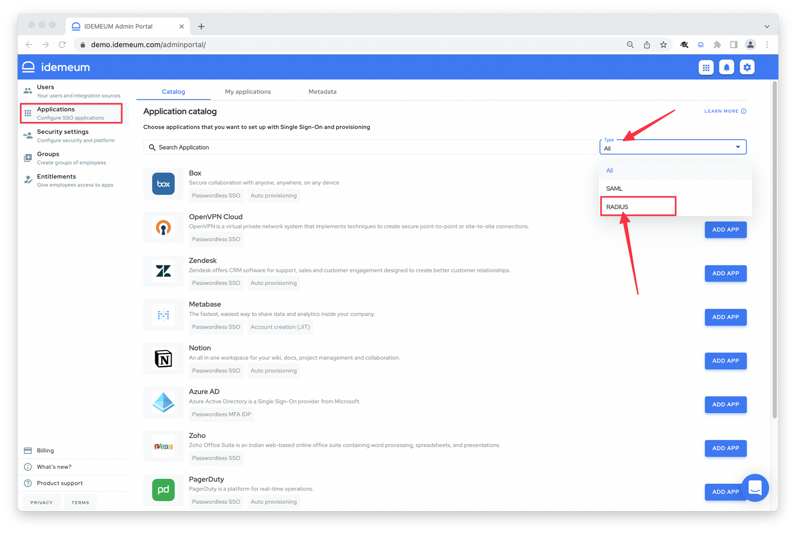
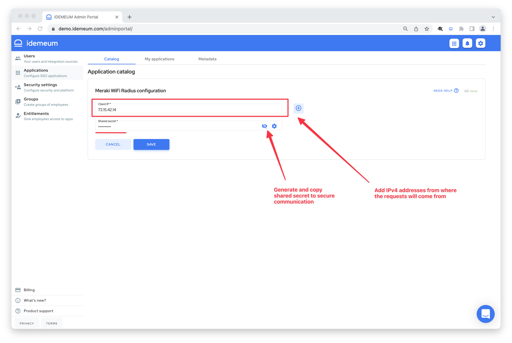

# How to set up Radius integration

## Configure idemeum

* Navigate to your idemeum portal and choose `Applications` section
* Now you can choose the filter on the right to search for Radius based applications
* Choose the application that you want to set up with Radius, i.e. Meraki AnyConnect VPN

::: tip Request an integration

If the application is missing for your specific infrastructure product, [contact us](https://docs.idemeum.com/contact/), and we will add the application right away.

:::

* You will need to specify IP addresses of clients that will communicate with idemeum Radius server. You can specify specific IP address (i.e `8.8.8.8`) or a CIDR block (i.e. `8.8.8.0/24`). By clicking a plus icon you can add multiple IP addresses or blocks.
* Generate secure secret that will be used for communication between clients and idemeum Radius server.
* Click `Save`

::: warning How entitlement works

If you are using an MFA license, Radius application will be automatically entitled to all users. However, if you are using Single Sign-On license you will need to manually entitle Radius application to users or user groups.

:::

## Configure your infrastructure

Setting up integration on your side will be dependent on the product you are using. We document all currently supported integrations on our [integrations portal](https://integrations.idemeum.com/).

But typically you will need:

* **Shared secret** that you generated when configuring Radius app in idemeum
* **Radius IP address** so clients can reach it.

::: tip Radius IP addresses

You can see idemeum Radius IP addresses [here](./cloud-radius-ip-address.html).

:::