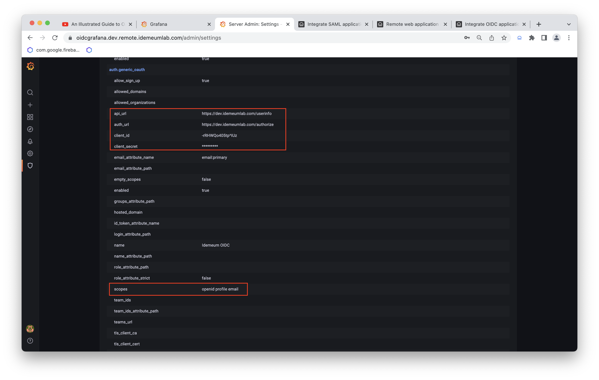

# Integrate OIDC application
[[toc]]

## Overview

idemeum certifies as an OpenId Connect (OIDC) Authorizartion Server. This means that we can integrate with applications that support OIDC authentication.

## Create OpenId Connect application

* Log into idemeum admin portal and navigate to `Applications`
* Click `Add app` button and choose `OIDC app`

* On the form you will have to provide the following information:
	* **Application name** - application name that will appear on the end user portal. It can contain any characters up to a maximum of 256 chars.
	* **Application URL** - this will be URL of your OIDC application.
	* **Signin Redirect URL** - During the OIDC flow, idemeum will check if the redirectUri that it receives is part of these Signin Redirect URL. You need to have at least one signin redirect uris and at most 10.

* Click `SAVE` to save the application configuration

* Once you save the application you will be promted with a popup that contains the clientId and clientSecret for this OIDC application. You need to keep this information somewhere save as you will need to use this information on the application that you are actually configuring (in our case on the Grafana admin settings page).

* In case the credentials have been compromised or you misplaced them, then you can regenerate them by clicking the 'Regenerate Credentials'

## Manage OIDC application

* Your OIDC application is accessible in the admin portal `My applications` section. You can directly search for it or use filters on the right and choose `OIDC apps`.
* You can `Edit` OIDC application configuration or `Remove` OIDC application from idemeum.

## Give access to OIDC application

* In order for users to access OIDC application you need to create an [entitlement rule](../application-entitlements.html) for the users or groups of users that should have access to it.
* Navigate to `Entitlements` and click `Add rule`

* In the example below I am directly entitling user `nik@idemeumlab.com` to access the OIDC Grafana application. You can also use groups to perform entitlement.

::: tip More about groups and entitlements

You can learn more about how [groups](./group-management.html) and [entitlements](./application-entitlements.html) work in idemeum.

:::

## Access OIDC application

* You can launch OIDC applications in the same way you would access any other application - from **browser user portal**, from **extension**, and **mobile application**.

## Configuring Grafana App with Idemeum using OIDC
We are going to showcase how you can configure a Grafana application to use OIDC with Idemeum for logging in users.

### Create an OIDC application in idemeum
You would first have to create an OIDC application in idemeum. See the section above on how to create an OIDC application.

Make a note of the clientId and clientSecret as you will need these values on the Grafana settings page.

### Configure your Grafana application to use OIDC with idemeum
* Login as administrator to the Grafana application and navigate to 'Settings' page. Then scroll down to the 'auth.generic_oauth' section

* On this page you will have to change some configurations so it will communicate with idemeum for authentication:
	* **api_url** - this is the URL where to fetch the user infomation from (https://<tenant_name>.idemeumlab.com/userinfo)
	* **auth_url** - this is hte URL to perform the authorization (https://<tenant_name>.idemeumlab.com/authorization)
	* **client_id** - the clientId that you got when you created the OIDC app in idemeum
	* **client_secret** - the clientSecret that you got when you created the OIDC app in idemeum
	* **scopes** - what scopes you are requesting from idemeum (openid profile email)
	* **token_url** - the api where to exchange the OIDC code with an access code (https://<tenant_name>.idemeumlab.com/token)

The urls and other configuration values that you need to set while configuring your OIDC application can be found on your idemeum admin portal.

