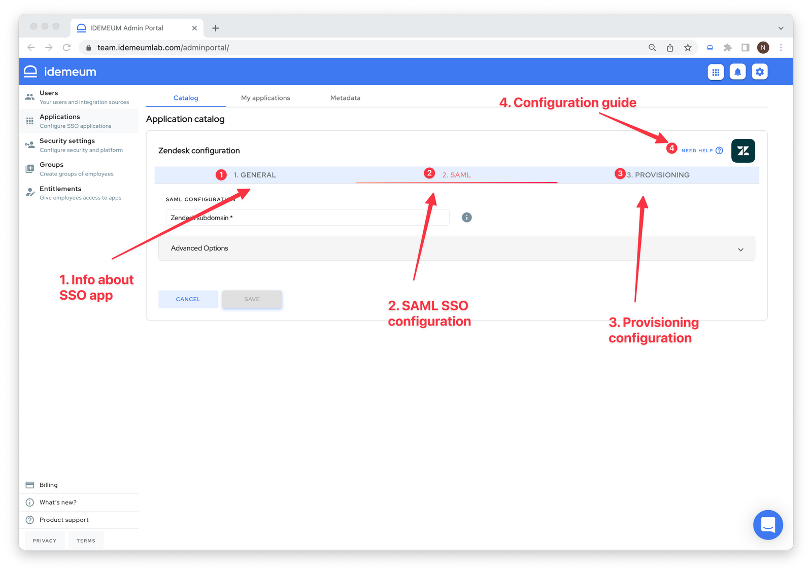
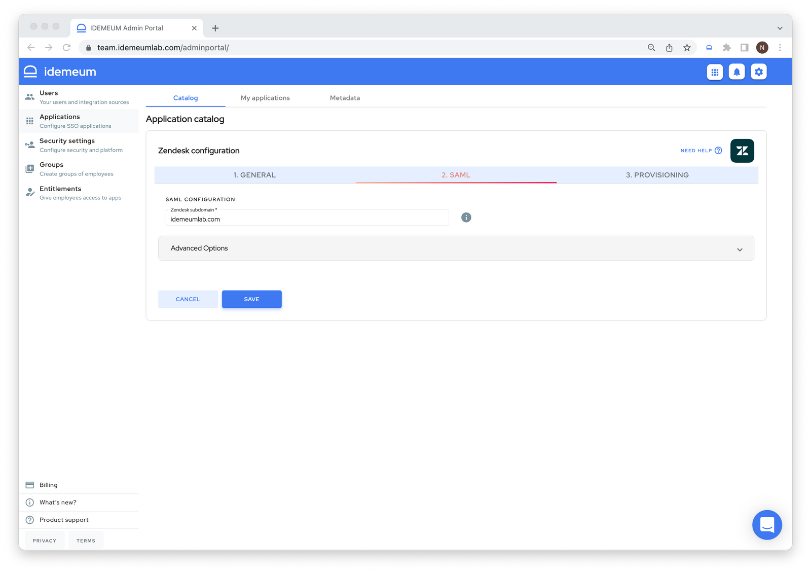

# Integrate SAML application
[[toc]]

## Overview

idemeum certifies and pre-configures SAML applications. For most of the applications we support, there is very little information that needs to be configured. Check our [integration catalog](https://integrations.idemeum.com) to browse all SAML applications that we support.

If there is a SAML application that we have not pre-configured, you can always add it using [custom SAML integration](./integrate-saml-app.html#set-up-custom-saml-application). 

## Set up pre-configured SAML application

* Navigate to `Applications` -> `Catalog` to choose the application you want to integrate using SAML. You can search for applications, and we also tag them to reflect supported capabilities.
* Once you do you will be redirected to an app specific configuration section that consists of 3 parts:
	* `General` - provides you with information about application
	* `SAML` - this is where you will configure SAML integration
	* `Provisioning` - this is where you will configure [automated application provisioning](./lifecycle-management.html)

* If you click on `Need help?` link you will be redirected to integration guide for that specific application. We provide step by step instructions on how to set up SAML both in idemeum and target application.
* We truly preconfigure SaaS applications on our side. Therefore often times you will need to enter minimal configuration parameters to setup SAML integration. You can always expand `Advanced options` and make changes as necessary, but when we certified and application we made sure all necessary configuration are done on our side.

* Once you configure SAML application and click `Save` the application will be moved from `Catalog` tab into `My applications` tab. You can always go back and edit or delete application.

## Set up custom SAML application

* Navigate to idemeum admin portal
* Access `Applications` -> `Add application` -> `Add custom SAML app`

* Now you can start configuring SAML integration. To configure SAML in the target application you will need to consult their documentation and you will need to use your [idemeum tenant metadata](./how-to-obtain-saml-metadata-for-idemeum.html).
* To configure SAML in idemeum you will have 3 options, and you will need to rely on what integrating application requires you to do:
	* You can upload metadata link for target application
	* You can upload metadata file for target application
	* You can configure SAML integration manually
	

* If you decide to configure SAML manually you will at least need `Assertion Consumer Service URL` and `Audience URI`. There might be other parameters that your application will present, and in idemeum you can expand advanced options to configure these additional values.

