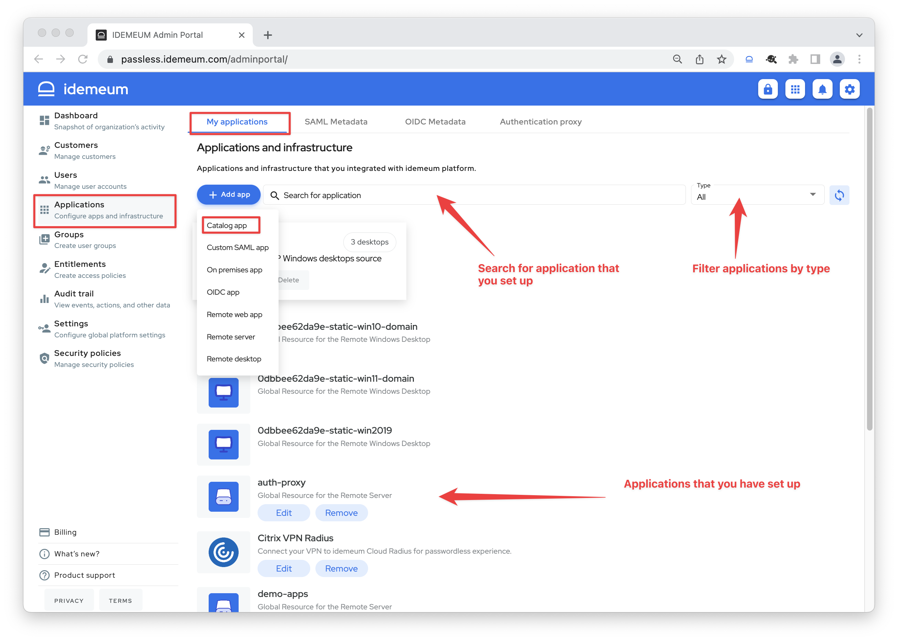

# Integrate SAML applications
[[toc]]

## Overview
idemeum offers 2 simple ways to integrate SAML applications for one-click passwordless access. 

1. **Pre-configured SAML integrations** - for most common SaaS applications idemeum certifies and pre-configures the integrations. You can search for SAML integrations right from `Applications` section, and you will have to provide only a few parameters to set up an integration. Check our [integration catalog](https://integrations.idemeum.com/tag/saml/) to browse all SAML applications that we support.
2. **Custom SAML integrations** - if there is a SAML application that we have not pre-configured, you can always integrate it with general configuration profile. 

## SAML integration set up

### Pre-configured SAML integrations

* Access idemeum admin portal and navigate to `Applications` section
* Click `Add app` and choose `Catalog app`

::: tip How to navigate applications section
Every application that you set up will be shown in the `My applications` section. You can search application by name, or filter the application by type using the search bar and filter sections on the right.
:::

* Now you can choose among the SAML applications that idemeum team pre-configured. Click `Add app` for the application you want to set up

* You will be redirected to an app specific configuration section that consists of 3 parts:
	* `General` - provides you with information about application
	* `SAML` - this is where you will configure SAML integration
	* `Provisioning` - this is where you will configure [automated application provisioning](./lifecycle-management.html)

* If you click on `Need help?` link you will be redirected to an integration guide for that specific application. We provide step by step instructions on how to set up SAML both in idemeum and target application.
* We truly preconfigure SaaS applications on our side. Therefore often times you will need to enter minimal configuration parameters to setup SAML integration. You can always expand `Advanced options` and make changes as necessary, but when we certified and application we made sure all necessary configuration are done on our side.
* Once you configure SAML application and click `Save` the application will shown `My applications` section. You can always go back and edit or delete application.

### Custom SAML integrations

* Navigate to idemeum admin portal
* Access `Applications` -> `Add app` -> `Custom SAML app`

* Now you can start configuring SAML integration. To configure SAML in the target application you will need to consult their documentation and you will need to use your [idemeum tenant metadata](./how-to-obtain-saml-metadata-for-idemeum.html).
* To configure SAML in idemeum you will have 3 options, and you will need to rely on what integrating application requires you to do:
	* You can upload metadata link for target application
	* You can upload metadata file for target application
	* You can configure SAML integration manually

* If you decide to configure SAML manually you will at least need `Assertion Consumer Service URL` and `Audience URI`. There might be other parameters that your application will present, and in idemeum you can expand advanced options to configure these additional values.

