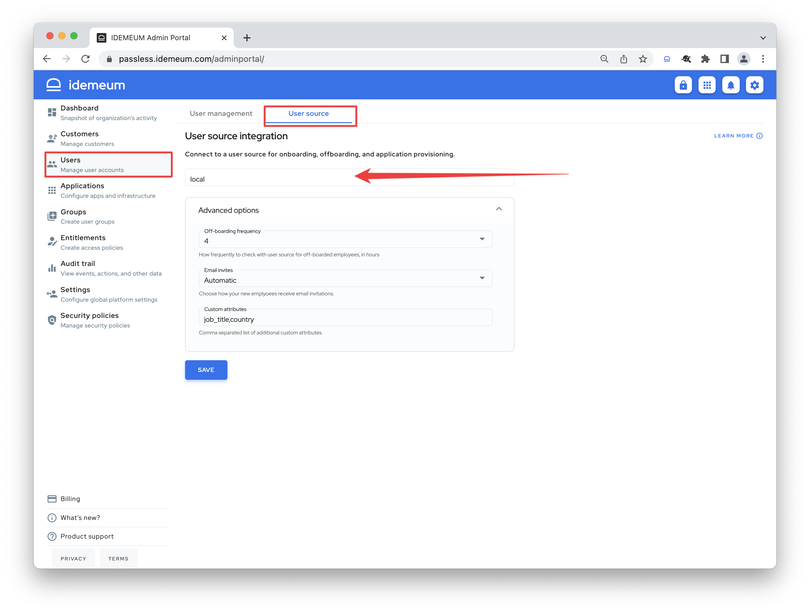
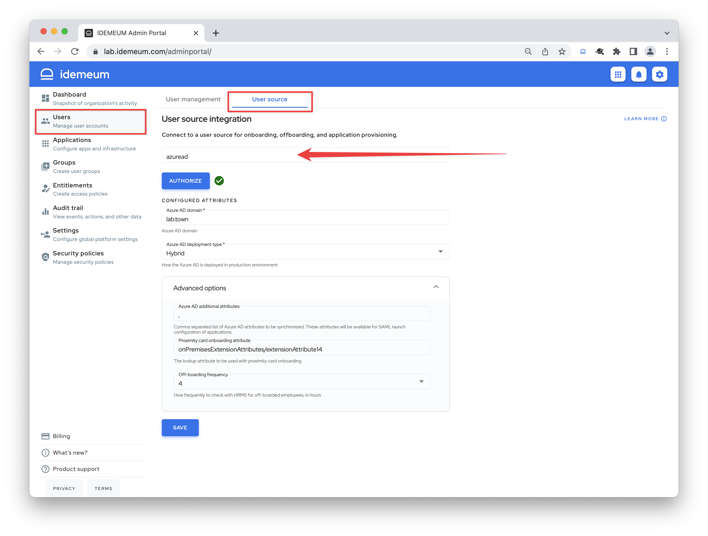

# User source integration

## Overview

You can manage users locally with idemeum cloud directory, or you can rely on external user source such as an existing Identity Provider, HRMS, or payroll system. Check our [integrations catalog](https://integrations.idemeum.com/tag/user-source/) to see what integrations we support today. 

1. **Local user source** - admins create user records manually in idemeum cloud directory and specify various attributes, including RFID badge ID values, or personal identity claims that can be used for Passwordless MFA [onboarding](./employee-onboarding.html). 
2. **External user source** - idemeum can integrate with external user source, such as an HR system or Identity Provider to onboard and sync users automatically.

## Local user source

* To configure local user source navigate to `Users` -> `User source` and choose `Local`
* Once you save your configuration. you can navigate to `Users` -> `User Management` section to start creating users

::: tip Advanced settings
* `Off-boarding frequency` - with this configuration you can choose how often you want idemeum to check for off-boarded employees using local user source. Say you delete user manually, and set this interval to 4 hours. Every 4 hours idemeum will check for off-boarded user to remove access and de-provision applications.
* `Email invites` - choose to either automatically send invitation email to users as soon as they are added by administrator or manually through user actions on user management tab.
* `Custom attrbiutes` - define additional attributes that can be added to local users. You can list comma-separated attributes (i.e. job_title, country, etc.)
:::

## External user source

External user source allows to leverage existing user database for automated user onboarding or RFID badge lookup. Users do not need to be manually created in idemeum, and it is expected that external user source will have a mapping between corporate email address and personal user information for [onboarding](./employee-onboarding.html) to work.

Today we support a variety of integrations, and you can check our integrations portal here - [user source integrations](https://integrations.idemeum.com/tag/user-source/). 

* To connect idemeum to external user source navigate to to `Users` -> `User source`
* Then choose the source that you want to connect to from a dropdown list
* Then you will need to either enter an **API key** or conduct an **oAuth authorization**

::: tip Advanced settings

* `Off-boarding frequency` - with this configuration you can choose how often you want idemeum to check for off-boarded employees using local user source. Say user is deleted in HR system, and you set this interval to 4 hours. Every 4 hours idemeum will check for off-boarded user to remove access and de-provision applications. 
* `Proximity card onboarding attribute` - the lookup attribute to be used with RFID badge onboarding.

Some attributes and configuration parameters are user source specific, and you can learn more information in each [integration guide](https://integrations.idemeum.com/tag/user-source/).
:::
