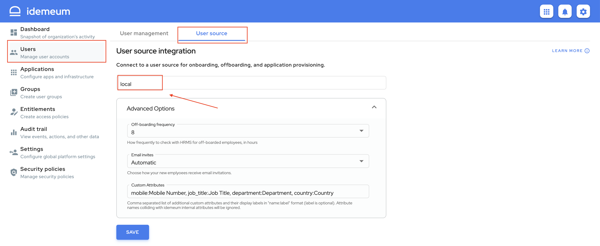
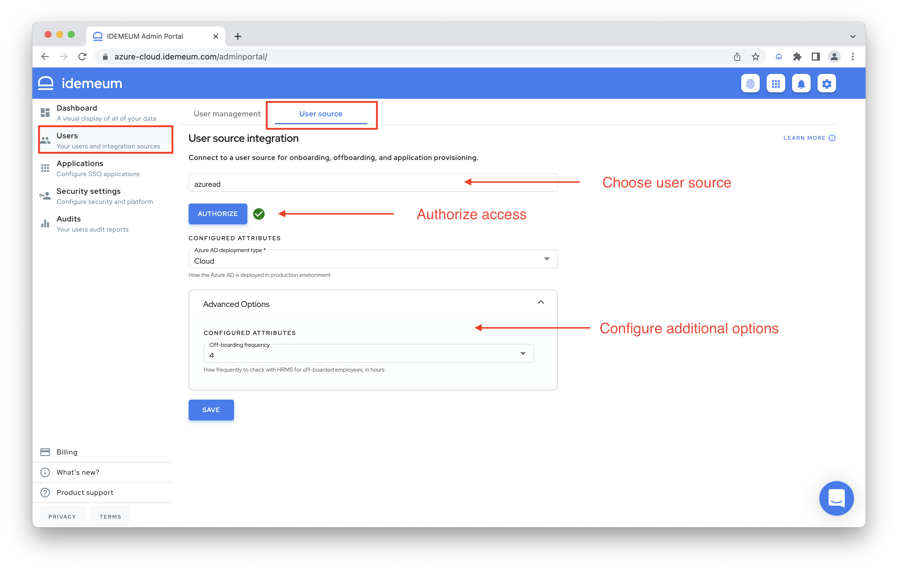

# User source integration
[[toc]]

## Overview
With idemeum you have several options for how to manage your users. You can manage users locally with idemeum cloud directory, or you can rely on external user source such as HR or Payroll system.

::: tip User source options

Today we support the following options for user source:

1. **Local user source** - admins manually create user records and specify mappings between personal and corporate identity claims so that new employees can be [onboarded](./employee-onboarding.html) into an organization with Passwordless MFA.
2. **External user source** - idemeum can integrate with external user source, such as an HR system to onboard users automatically.

:::

## Local user source

With local user source admins can create users manually and specify personal claims to corporate email mappings for [employee onboarding](/employee-onboarding.html) to work.

* To configure local user source navigate to `Users` -> `User source` and choose `Local`.
* Once you save your configuration. you can navigate to [user management](./user-management.html) section to start creating users.

::: warning Advanced settings

* **Off-boarding frequency** - with this configuration you can choose how often you want idemeum to check for off-boarded employees using local user source. Say you delete user manually, and set this interval to 4 hours. Every 4 hours idemeum will check for off-boarded user to remove access and de-provision applications. 

:::

## External user source

External user source allows to leverage existing user database for automated user onboarding. Users do not need to be manually created in idemeum, and it is expected that external user source will have a mapping between corporate email address and personal user information for [onboarding](./employee-onboarding.html) to work. 

Today we support a variety of integrations, and you can check our integrations portal here - [user source integrations](https://integrations.idemeum.com/tag/user-source/). 

* To connect idemeum to external user source navigate to to `Users` -> `User source`.
* Then choose the source that you want to connect to from a dropdown list.
* Then you will need to either enter an **API key** or conduct an **oAuth authorization**.

::: warning Advanced settings

* **Off-boarding frequency** - with this configuration you can choose how often you want idemeum to check for off-boarded employees using local user source. Say user is deleted in HR system, and you set this interval to 4 hours. Every 4 hours idemeum will check for off-boarded user to remove access and de-provision applications. 
* **Corporate email format** - when employees onboard into organization they are using personal email address, phone number, or ID document. However, corporate email address is required in order for idemeum to log user into applications. As a first step idemeum looks for corporate email address in user source. If found that email will be used for all applications provisioned for the user. If the email is not found, idemeum will create one on the fly. With this setting you can choose what email format you will use for all employees. The default is `firstname.lastname@domain.com`.

:::