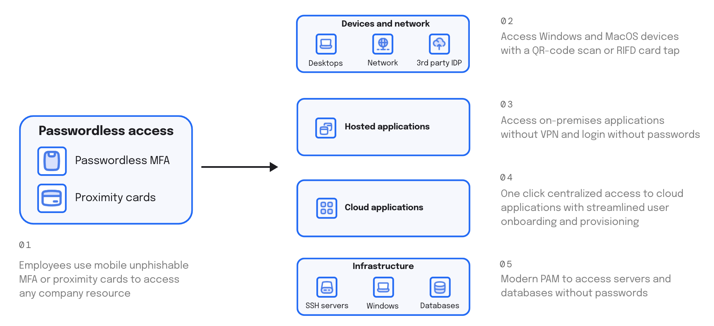

# Welcome to idemeum

## What is idemeum?

idemeum is a zero-trust platform that offers one place to manage access to devices, applications, and infrastructure. 

Employees can pick a mobile device or an existing RFID badge and access pretty much any company resource without passwords, including cloud or on-premises applications, SSH or RDP servers, databases, Windows or Mac computers, and more. 

idemeum uniquely combines **Privileged Access Management (PAM)**, **Workforce Identity (IAM)**, and **Passwordless Technology**. Instead of deploying a VPN to access your private applications, Single Sign-On (SSO) to access your cloud applications, Privileged Access Management (PAM) solution to access your infrastructure, and Multi-Factor Authentication (MFA) to secure access, idemeum combines all of that in one platform.

idemeum is SaaS hosted on AWS. We try to minimize the footprint of on-premises components that our customers need to deploy. We architected idemeum based on [micro-services architecture](https://blog.idemeum.com/microservice-scalability/) to offer high availability and security.

You can deploy and leverage the power of the whole platform, or choose the components that you need. Check our [pricing and licensing](https://idemeum.com/pricing) page to see what product tiers we offer today. 

## How idemeum can help

There are several ways idemeum can help your business:

1. **Eliminate passwords** - with our Universal Passwordless MFA or RFID access you can offer your employees seamless passwordless login to applications, desktops, Wi-Fi, VPNs, and infrastructure resources. We support integration with pretty much any resource.
2. **Replace legacy VPN with Zero-Trust Network Access (ZTNA)** - with our modern Secure Remote Access you can replace legacy VPN and offer your employees one-click access to infrastructure, including on-premises apps, SSH servers, RDP desktops, databases, and Kubernetes clusters. 
3. **Consolidate identity stack to save money** - instead of deploying separate products for PAM and IAM, you can leverage our cloud-based unified platform to access and manage your applications and access to privileged resources.

## Quick demo

<iframe src='https://www.youtube.com/embed/-3StOlDjMrQ' frameborder='0' allowfullscreen></iframe>

