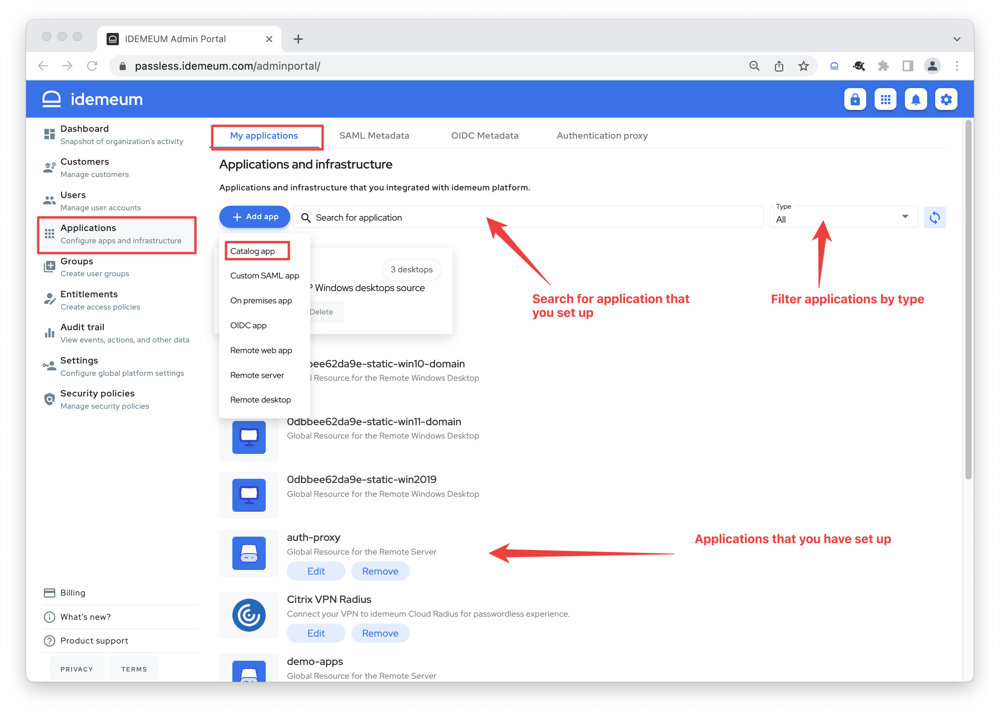
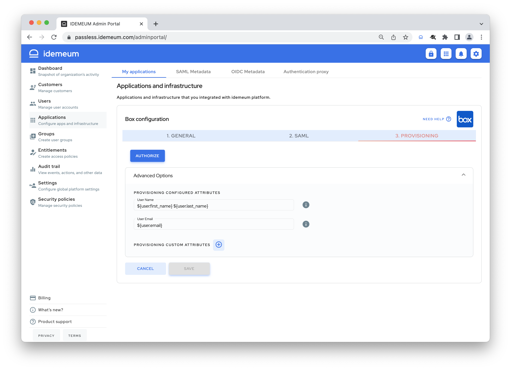

# Automated provisioning

[[toc]]

## Overview

idemeum allows you to automatically create user accounts when employees are [onboarded](./employee-onboarding.html), and safely and timely remove application accounts when your employees leave the organization. 

## How it works

Today idemeum supports SaaS application provisioning for employees who onboard with a mobile device. 

* First employee verifies phone number of email address in the mobile application and [onboards](./employee-onboarding.html) into organization by scanning a login QR code
* idemeum locates the user record in [external user source](./integration-with-hr-system.html#external-user-source) or [local user source](./integration-with-hr-system.html#local-user-source) and pulls required attributes such as role, department, name, etc.
* Based on these attributes idemeum will automatically create application accounts for employee to become productive immediately
* Once the employee is terminated / off-boarded in idemeum or external user source, all application accounts will be removed and access revoked

## How to configure provisioning

First check our integration portal to see what applications we support for [automated provisioning](https://integrations.idemeum.com/tag/provisioning/).

* Access your idemeum admin portal and navigate to `Applications` section. 
* Click `Add app` and choose `Catalog app`

* You can search for an application that you want to set up provisioning for. We recommend you first set up [SAML Single Sign-On](./integrate-saml-app.html) for that application.
* Click `Add app`. And then navigate to `Provisioning` section.

* Based on what application supports, you will either have to enter an **API key** or conduct **oAuth flow** to allow idemeum to perform automated provisioning. For most applications we rely on [SCIM protocol](https://scim.cloud/) to conduct provisioning, however for some applications we rely on custom API connectors that we developed.

::: tip Detailed instructions 
Please, check our [integrations portal](https://integrations.idemeum.com) as we have a detailed step by step instructions there for how to enable SSO and provisioning for each application that idemeum supports.
:::