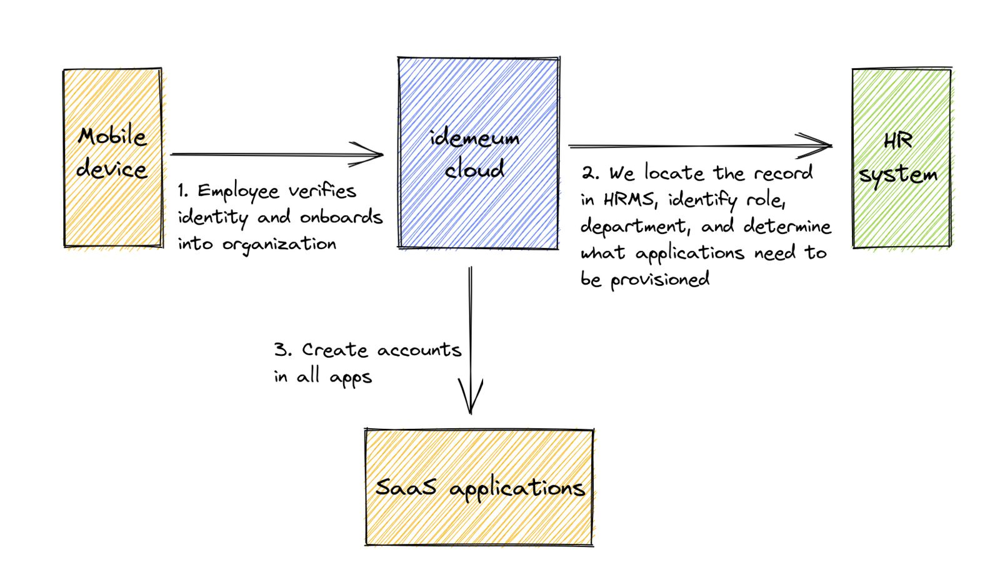
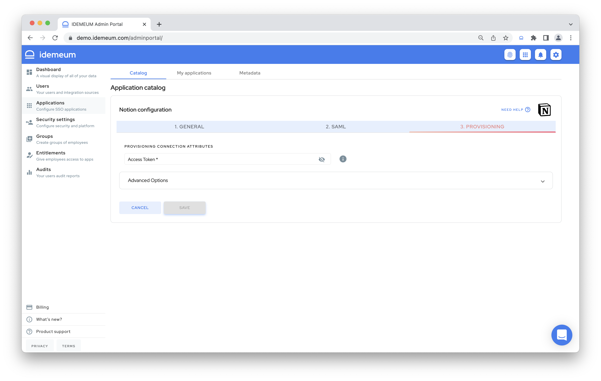

# Automated account provisioning

## Overview

idemeum offers end to end lifecycle management capabilities. You can integrate idemeum with your SaaS applications to:

* **Automate account creation** to automatically add employees to apps right when the start
* **Timely remove application accounts** for employees who leave the organization
* **Reduce costs** by quickly recuperating software licenses for employees that are terminated

## How it works

Typically idemeum provisions accounts when employees first [onboard])(./employee-onboarding.html) into an organization with Passwordless MFA. Here is example of the flow when [external user source](./integration-with-hr-system.html#external-user-source) is used for onboarding / off-boarding. 

* First employee verifies digital identity and [onboards](./employee-onboarding.html) into organization by navigating to a company portal and scanning a QR code
* idemeum locates the user record in external user source and pulls required attributes such as role, department, name, etc.
* Based on these attributes idemeum will automatically create application accounts for employee to become productive immediately
* Once the employee is terminated / off-boarded in HRMS, all application accounts will be removed and access revoked

## How to configure provisioning

* First check our integration portal to see what applications we support for [automated provisioning](https://integrations.idemeum.com/).
* Access your idemeum admin portal and navigate to `Applications` section. You can search for an application that you want to set up provisioning for. We recommend you first set up Single Sign-On for that application.
* Click `Add application`. And then navigate to `Provisioning` section.
* Based on what application supports, you will either have to enter an **API key** or conduct **oAuth flow** to allow idemeum to perform automated provisioning. For most applications we rely on SCIM protocol to conduct provisioning, however for some applications we rely on custom API connectors that we developed.

Please, check our [integrations portal](https://integrations.idemeum.com) as we have a detailed step by step instructions there for how to enable SSO and provisioning for each application that idemeum supports.
