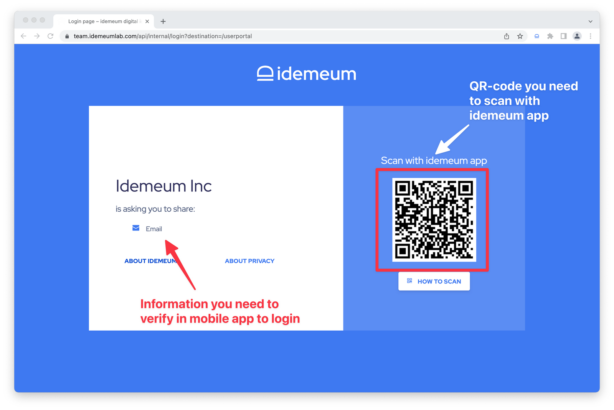
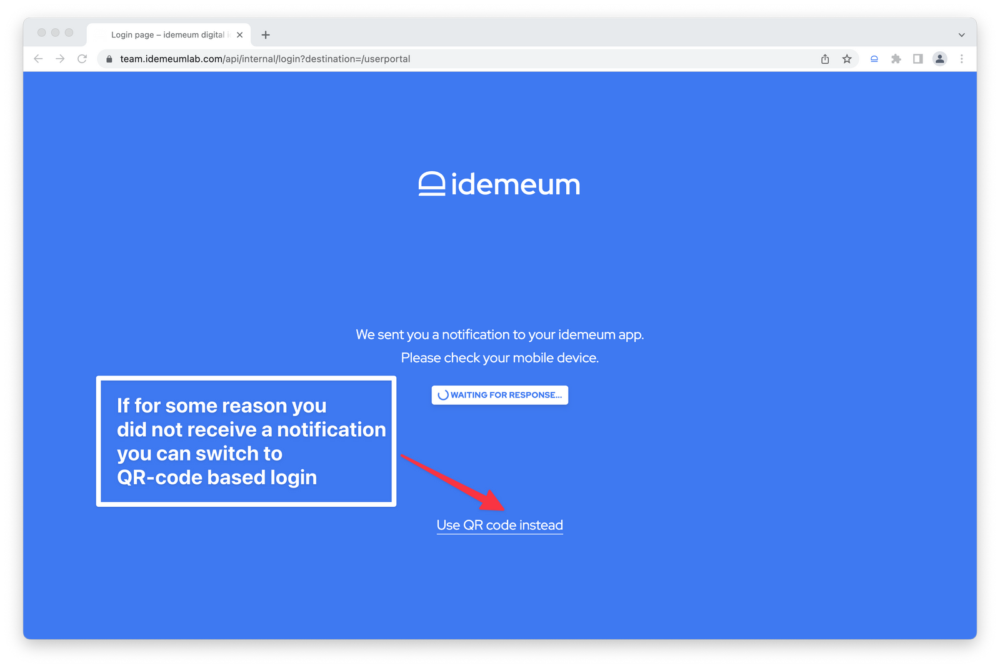
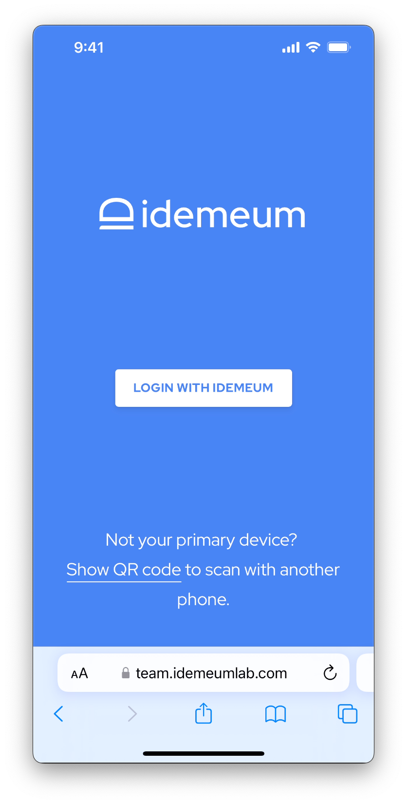
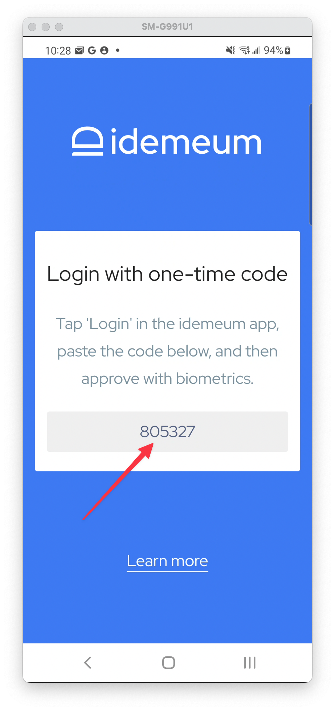
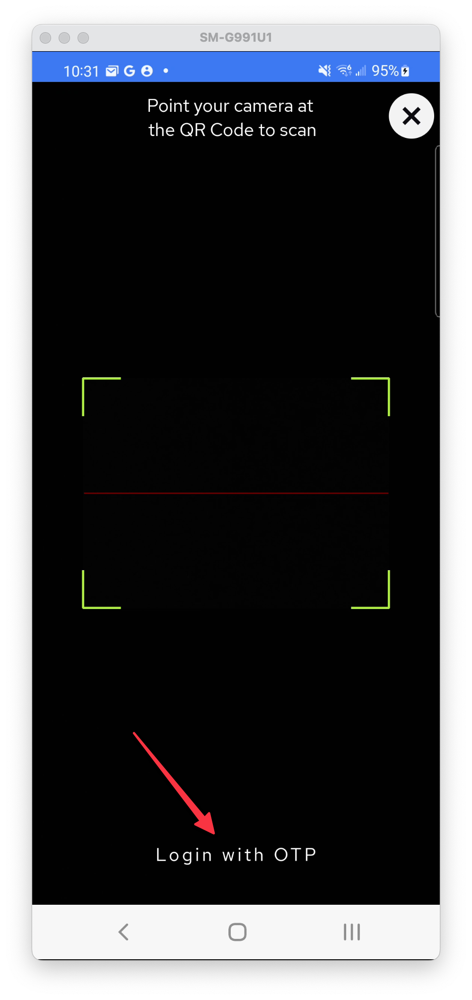
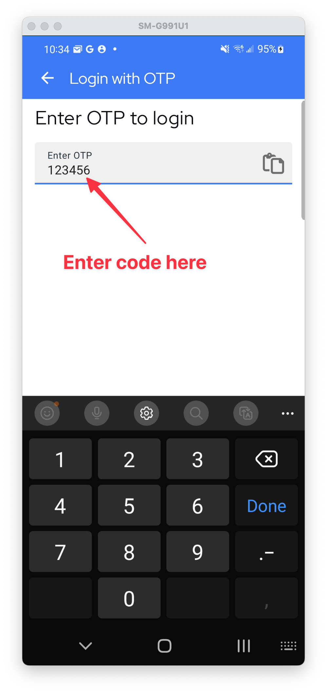

# Login experience with MFA

## Overview

When accessing company resources idemeum offers passwordless logins of several types. Instead of entering passwords, employees leverage biometrics to access any resource securely. 

Every login with idemeum is **multi-factor**, as several authentication factors are used: **certificates** (*something you have*) and **biometrics** (*something you are*).

## 1. Login with QR-code
To login with QR-code you will need:

1. Access company application portal or any resource such as VPN or Wi-Fi. You will be shown an idemeum QR-code. 
2. Scan the QR-code with idemeum mobile application.
3. Once you scan the QR code you will see the approval screen that you will need to approve with biometrics.

Here is how login page with QR code looks like.

<iframe src="https://www.loom.com/embed/9912d8a4b5c54741a8c4093e7920625a" frameborder="0" webkitallowfullscreen mozallowfullscreen allowfullscreen style="position: absolute; top: 0; left: 0; width: 100%; height: 100%;"></iframe>

## 2. Login with push notification
Push notification login works on desktop browsers where you already logged in once with QR-code login. After QR-code login idemeum saves cookie in your browser so that next time when you login from the same browser a mobile notification will be sent to your mobile device.

To login with puch notification you will need:

1. Access company application portal through a desktop browser where you already logged in before.
2. You will receive a push notification to your device.
3. Approve login with biometrics.

Here is how login page with push notification looks like.

::: warning QR-code fallback

If for some reason you did not receive a notification you can switch back to login with QR-code instead by clicking on `Use QR code` instead link.

:::

<iframe src="https://www.loom.com/embed/cfe037cfb329483ab4ac25660a3813c2" frameborder="0" webkitallowfullscreen mozallowfullscreen allowfullscreen style="position: absolute; top: 0; left: 0; width: 100%; height: 100%;"></iframe>

## 3. Login with universal link on mobile
When logging into application or resources on mobile phones you can not scan idemeum QR-code. Therefore we provide seamless capability to login with a click of a button. When accessing an application on your mobile phone you will be redirected to idemeum app and will see `Login with idemeum` button. Once you click that button, idemeum application will open and you will be able to approve login with biometrics.

To login with universal link on mobile you will need:

1. Access application or company portal on your mobile phone.
2. You will see `Login with idemeum` button.
3. Once clicking the button you will be redirected to idemeum app for approval.
4. Approve login with biometrics and go back to application.

Here is how idemeum login page looks like on a mobile device.

<iframe src="https://www.loom.com/embed/07cda5cf6d724f7c876687e35a7d18ea" frameborder="0" webkitallowfullscreen mozallowfullscreen allowfullscreen style="position: absolute; top: 0; left: 0; width: 100%; height: 100%;"></iframe>

## 4. Login with One-Time-Code (OTP)
When you access company resources from mobile devices and need to login with idemeum, you will be automatically sent to idemeum app to complete login with biometrics. We are leveraging universal links to enable this experience.

Unfortunately universal links do not always work on Android, especially when you access native applications. To solve this problem and still offer passwordless experience for Android native applications we built login with one-time code capability.

::: tip 

Login with One-time code is only applicable to logging into native applications on Android. When you need to access applications with mobile browser you will be automatically sent to idemeum app.

:::

To login with OTP you will need:

1. On Android access any company native application that you need to log into
2. You will type in your username, and a Web-view will open with your one-time login code. Memorize this code or copy it to clipboard.

3. Now you can manually go to idemeum app, launch it and click Login at the bottom menu

4. Click `Login with OTP` at the bottom of the screen. You will see a screen where you can now enter your one-time code.

5. Approve login with biometrics and you are good to go. Return to original application and you will be logged in.

<iframe src="https://www.loom.com/embed/62d43bda5eab42c1bfb825b0e45df6ef" frameborder="0" webkitallowfullscreen mozallowfullscreen allowfullscreen style="position: absolute; top: 0; left: 0; width: 100%; height: 100%;"></iframe>

