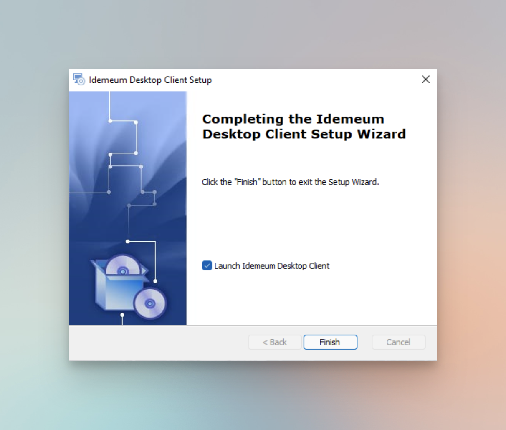

# Install Idemeum Desktop Application

[[toc]]

## Windows installation

### Install with UI

- Navigate to idemeum `User portal`
- Choose `Accounts` and then `Add desktop app`
- Chose `Windows` and click `Download`

- Run downloaded installer on your Windows machine
- Approve any requests to install dependencies and libraries
- Proceed with installation wizard, choose installation directory, and approve installation

- Once installation is complete, click `Finish` to start pairing your idemeum mobile application with this Windows machine.

- Once desktop client is installed and launched, you can start pairing your mobile device with Windows workstation. 
- As a first step you will need to enter the URL of your idemeum company portal

- Now you can choose how you would like to access this workstation. You can login with mobile app by scanning a QR-code, or you can access this workstation with an RFID badge tap. You can learn more about [RFID Single Sign-On](../rfid/rfid-overview.html).

- Now you can pair mobile application with this workstation. Take your idemeum mobile application, click `Login` at the bottom menu, scan the QR-code and approve pairing. 

::: warning Enter your password

If you are installing idemeum desktop client on a non domain-joined workstation, you will need to enter your username and password. idemeum desktop client will not send your credentials to idemeum cloud. It will use them locally to create a virtual smart card. 

if you are installing idemeum desktop client on a domain-joined workstation. you will not need to enter your password and can proceed to pairing right away. 

:::

- Once you approve pairing, and if everything is successful the application will be paired with your mobile device, and you will receive a confirmation screen. 

- Once the desktop application is paired the new application with your computer name will be added to your application catalog on desktop as well as mobile.

- You can now start accessing your workstation with passwordless MFA.

