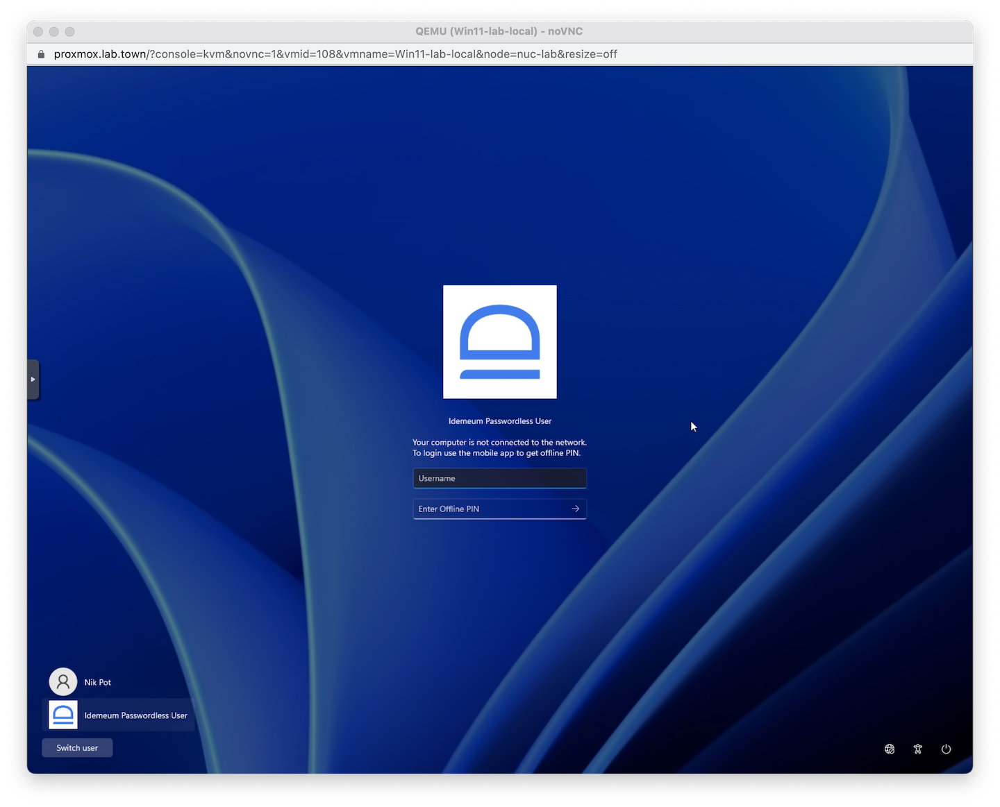
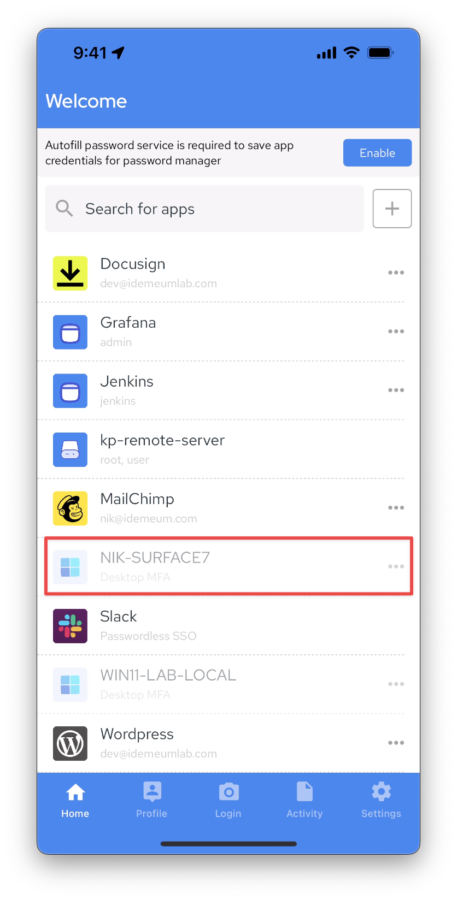
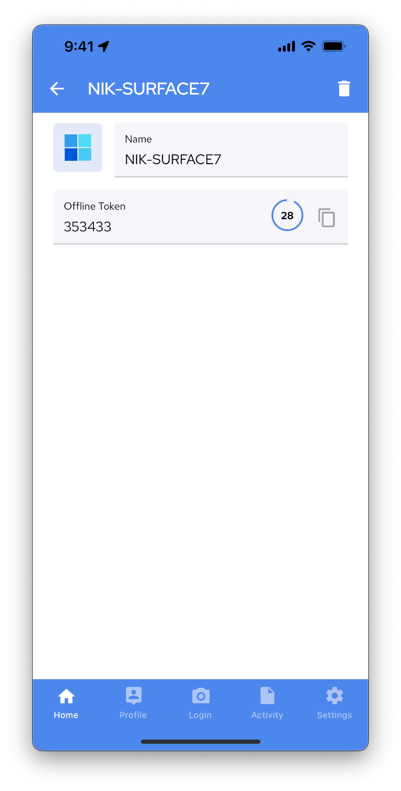

# How to Login with Passwordless MFA

## Online login with QR-code

You can login by scanning idemeum QR-code when both a workstation and mobile device are online. 

* Access your computer, and you will be presented with a QR code

* Scan the QR-code with idemeum mobile application
* Approve login with biometrics

## Offline login with one-time code (OTP)

When your computer is offline and not connect to Internet, we provide a convenient way to login with secure one-time code.

* Access your computer, and since you are offline you will be presented with username and one-time code screen

* Open idemeum mobile application and in the list of applications find the computer that you want to log into

* Click on `...` and you will be presented with one-time code that you can use to login into your workstaion

* Enter your `username` and `one-time code` into a login screen to access your computer
