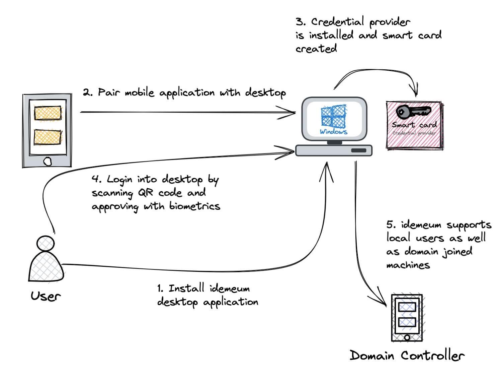

# Passwordless MFA for Workstations

<iframe src='https://www.youtube.com/embed/Cbfnvhjdtfg' frameborder='0' allowfullscreen></iframe>

## Overview

idemeum Passwordless MFA can be integrated with your Windows and MacOS workstations to protect login with secure unphishable MFA. We developed a desktop application that once installed on your workstation can be paired with idemeum mobile application. As a result, you can login into your workstation by simply scanning a QR-code and approving with biometrics. 

## Supported use cases

Here are the use cases that idemeum supports today. 

| OS | Type | Login type | Dedicated user| Shared users |
|:--- |:---|:---|:---|:---|
|Windows|[Local users](./desktop-mfa-local-users.html)|QR-code|Yes|Yes|
|Windows|[Domain-joined](./desktop-mfa-win-domain-joined.html)|QR-code|Yes|Yes|
|Windows|[Domain-joined](../rfid/rfid-configuration-guide.html)|RFID badge|No|Yes|

::: tip Supported scenarios

- **Type** - computer type, whether it is joined to Active Directory domain or used only with local accounts.
- **Login type** - defines how users access the workstation. Either using mobile app to scan the login QR-code, or leveraging RFID badge to access workstation. 
- **Dedicated user** - workstation is accessed only by the user who installaed desktop application and paired with mobile device. No other users can login into workstation. 
- **Shared users** - multiple users can access workstation with mobile device or RFID badge. 

:::

## Supported login methods

| Login method | Status| Description|
|:---|:---|:---|
| [Login with QR-code](./desktop-how-to-login.html#online-login-with-qr-code)| online | Login by scanning QR-code with idemeum app|
| [Login with OTP](./desktop-how-to-login.html#offline-login-with-one-time-code-otp) | offline | Login with one-time code that you retrieve from mobile app|

## How desktop MFA works

idemeum desktop client leverages [virtual smart cards](https://learn.microsoft.com/en-us/windows/security/identity-protection/virtual-smart-cards/virtual-smart-card-overview) (certificates) to enable passwordless login into workstations. When idemeum desktop app is installed on a computer, we create a [custom credential provider](https://learn.microsoft.com/en-us/windows/win32/secauthn/credential-providers-in-windows) that will be processing authentication requests and logging the users with passwordless MFA instead of username and password. idemeum supports both domain joined and non-domain joined machines with user experience being completely the same.

