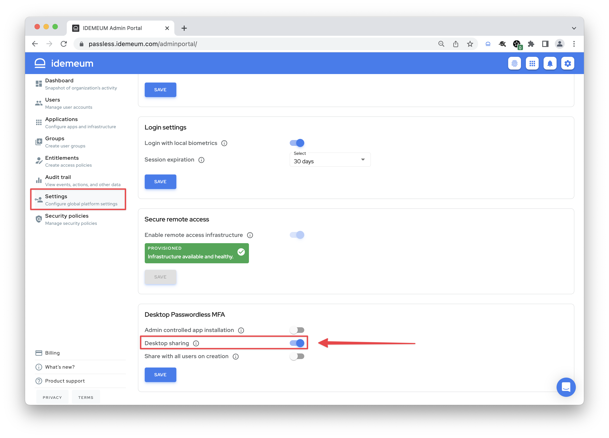
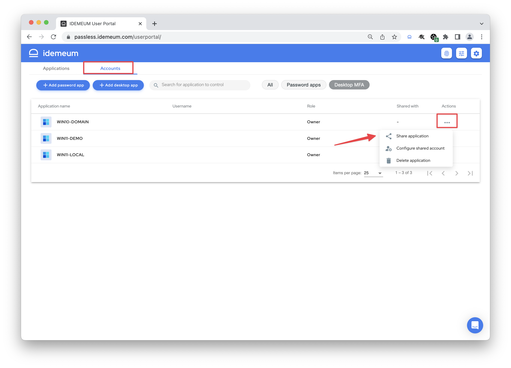
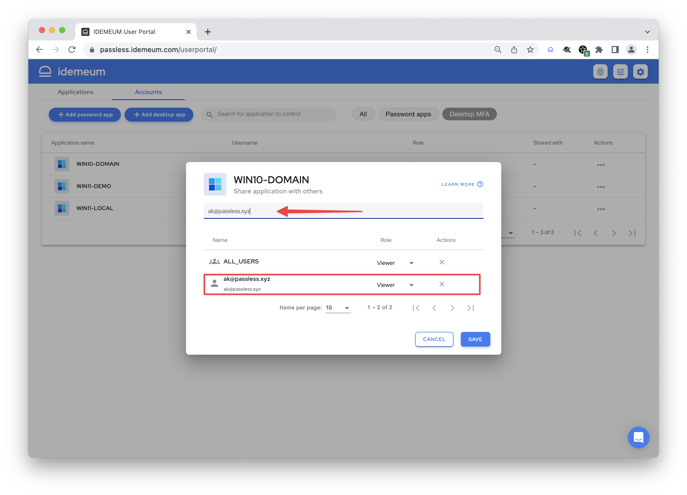
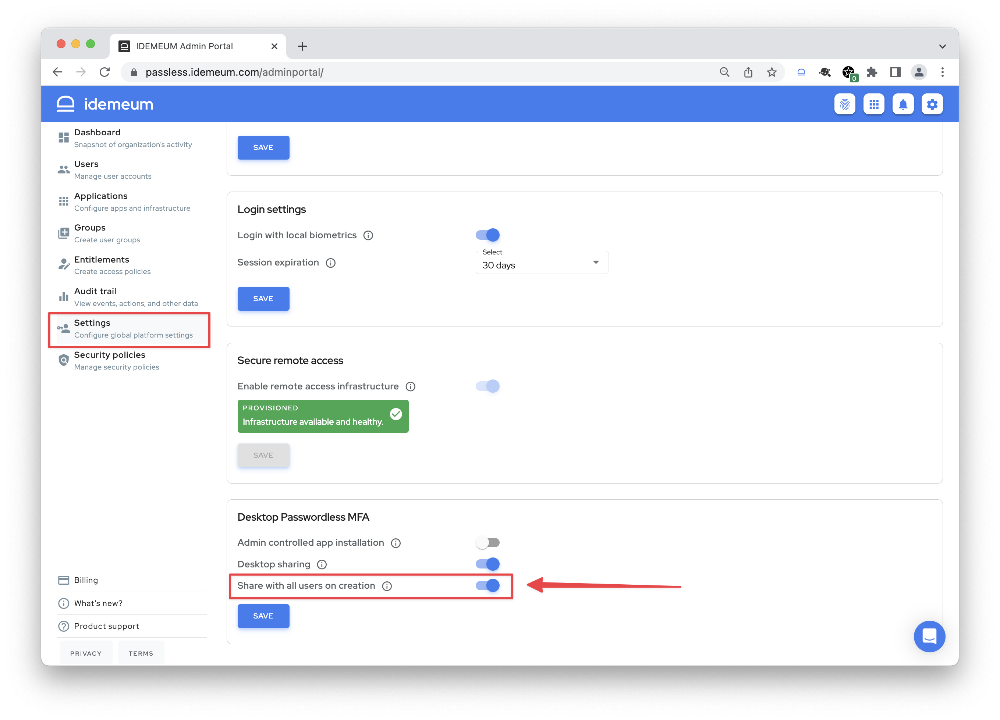

# Share Access to Workstations

## Overview

idemeum allows you to granularly control who can access workstations with Passwordless MFA. In some cases it is convenient to share a workstation with everyone. For example in hospitals most workstations are shared, and every clinician needs to access every workstation with an RFID badge. However, in other cases you need to limit access to workstation to only a few employees.

Today we support the following options:

1. [**Do not share workstation with anyone**](./desktop-mfa-share-access.html#do-not-share-workstation-with-anyone) - operate in dedicated user mode. Only the user who has installed desktop application will have access to workstation.
2. [**Allow users to share their workstations**](./desktop-mfa-share-access.html#allow-users-to-share-their-workstations) - in this mode the user who installed the desktop application can share the workstation with other users.
3. [**Automatically share with everyone**](./desktop-mfa-share-access.html#automatically-share-workstation-with-everyone) - when idemeum desktop application is installed, it will be automatically shared with `All users`. This option is enabled by default. 

::: danger Important note!

Sharing does not mean all users will access the workstaion under the same account. Sharing means that each user can login into a workstation with his or her account.

- If a domain-joined machine is shared, each user will be able to login into a workstation with his or her domain account. 
- If a machine with local accounts is shared, each user will be able to pair mobile app to his or her local user account and then access a workstation with Passwordless MFA.
- If a workstation is not shared, only user who installed desktop application will be able to access workstation.

:::

## Do not share workstation with anyone

In this option the workstation will operate in dedicated user mode. Only the user who installed idemeum desktop application will have access to workstation. 

- Access your idemeum `Admin portal`
- Navigate to `Settings` -> `Desktop Passwordless MFA`
- Disable both `Desktop sharing` and `Share with all users on creation` options to enable this mode

## Allow users to share their workstations

In this option the user who installed and paired an idemeum desktop application has the sharing control - he can share application with other users in the organization. This mode is only applicable to domain-joined workstations.

- Access your idemeum `Admin portal`
- Navigate to `Settings` -> `Desktop Passwordless MFA`
- Enable `Desktop sharing` option to allow users to share domain-joined workstations with other users.

To share the workstation with others the user will need to perform the following:

- Navigate to idemeum `User portal`
- Access `Accounts`
- Find the workstation to share, click on `...` and choose `Share application`

- Choose the users to share the application with from the dropdown menu
- Assign the `User` or `Owner` role based on your requirement

::: warning About roles

- **Viewer** - only able to login into workstation. Can not share, edit, or delete application.
- **Owner** - can login, share, edit, or delete application.
:::

## Automatically share workstation with everyone

idemeum allows you to automatically share a workstation with all users in your organization when  a desktop application is installed and paired. You can configure this in admin portal settings. 

::: warning Enabled by default

Automatic sharing with all users is enabled by default for your tenant. If this functuianlity does not meet your requirements, you can disable it in your idemeum admin portal.

:::

- Access your idemeum `Admin portal`
- Navigate to `Settings` -> `Desktop Passwordless MFA`
- Check or uncheck `Share with all users on creation` based on your requirements

When this option is enabled, new desktop app that is installed and paired will be shared with all user automatically. Users will not be able to delete and edit this application, but they will be able to access it with their own account by scanning a QR-code or tapping a badge. 
