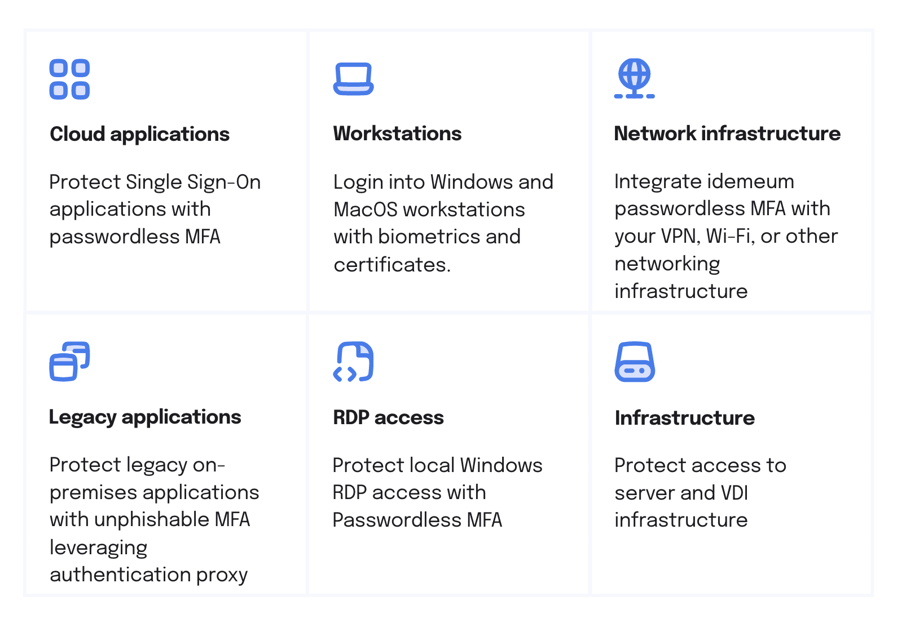

# Passwordless MFA Architecture

## Overview

Idemeum Passwordless MFA can be universally integrated with your existing company infrastructure to protect pretty much any resource access in your organization. Here is what we support today. 

### [Cloud Applications](./mfa-cloud-applications.html)

idemeum seamlessly integrates with your Single Sign-On identity provider to protect access to your cloud applications (SAML / OIDC) with passwordless MFA. Today we certified integration with all major Identity Providers such as Azure Active Directory, Okta, OneLogin, Google Workspace and more, and the integration is very simple and leverages federation identity protocols such as SAML. Check our [integrations portal](https://integrations.idemeum.com/) to learn more what Identity Providers we support today. 

if you do not have an existing [Single Sign-On Identity provider](../passwordless-single-sign-on-overview.html) and would like to leverage all-in-one solution, idemeum can offer fully-featured Single Sign-On so that you can integrate various cloud applications, and centralize access leveraging [SAML](https://en.wikipedia.org/wiki/Security_Assertion_Markup_Language) and [OpenID Connect](https://openid.net/connect/) protocols. 

### [Workstations](./desktop-mfa-overview.html)

idemeum can protect login into Windows and MacOS workstations with Passwordless MFA. idemeum offers a desktop application that when installed creates a credential provider to login users into workstation with smart cards and certificates instead of passwords. 

Today we support both domain-joined workstations, as well as workstations with local users. What is more, idemeum supports workstations with shared users allowing fast user switching and access.

### [Network Infrastructure](./mfa-network-infrastructure.html)

idemeum can integrate with your existing network infrastructure, including existing VPN, Wi-Fi, as well as networking devices in order to protect access to these resources with Passwordless MFA. Today we support integrations leveraging Radius and SAML protocols. What is more, for Radius integrations you do not need to deploy any servers, as idemeum offers [cloud-based Radius service](../cloud-radius-overview.html). 

### Legacy Applications

idemeum can also protect access to legacy self-hosted applications that do not support modern federation standards and leverage Active Directory or LDAP servers for user authentication. First and foremost, idemeum offers cloud proxy to enforce access to these applications with Passwordless MFA, and secondly idemeum provides authentication proxy that can remove the need for users to enter any passwords, as secure session-bound tokens will be generated for each login session. 

### RDP Access

idemeum can protect RDP access to local Windows servers and workstations with Passwordless MFA. If you access a Windows workstation with RDP protocol, instead of authenticating with username and password, you can leverage idemeum Passwordless MFA. 

### Infrastructure

idemeum can protect infrastructure and Virtual Desktops (VDI) access with Passwordless MFA. VDI access can be integrated leveraging SAML or Radius protocols, whereas remote access to SSH, RDP, databases can be protected leveraging idemeum cloud proxy service. 

### [Password Vault](./mfa-password-vault.html)

idemeum also offers cloud-based zero-knowledge password vault to store, share and autofill credentials across sites. We do not require a master password, and access to vault is protected by Passwordless MFA and biometrics. 