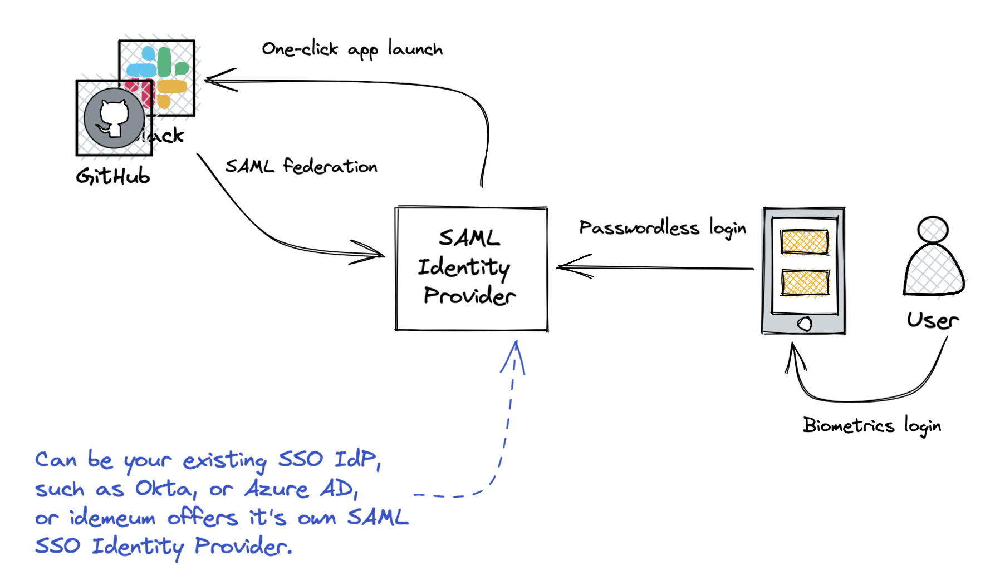

# Passwordless MFA for Cloud Applications

<iframe src='https://www.youtube.com/embed/AlKuTAYuc8k' frameborder='0' allowfullscreen></iframe>

## Overview

If you have an existing identity infrastructure and leverage a Single Sign-On Identity Provider such as Okta, Azure Active Directory, etc. you can simply plug in idemeum to enable passwordless access. 

For instance, if you already have Okta, and users access any application protected by Okta, instead of logging in with username and password, users are redirected to idemeum for authentication. Users open idemeum mobile application, scan login QR-code, approve with biometrics and can immediately access any Okta application.

## How it works

idemeum integrates with your existing Identity Provider using SAML federation protocol. All authentication requests will be redirected to idemeum, and once users authenticate with Passwordless MFA, idemeum will create a SAML assertion for the user and pass it back to your Identity Provider. 

## How to integrate

We document detailed steps for how to integrate idemeum with various Identity Providers. Check idemeum integration catalog to see what [Identity Providers](https://integrations.idemeum.com/tag/identity-provider-mfa/) are supported.

Here are the steps you can take to integrate idemeum with your existing Identity Provider. 

* **Step 1:** Install idemeum app and [create idemeum tenant](../quickstart.html#step-1-sign-up-for-idemeum-cloud-tenant) for your organization.
* **Step 2:** Configure user source for user onboarding and mapping between personal and corporate identity claims. Please, refer to [onboarding overview](../employee-onboarding.html) manual to understand why we need user source configured.
* **Step 3:** Navigate to [integrations portal](https://integrations.idemeum.com) and find the integration guide for your Identity Provider. We have detailed steps for how to set up SAML federation between idemeum and your IDP. 
	* Here are some major Identity Providers that idemeum can integrate with:
		* [Okta](https://integrations.idemeum.com/okta/)
		* [Azure AD](https://integrations.idemeum.com/azuread/)
		* [OneLogin](https://integrations.idemeum.com/onelogin/)
		* [Google Workspace](https://integrations.idemeum.com/google-workspace/)

## Questions?

If you have any questions, drop us a note at [support@idemeum.com](mailto:support@idemeum.com)