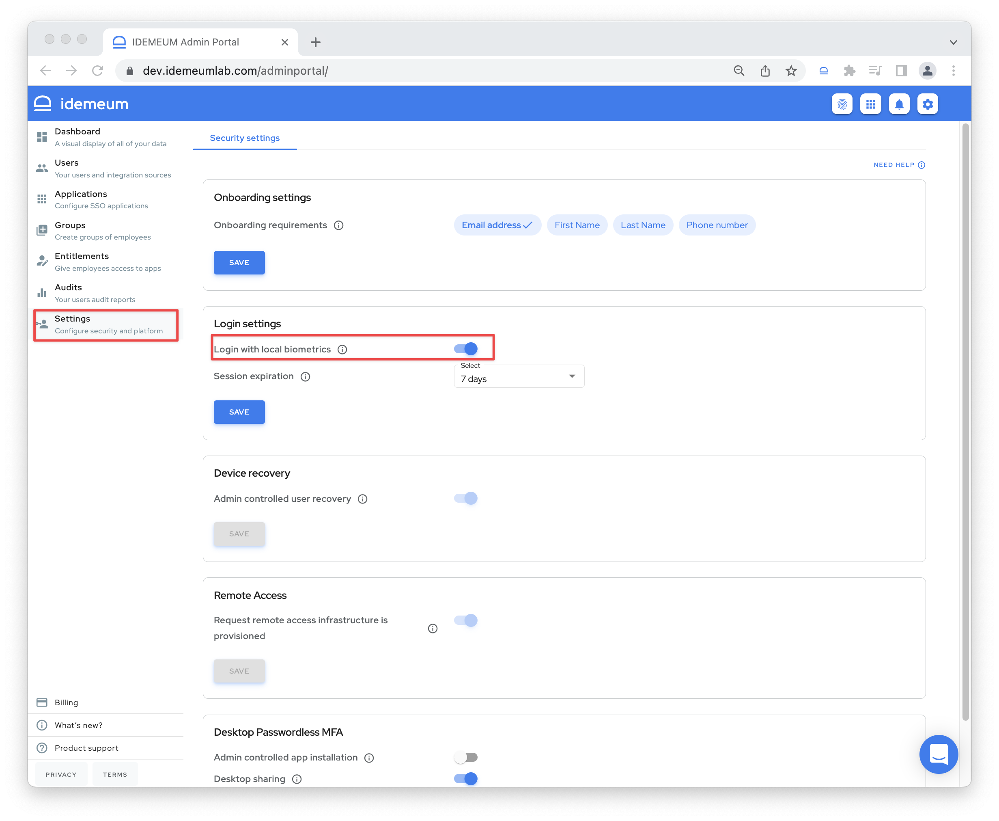
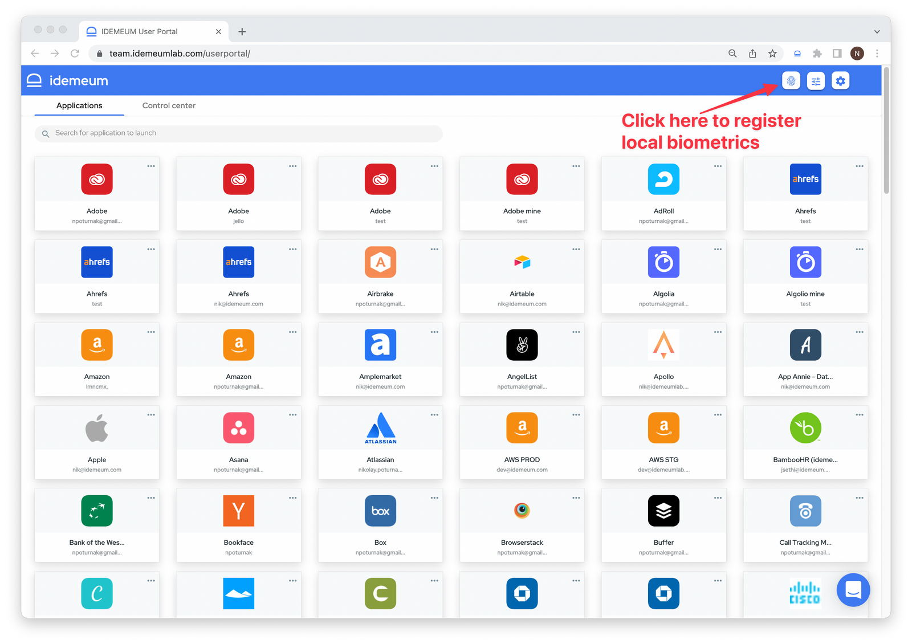
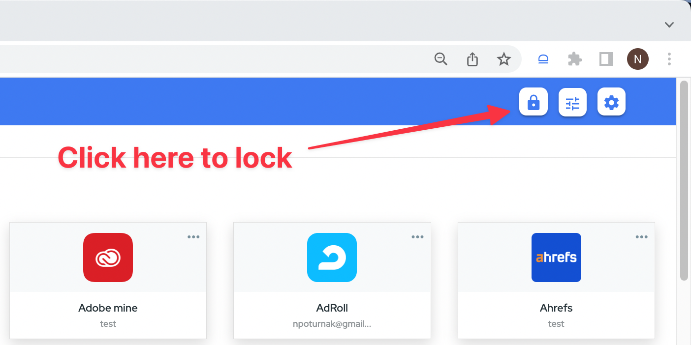
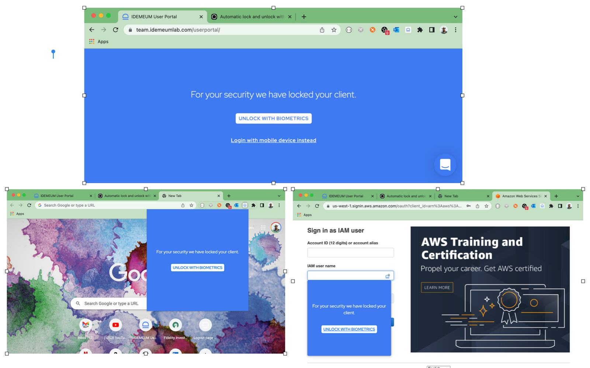
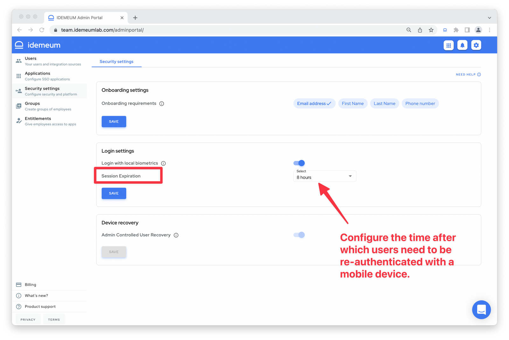
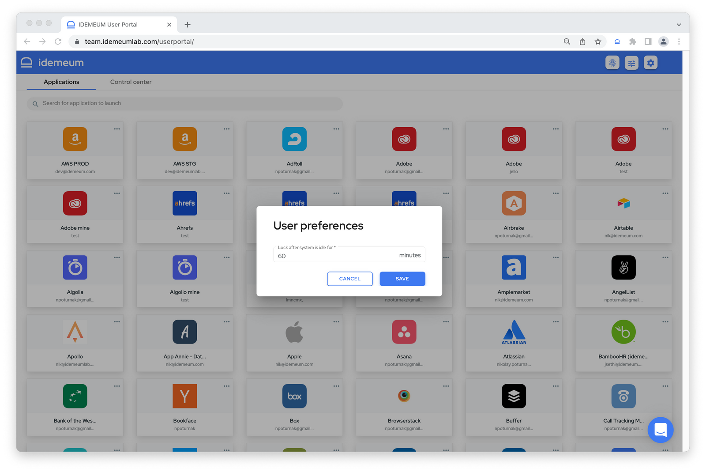

# Local biometrics

[[toc]]

## Overview
Oftentimes employees do not have a phone nearby or do not want to use mobile device every single time they access applications. What is more, most laptops today offer what is called **platform biometric authenticators**. For example an Apple MacBook will have a local fingerprint reader that can be used to authenticate employees.

That is why idemeum offers an option for employees to use these platform authenticators, which we call local biometric sensors to access applications and company resources without passwords from laptops, tablets, and desktop devices.

::: tip Local biometrics technology

Technology that we are leveraging for local biometric authentication is called [Webauthn / FIDO2](https://fidoalliance.org/fido2/fido2-web-authentication-webauthn/). Local biometrics are offered for browser flows and are dependent on your browser support of FIDO2. Even though most browsers today support Webauthn there are still some niche browsers that need to extend support for this technology.

You can check Webauthn browser support [here](https://caniuse.com/?search=webauthn).

:::

## How to enable local biometrics
Before employees can use the feature, administrators need to navigate to `Admin Portal` > `Settings` > `Login Settings` > `Login with local biometrics` and enable the feature.

Once local biometrics are enabled employees will be able to register Webauthn credentials from supported browsers and perform logins with local biometrics.

## How to use local biometrics
Once local biometrics login is enabled and user's browser supports Webauthn, users will need to go through 2 steps to start using this feature.

#### 1. Register local biometric credential
User will need to navigate to idemeum application portal and click on the `biometric icon` at the top of the menu. Once clicked, the system will prompt the user to scan biometric sensor and will confirm registration upon success. 

#### 2. Lock / unlock portal with local biometrics
To lock the user portal users will need to click on the `lock` button at the top of the menu. To unlock the portal users will need to click `Unlock with biometrics` and provide the biometric scan to access applications.

## User experience

#### Register biometrics

If user's browser supports Webauthn/FIDO, then user will be able to register her biometrics as show in the picture.

#### Lock user portal

Users can manually lock client by clicking lock button. This button is only visible if biometrics are registered.

#### Unlock user portal

Some of the following screenshots demonstrate locked User Portal & Extension screens.

To unlock the client, user can click on Unlock with biometrics button, followed by biometric authentication.

## Local biometrics demo

<iframe src="https://www.loom.com/embed/ddaf8aff68a4462a9e5c3cbd9cc0e258" frameborder="0" webkitallowfullscreen mozallowfullscreen allowfullscreen style="position: absolute; top: 0; left: 0; width: 100%; height: 100%;"></iframe>

## Session management

Local biometrics provide added security as well as user convenience. When local biometrics are enabled, we recommend to extend the time when users are required to re-authenticate with a mobile device.

For example, default time is set to 8 hours. Meaning once users log in and 8 hours after that they will need to re-authenticate with a mobile device, even if they are using local biometrics to lock and unlock user portal.

We recommend extending this time to a week or even longer as this will not compromise security and will add user convenience, as users will not need to use phone every time.

## Idle detection

We take security even further by detecting if user is using a device / browser or not. We call it **idle detection**. idemeum's ability to detect user activity (mouse / keyboard activity) depends upon underlying platform (Browser, Operating System, Preferences etc.), hence actual experience can vary for different platforms.

If we detect that user is idle, then idemeum will automatically lock the user portal with local biometrics. By default idle timeout is set to 60 minutes. This interval is configurable, and can be set by the user.

Here is how to configure it. First access **user portal settings**.

Then you can configure interval.

