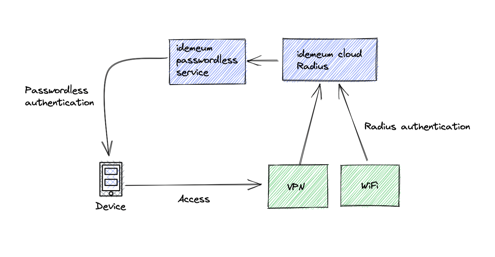
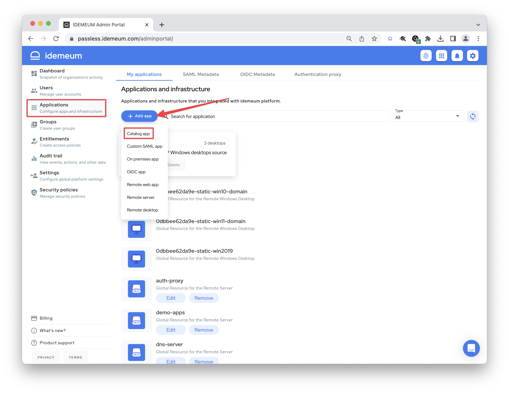
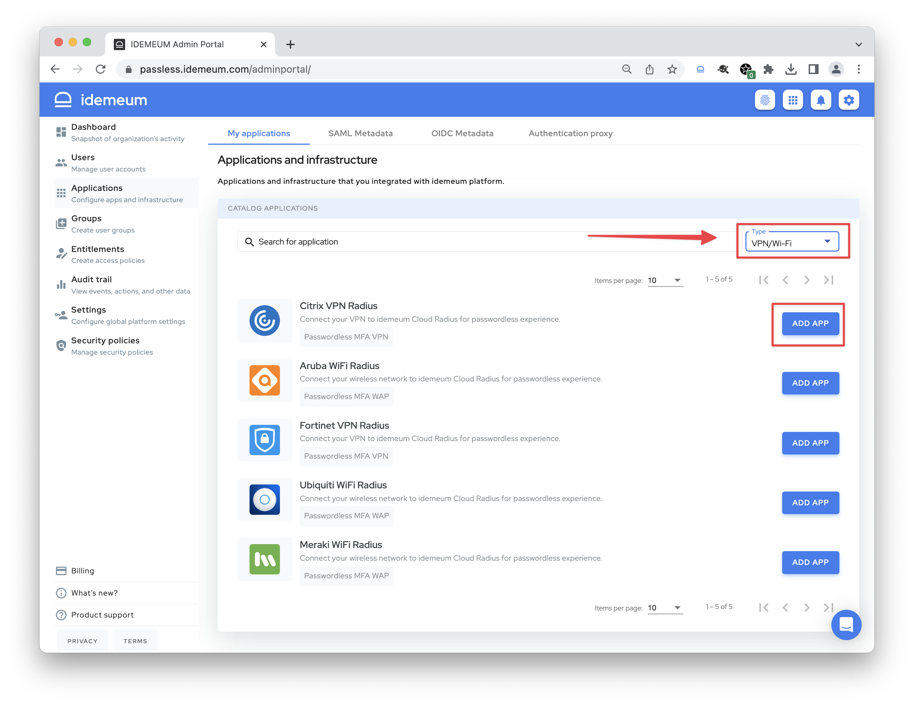
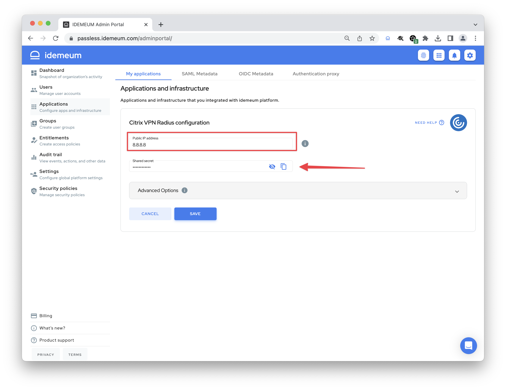
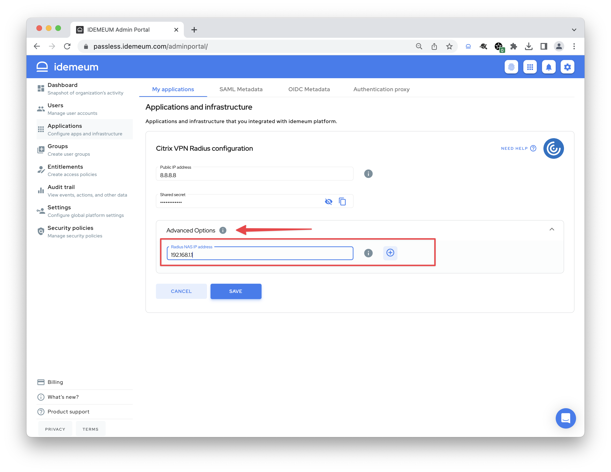
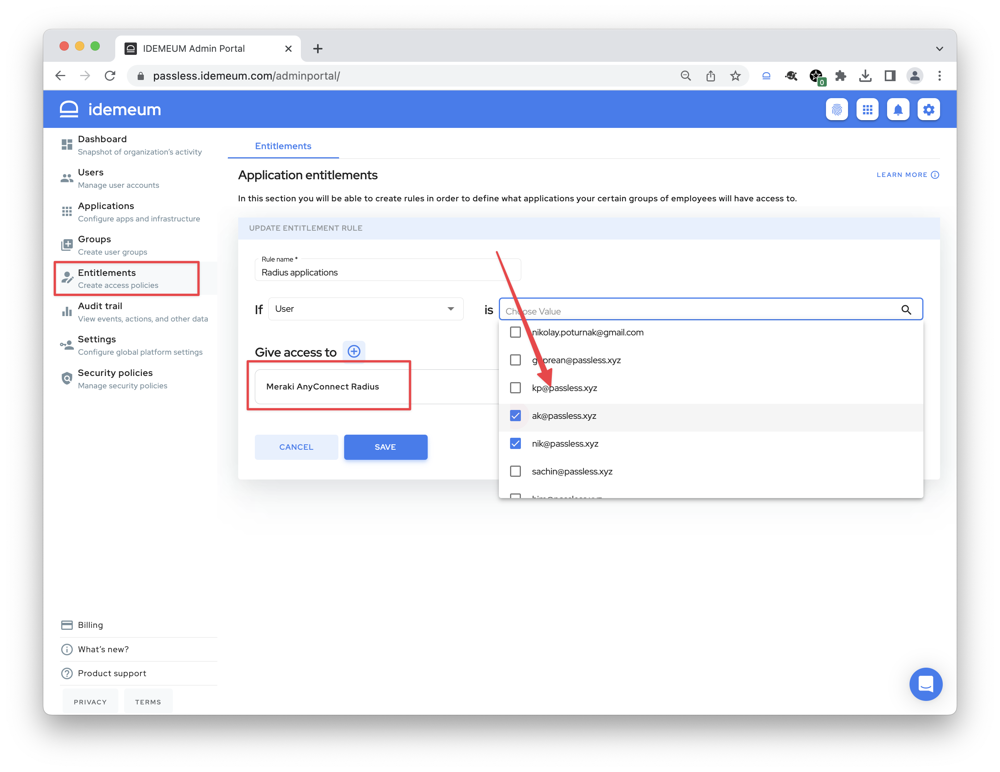

# Passwordless MFA for Network Infrastructure

<iframe src='https://www.youtube.com/embed/Q0V94hbUOh0' frameborder='0' allowfullscreen></iframe>

## Overview

idemeum can integrate with your existing network infrastrcuture, such as VPN, Wi-Fi, or networking devcies, and protect employee access with Passwordless MFA. There is no need to use passwords and one-time codes anymore, employees simply enter email address and approve login with a mobile device and biometrics. 

[[toc]]

## How it works

One option is to integrate your VPN/Wi-Fi with idemeum leveraging [SAML](https://en.wikipedia.org/wiki/Security_Assertion_Markup_Language) federation protocol. Upon accessing VPN or Wi-Fi the authentciation request will be forwarded to idemeum, and users will need to scan the QR-code with idemeum mobile device to login. 

The other option is to leverage idemeum[ Cloud Radius](https://en.wikipedia.org/wiki/RADIUS) infrastructure. You do not need to deploy any Radius servers in your environment, as we will handle that for you. User will only need to enter their email address in the Radius authentication screen, and then approve login with mobile device biometrics.

## Integration guide for Radius

### Configure idemeum

* Navigate to your idemeum `Admin portal` and choose `Applications` section
* Click `Add app` and then choose `Catalog app`

* In the filter section on the right choose `VPN/Wi-Fi` and the click `Add app` for the Radius application that you want to configure
::: warning Request application
If an application integration for your infrastructure is missing, reach out to [support@idemeum.com](mailto:support@idemeum.com) and we will be happy to add a new integration for you.
:::

- Now you need to specify the IP address from which the Radius requests will be coming to idemeum cloud. In other words, this is the external IP address of your router WAN interface where the requests will come from. You can specify specific IP address (i.e `8.8.8.8`) or a CIDR block (i.e. `8.8.8.0/24`).
- Once you click `Save` the application will be created, Radius server configured for your tenant, and you will be given a `secret` that you will use for your infrastructure configuration.

- **Optional step** - if you have multiple Radius applications configured (say one for VPN and one for Wi-Fi), for each application you need to specify the IP address of your Radius client that will be sending Radius requests. This way in the idemeum cloud we will differentiate between requests coming for different applications. Expand `Advanced options` and enter the `Radius NAS IP address` and hit `Save`.

- As a last step you need to give users access to your newly-configured Radius application. Navigate to `Entitlements`, click `Add rule` and create a rule for users or groups who will need to access this Radius application. 

### Configure your infrastructure

Setting up integration on your side will be dependent on the product you are using. We document all currently supported integrations on our [integrations portal](https://integrations.idemeum.com/). If an integration is missing for your product, reach out to [support@idemeum.com](mailto:support@idemeum.com).

Typically you will need:

* **Shared secret** that you generated when configuring Radius app in idemeum
* **Radius IP address** so clients can reach it

🔗 idemeum Cloud Radius IP addresses -[ Cloud Radius Overview](../cloud-radius-overview.html)

