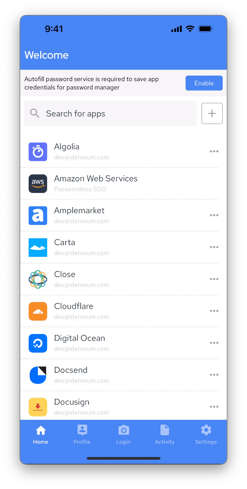
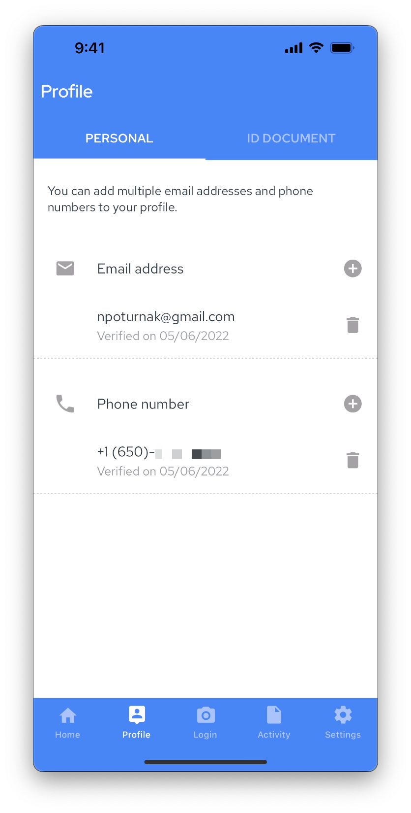
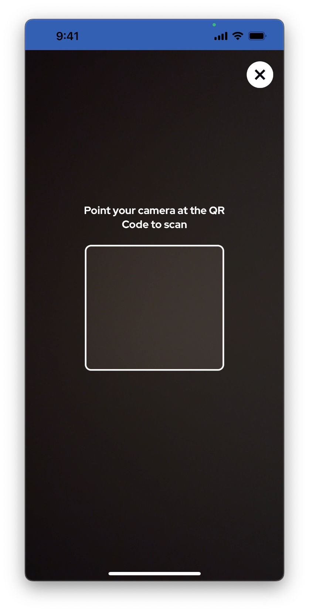
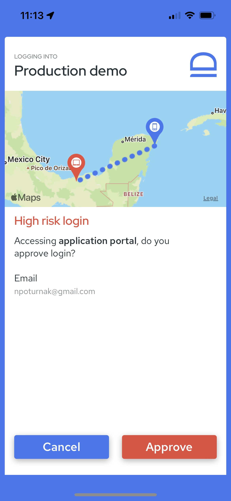
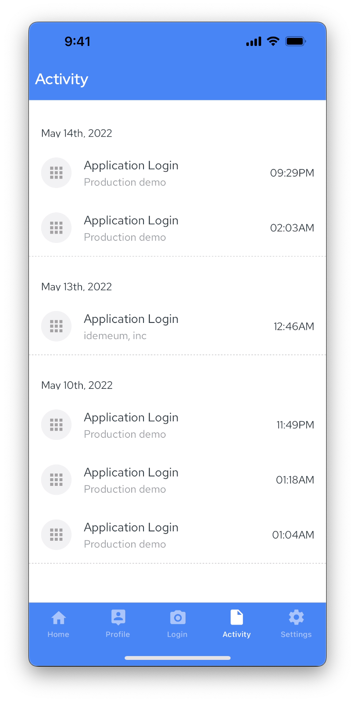
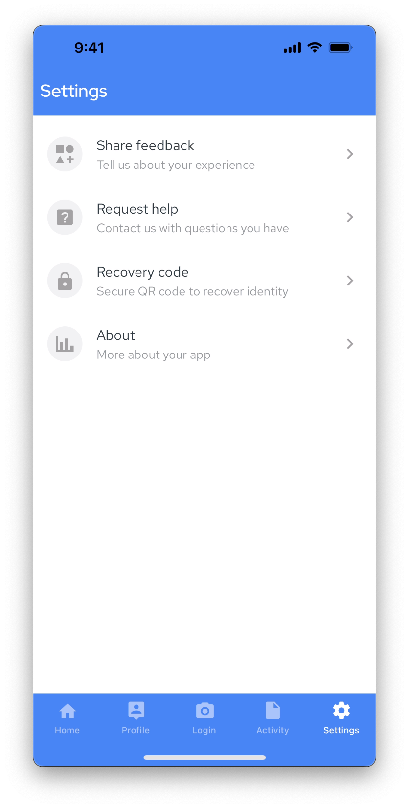

# Mobile UI overview

[[toc]]

## Home

Home screen is where you can immediately access your applications with a simple click. Great thing about idemeum is that it aggregates all Single Sign-On (SSO) and password-based applications in a single place. If you click on SSO application, it will launch seamlessly without any passwords. If you launch password based application, it will launch, password will be auto-filled, and you will be logged in.

## Profile

In profile section you can add your verified digital identity claims. These claims will be used to onboard you into your organization. idemeum supports verifying the following personal claims:

1. Email address
2. Phone number
3. Government issued ID

## Login

Clicking on `Login` will open the camera to scan the QR code.

::: tip Login with OTP

On Android devices `Login` screen also shows an option to login with one-time code OTP. You can learn more about it [here](./login-experience.html#_4-login-with-one-time-code-otp). 

:::

Once you scan a valid QR code you will be redirected to login approval screen. On that screen you will be able to approve login and perform biometric scan.

::: tip Geolocation security

You will also be shown a map with location of your mobile and desktop devices. In case the devices are too far apart, it might be a fraudulent login that you need to carefully assess before approving. You can learn more about geolocation security here. 

:::

## Activity

Activity is a section where you will see information about various application activity, such as adding a new email address, or logging into an application.

## Settings

In the settings section you will be able to set up your application security settings and get information about application version and your decentralized identifier (DID).

* **Share feedback**- you will be able to share suggestions and requests with idemeum team
* **Request help** - this section will present options for how to contact idemeum team
* **Recovery code**- in case your device is lost or stolen, you will be able to recover your data only with recovery code. In this section you will have an option to print your recovery QR code or save it to cloud storage. You can learn more about device recovery [here](./recovery-overview.html).
* **About** - information about your app: version, your unique identified (DID), and where the crypto keys are stored.

