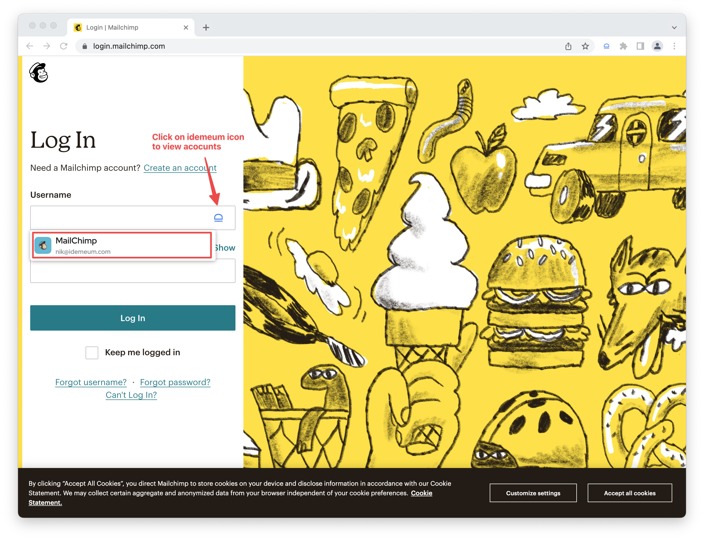
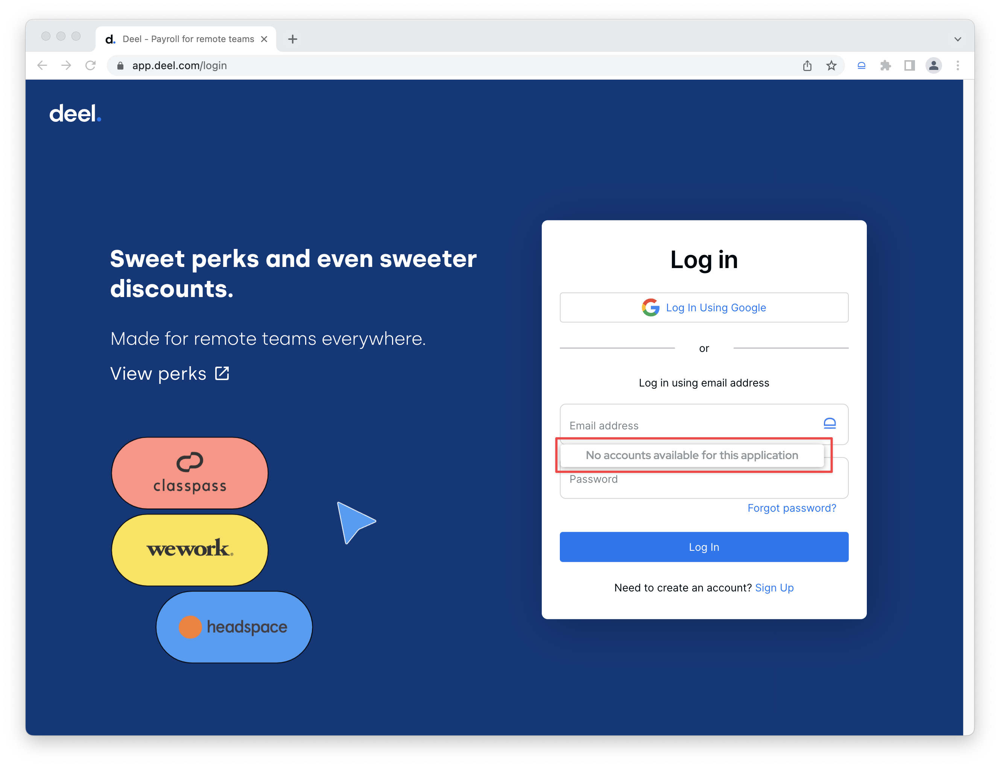
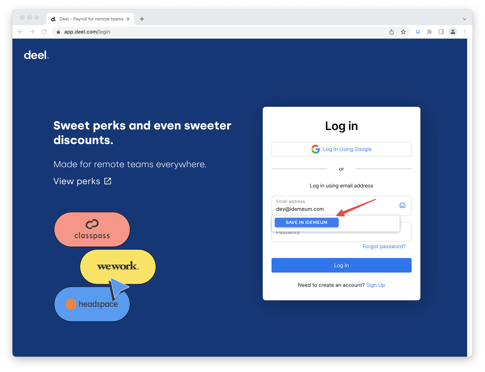
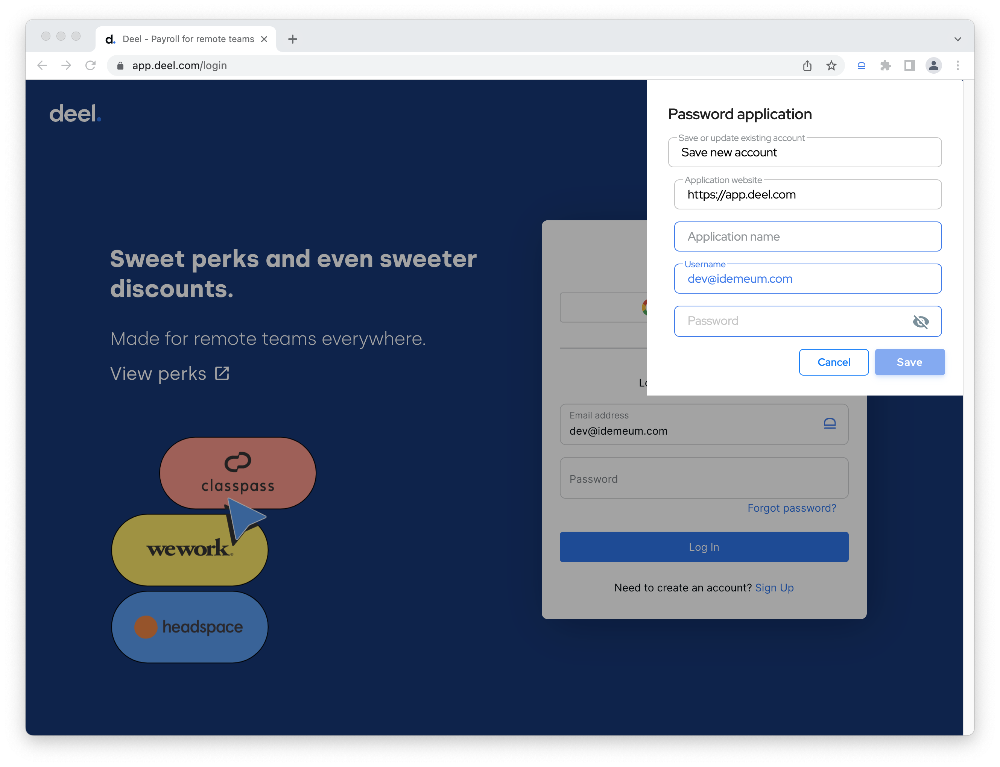

# Password auto capture

## Overview

When you access applications that you do not have accounts for, idemeum can automatically save your login information, so that next time you do not have to type credentials again. 

Today auto capture works only on desktop browsers with idemeum extension installed. 

## Desktop browser auto capture

* Navigate to any web application in your browser and access login page
* If there are existing account, you can view them by clicking on idemeum icon in the `username` or `password` field

* If there are no accounts available, idemeum will display `No accounts available for this application`

* Once you start typing the new username, idemeum will display a button to save credentials in your password vault

* Once you click save, idemeum will display a menu to save your credentials

* If you are saving a new account and no email address is associated with this application, idemeum will create a new record for this application in a password vault.
* If you already have an account with the same email, but want to provide a new password, idemeum will update existing account with a new password. 
* Type an `Application name`
* Make sure `Username` and `Password` are correct
* Save application in idemeum
* You can now autofill credentials for the application