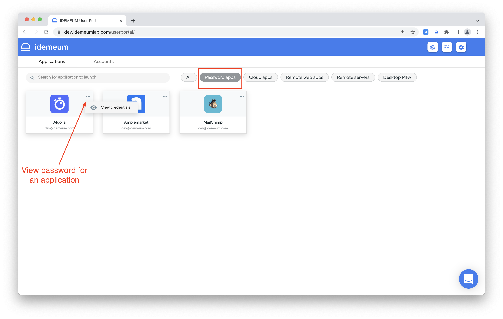
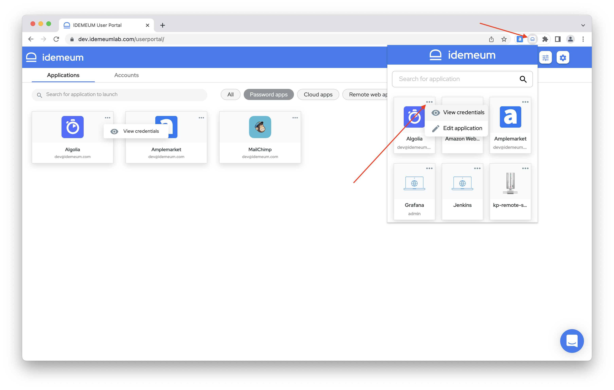
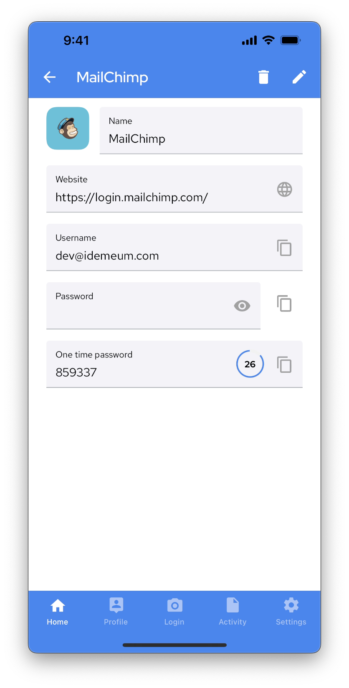

# Password Vault overview

## Overview
::: tip What is Password Vault?
Password vault is a secure place to store your passwords, share them with other employees, and safely fill credentials to cloud or on-premises web applications.
:::

idemeum Password Vault is hosted in the cloud, but it is protected by zero-knowledge encryption. What that means is that we do not see your passwords. And if our cloud gets compromised, your passwords will never be exposed to attackers. 

::: warning About zero-knowledge encryption 
When you install idemeum mobile application, a set ot crypto keys is created and persisted in your mobile device's hardware backed storage. Then these keys are used to encrypt your credentials in the cloud. All key management and encryption happens on your device or browser, therefore we do not see your private encryption keys of passwords.

You can learn more about crypto in our [security](./security-whitepaper.html) section.
:::

<iframe src='https://www.youtube.com/embed/udsbzdEnhkg' frameborder='0' allowfullscreen></iframe>

## Accessing Password Vault
There are several ways to access your passwords in idemeum Password Vault. 

### Browser portal
Navigate to your idemeum portal at `company.idemeum.com` and you will have access to all company resources including password applications. 

### Browser extension
In order to auto-fill credentials to cloud and on-premises applications, you will need to install idemeum browser extension. Extension allows you to access any company resource as well, including password applications.

### Mobile application
Mobile application offers access to password vault as well.

