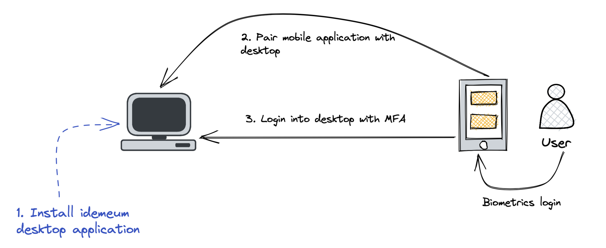

# Passwordless MFA for desktop
[[toc]]

## Overview

idemeum also offers a desktop integration to allow users login into desktops without passwords leveraging Passwordless MFA. As a first step, users install idemeum desktop application that will register as a credential provider. Once idemeum mobile app is paired with desktop, users are able to use mobile biometrics to login into desktop computers.

## Passwordless MFA for Windows

::: warning Early access

This feature is in early access.

Please, contact us for more details at [support@idemeum.com](mailto:support@idemeum.com)

:::

<iframe src='https://www.youtube.com/embed/tXIVEv88kXQ' frameborder='0' allowfullscreen></iframe>
