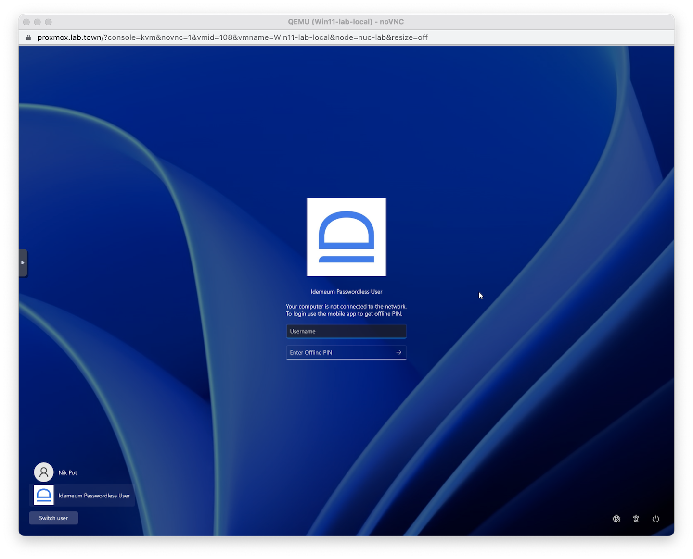
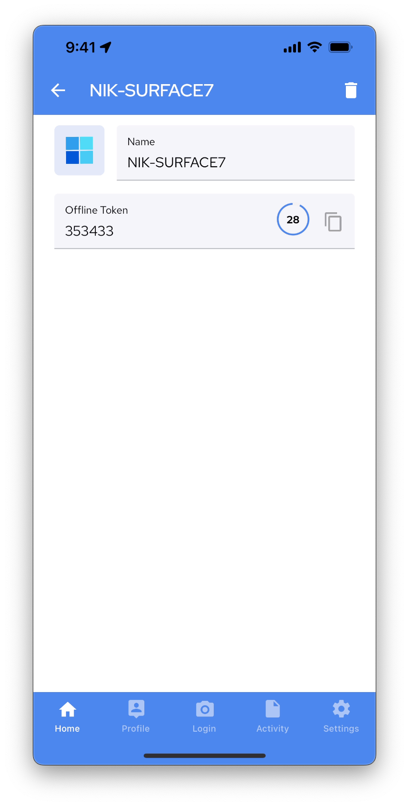

# Passwordless MFA for Windows
[[toc]]

## Overview
idemeum Passwordless MFA can be integrated with Windows desktops in order to offer passwordless login.

We developed a Windows desktop application that once installed on your laptop or desktop can be paired with idemeum Passwordless MFA mobile app. As a result, you can login into your Windows desktop by simply scanning a QR code and approving with biometrics. 

<iframe src='https://www.youtube.com/embed/tXIVEv88kXQ' frameborder='0' allowfullscreen></iframe>

## How it works
idemeum leverages [virtual smart cards](https://learn.microsoft.com/en-us/windows/security/identity-protection/virtual-smart-cards/virtual-smart-card-overview) (certificates) to enable passwordless login into Windows machines. When idemeum desktop app is installed on a Windows machine, we create a [custom credential provider](https://learn.microsoft.com/en-us/windows/win32/secauthn/credential-providers-in-windows) that will be processing authentication requests and logging the users with passwordless MFA instead of username and password. idemeum supports both domain joined and non-domain joined machines with user experience being completely the same.

Logging into a Windows machine becomes as simple as scanning a QR-code with idemeum mobile app and approving with biometrics. 

### Windows OS support

We support the following operating systems. 

| Operating system| Support|
| ------------- |:-------------:|
| Windows 10 | Yes |
| Windows 11 | Yes |

## How to login

Today there are two ways to login into a Windows machine, depending on whether a computer is connect to Internet. 

### Online mode with QR-code
When your computer is connected to Internet, passwordless login with idemeum becomes very seamless.

* Access your computer, and you will be presented with a QR code

* Scan the QR-code with idemeum mobile application
* Approve login with biometrics

### Offline mode with one-time code
When your computer is offline and not connect to Internet, we provide a convenient way to login with secure one-time code.

* Access your computer, and since you are offline you will be presented with username and one-time code screen

* Open idemeum mobile application and in the list of applications find the computer that you want to log into

* Click on `...` and you will be presented with one-time code that you can use to login into Windows desktop

* Enter your `username` and `one-time code` into windows login screen to access your computer

## How to install

### Non domain joined machines

For non-domain joined machines there are no pre-requisites. Just instal the latest idemeum desktop application for windows, pair with your mobile device and you are good to go. Below we provide the detailed steps to install and configure idemeum desktop application for windows. 

[Installation guide for non domain joined machines](https://integrations.idemeum.com/windows-installation-guide-for-non-domain-joined-machine/)

### Domain joined machines

::: warning Configure Active Directory Certificate Services

Before installing idemeum desktop client on domain joined devices, please perform one-time configuration for Active Directory Certificate Services. 

We provide detailed steps here - [AD CS configuration](https://integrations.idemeum.com/windows-desktop-login-mfa-adcs-configuration/)

:::

Once you completed Active Directory set up, please, proceed with the desktop application installation. 

[Installation guide for domain joned machines](https://integrations.idemeum.com/windows-installation-guide-for-domain-joined/)
