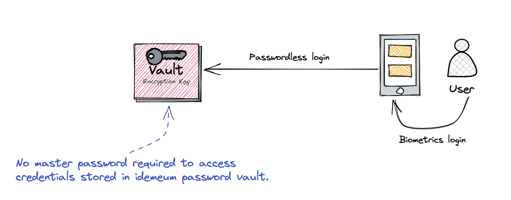

# Passwordless MFA for vault

## Overview

Typically accessing a password manager / password vault requires memorizing and typing a master password, which is used to generate keys to unlock the vault. idemeum transforms this process and completely eliminates the need to have a master password. Instead, idemeum allows to access credentials vault with biometrics and Passwordless MFA instead.

## How to set up

Every idemeum license comes with Password Vault included by default. Once you have your idemeum tenant set up, you can start inviting users, who in turn will be able to use password vault, create applications, and share credentails with other employees. 

* **Step 1:** Install idemeum app and [create idemeum tenant](./self-service-onboarding.html) for your organization.
* **Step 2:** Configure user source for user onboarding and mapping between personal and corporate identity claims. Please, refer to [onboarding overview](/employee-onboarding.html) and [user source](/integration-with-hr-system.html) configuration manuals to understand why we need user source configured.
* **Step 3**: Start creating password applications and sharing credentials with other user leveraging password vault.