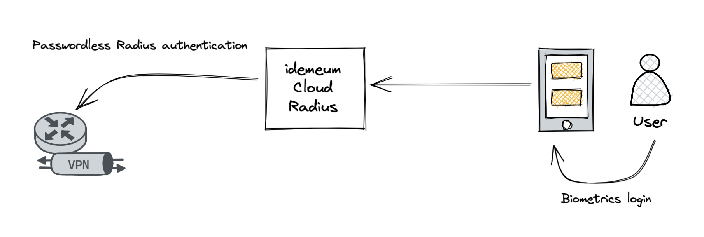

# Passwordless MFA for Single Sign-On

## Overview

idemeum offers fully featured [Cloud Radius](./cloud-radius-overview.html) instance for each idemeum tenant. Therefore, network infrastructure such as VPN, Wi-Fi, or network devices can be easily integrated with Radius instance to perform passwordless access as well. 

When accessing resources integrated with idemeum [Cloud Radius](./cloud-radius-overview.html), users do not need to enter passwords. All they need to do is to type an email, and idemeum mobile app will receive a login request notification. 

<iframe src='https://www.youtube.com/embed/Q0V94hbUOh0' frameborder='0' allowfullscreen></iframe>

## How to integrate

Integrating with idemeum is very simple, and we document everything in detail. Here are the steps you can take to integrate idemeum with your Radius clients. 

* **Step 1:** Install idemeum app and [create idemeum tenant](./self-service-onboarding.html) for your organization.
* **Step 2:** Configure user source for user onboarding and mapping between personal and corporate identity claims. Please, refer to [onboarding overview](./employee-onboarding.html) and [user source](./integration-with-hr-system.html) configuration manuals to understand why we need user source configured.
* **Step 3:** Set up idemeum Cloud Radius instance by following this [guide](./how-to-set-up-radius-integration.html).
* **Step 4:** Navigate to [integrations portal](https://integrations.idemeum.com) and find the integration guide for your VPN / Wi-Fi, or any other integration that you want to connect to Cloud Radius instance. 

::: tip Need help?

Let us know if you need any help in [contact us](https://idemeum.com/contact/) or email at [support@idemeum.com](mailto:support@idemeum.com)

:::