# idemeum quickstart :rocket:
Welcome!

Follow these steps to create your platform to manage access to applications and infrastructure.

[[toc]]

## Step 1: Sign up for idemeum cloud tenant
idemeum is passwordless, therefore you first need to set up idemeum mobile application so that you can access everything with biometrics.

* [Download](./downloads) idemeum mobile application from [IOS App Store](https://apps.apple.com/us/app/idemeum/id1552180449) or [Android Play Store](https://play.google.com/store/apps/details?id=com.idemeum.dvmi).
* Set up idemeum application and **verify your business email address**. We will use your business domain name to create a cloud portal for you in the form `your_domain.idemeum.com`.
* Navigate to [https://idemeum.com/try](https://idemeum.com/try), choose the [license](https://idemeum.com/pricing) that you want to try, and after that scan idemeum QR-code with your idemeum application.

::: tip We will create your idemeum cloud tenant

As a result we will create your personal company portal in the form of `your_domain.idemeum.com`

:::

## Step 2: Onboard your first users

* Navigate to `Users` -> `User source` and choose `local` directory

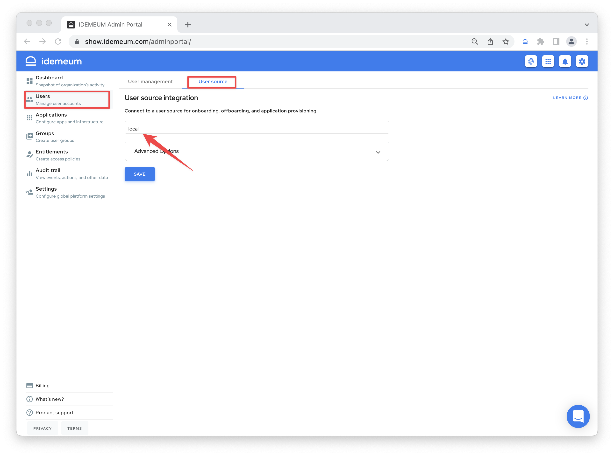

* Now you can create and manage your users in idemeum. Click on `Users` -> `Add user`.
* Enter `First name`, `Last name`, `Corporate email` that you want to assign to this user, and `Personal email address`.

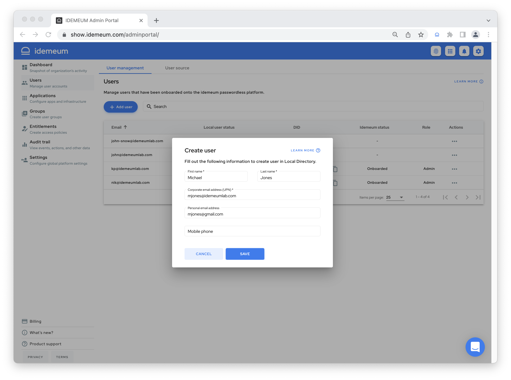

* We will send a welcome email to this user with instructions of how to onboard.
* As a result, this user will be able to install idemeum application, verify company or personal email address, navigate to your company portal and onboard into passwordless access. 

::: tip More about user onboarding

You can learn more about user [onboarding](./employee-onboarding.html). 

:::

## Step 3: Start using password vault

::: warning Install idemeum browser extension

Password vault requires you to use idemeum browser extension. 

* [Download](./downloads) extension for your browser
* Make sure you disable default browser autofill

:::

* Switch to a `User portal` by clicking on button at the top right. This is where you will be able to switch back and forth between user and admin portals.

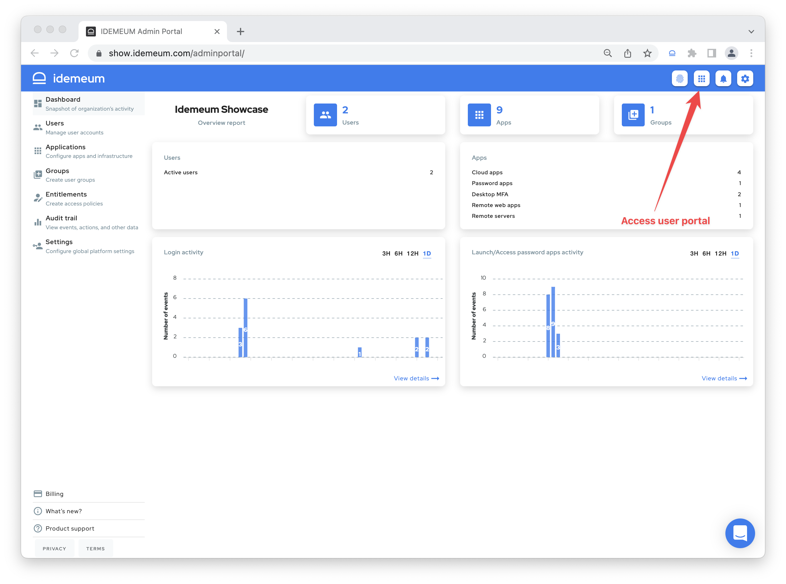

* Click `Accounts` -> `Add password app`

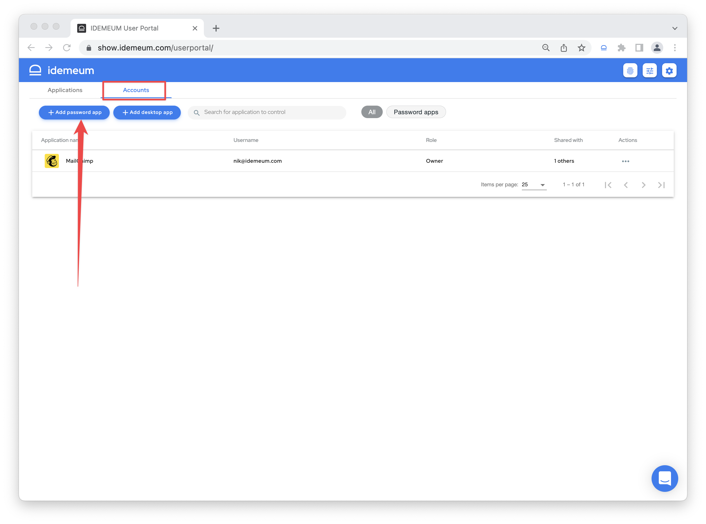

* You can now create any password application. Start by typing a name to choose from pre-configured applications, or create any application you like.
* Enter `website`, `username`, and `password`. You can also set up `TOTP` codes if required.

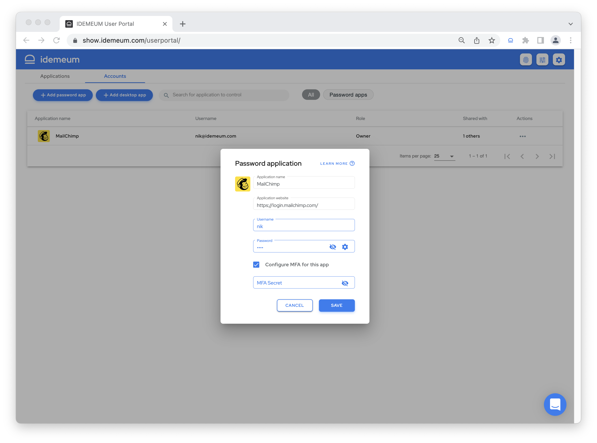

* You can now launch this application from your catalog, browser extension, or mobile application. New tab will open and credentials will be automatically filled. 

::: tip More about password vault

You can learn more about [Password Vault](./password-vault-overview.html). 

:::

## Step 4: Integrate SAML Single Sign-On applications
idemeum supports integration with SAML SSO applications. We maintain a detailed [integrations catalog](https://integrations.idemeum.com) where we provide instructions on how to integrate most common applications.

* Navigate to `Applications` and search for SAML SSO application to integrate. Then click `Add app` button.

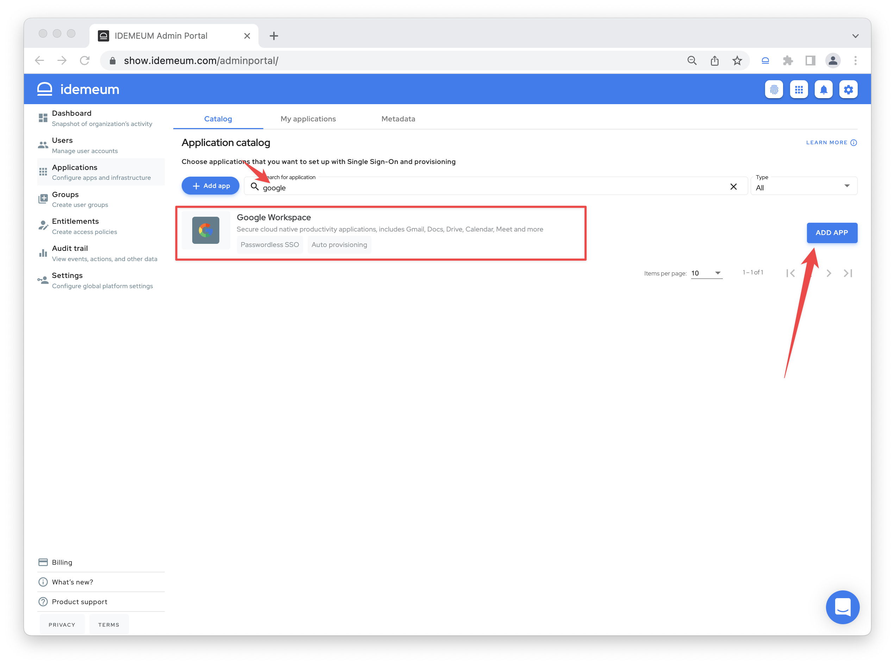

* You will now be able to go through tabs and set up integration with idemeum, including Single Sign-On and provisioning. If you need any help, click on `Learn more` and you will be redirected to detailed integration guide.

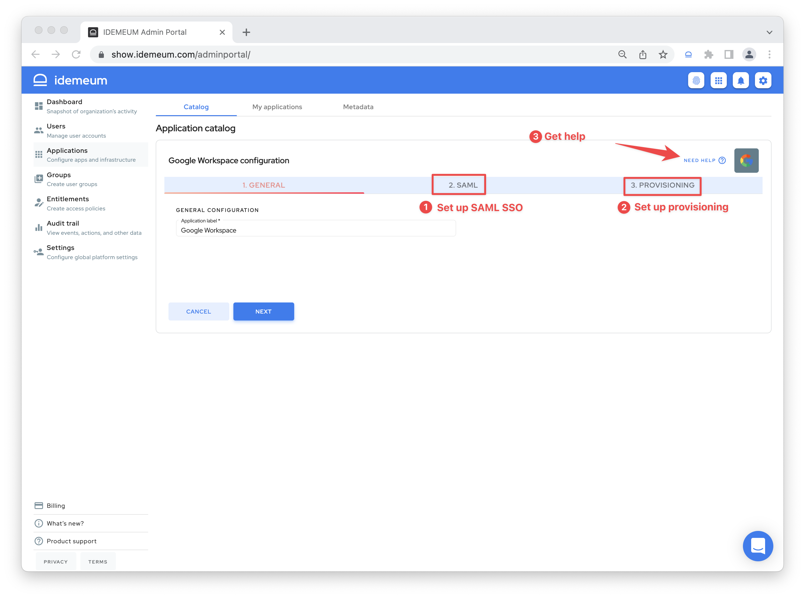

::: tip More about SAML Single Sign-On

You can learn more about user idemeum [Passwordless Single Sign-On](./passwordless-single-sign-on-overview.html). 

:::

## Step 5: Integrate remote applications and servers
You can also integrate your on-premises applications and servers with idemeum without publicly exposing these resources. As a result you can access your infrastructure without passwords. 

* Navigate to `Applications` -> `Add app` and chose what to add - **on-premises web application** or **server**

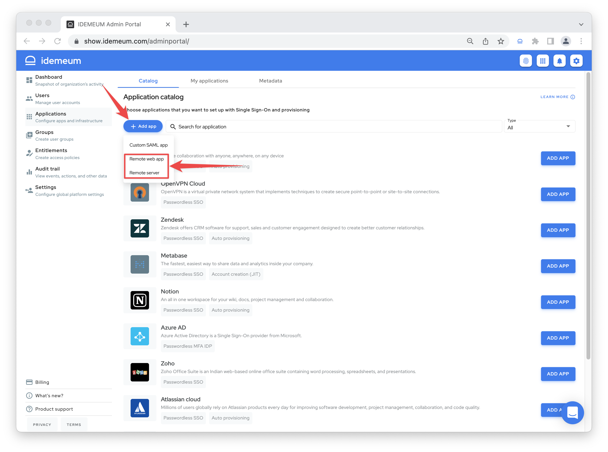

* Provide required information such as local URL to access on-premises web app or local server name
* Install idemeum agent to access remote web app or server without exposing any ports

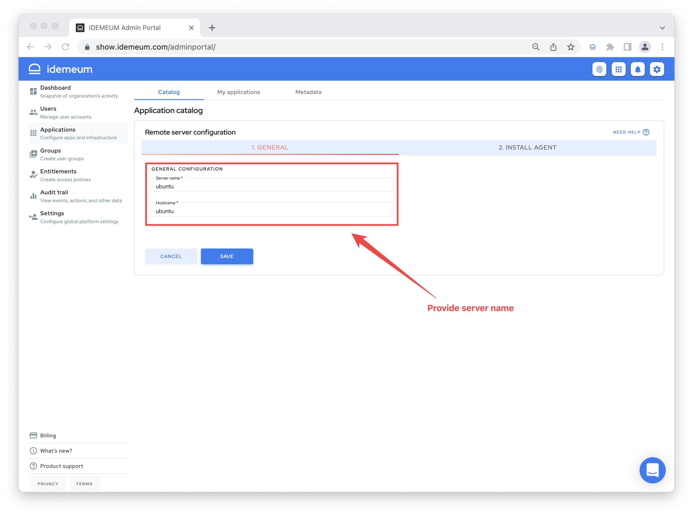

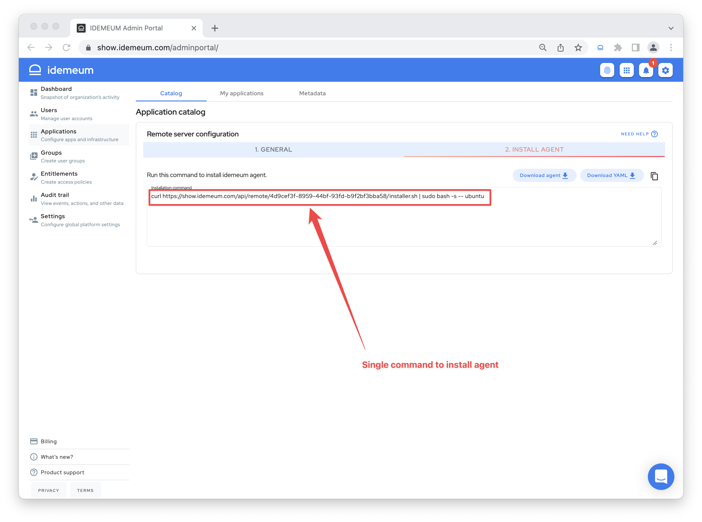

* Now you can launch your remote web in the browser, as well as access your servers with SSH terminal in the web browser as well

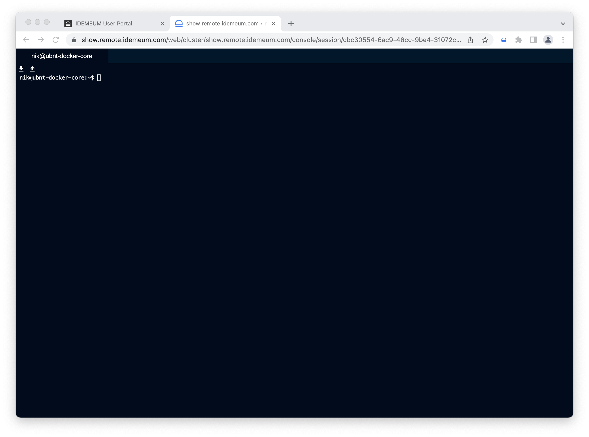

::: tip More about Secure Remote Access

You can learn more about user idemeum [Secure Remote Access](./remote-access/secure-remote-access-overview.html). 

:::

## Step 6: Give employees access to what they need
You can use `Entitlements` section to control what your employees have access to. 

* Navigate to `Entitlements`
* Click `Add rule`

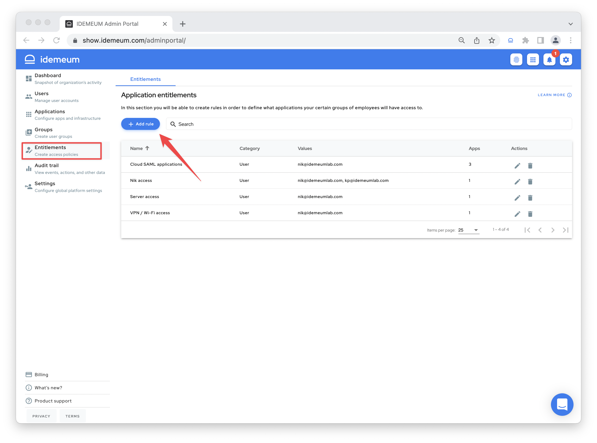

* Now you can choose users and applications that they can access.

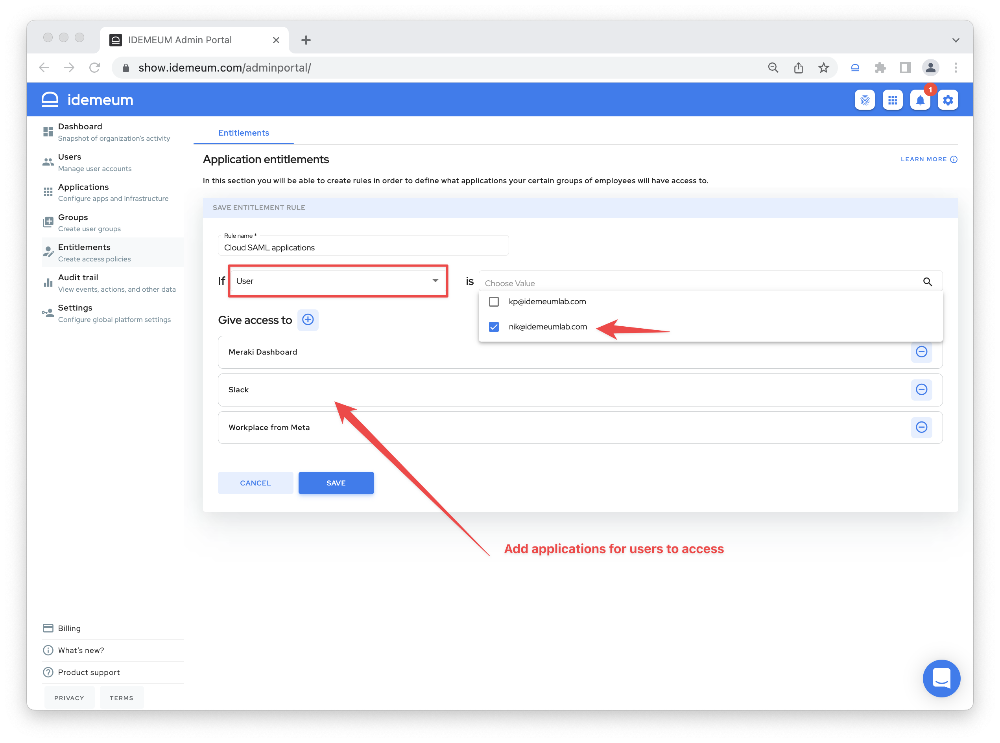

::: tip More about entitlements

You can learn more about user idemeum [entitlements](./application-entitlements.html). 

:::

## Step 7: Let us know if you have any questions

If you have any questions you can let us know:

* Drop us a note ar [support@idemeum.com](mailto:support@idemeum.come)
* Your idemeum portal has built-in chat at the bottom right of the screen

