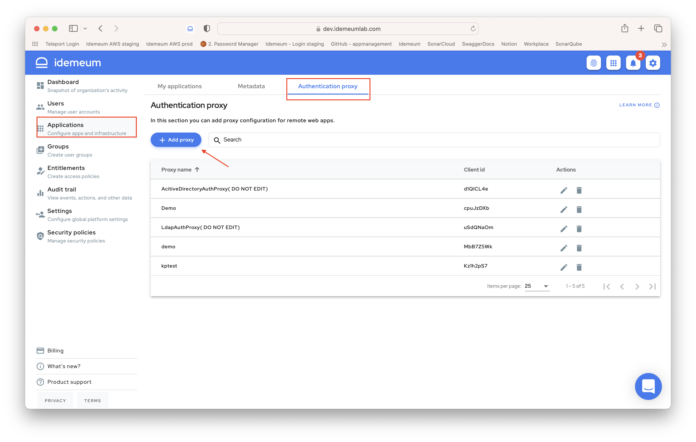
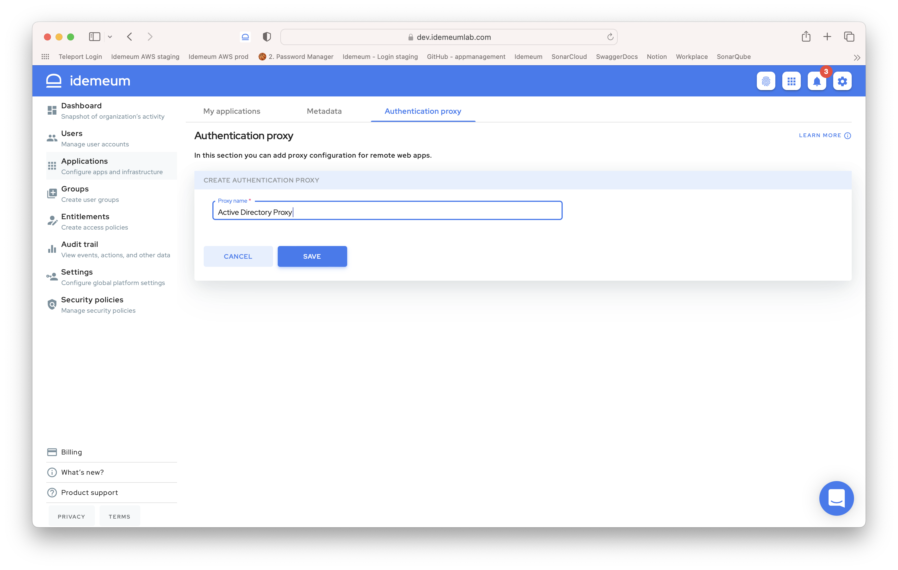
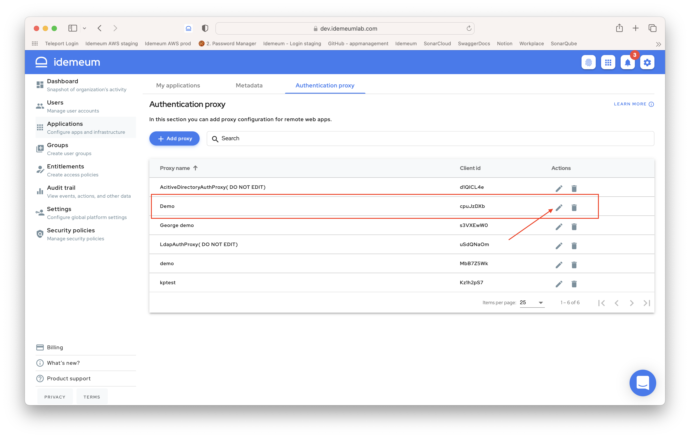
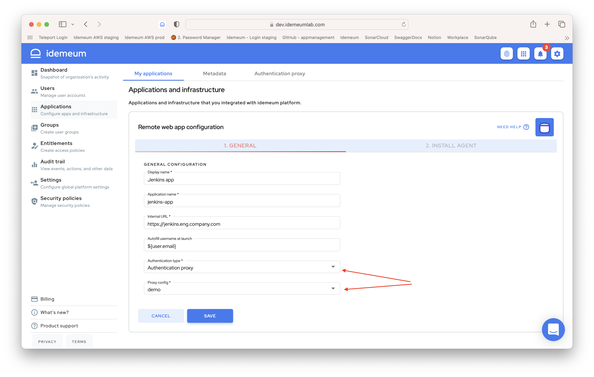
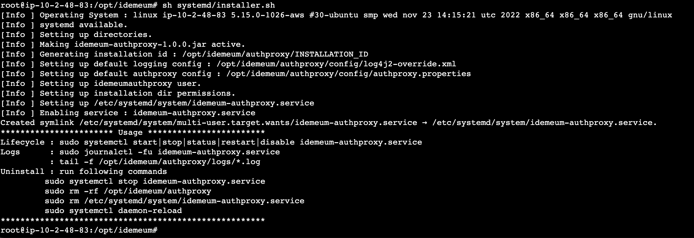
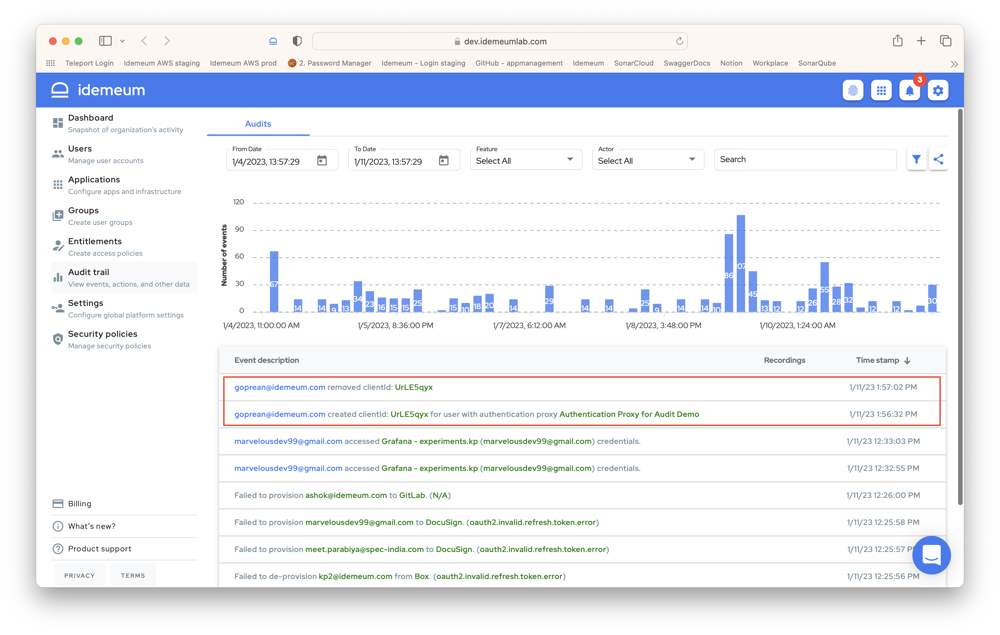
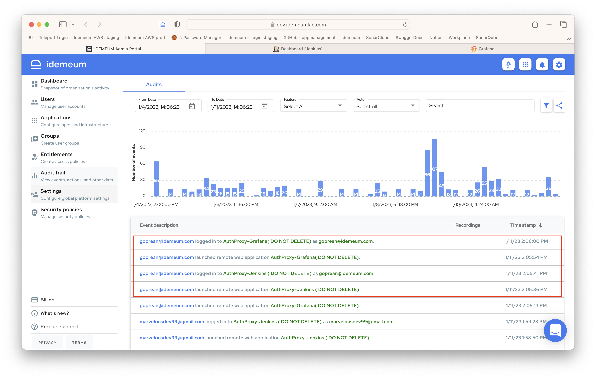
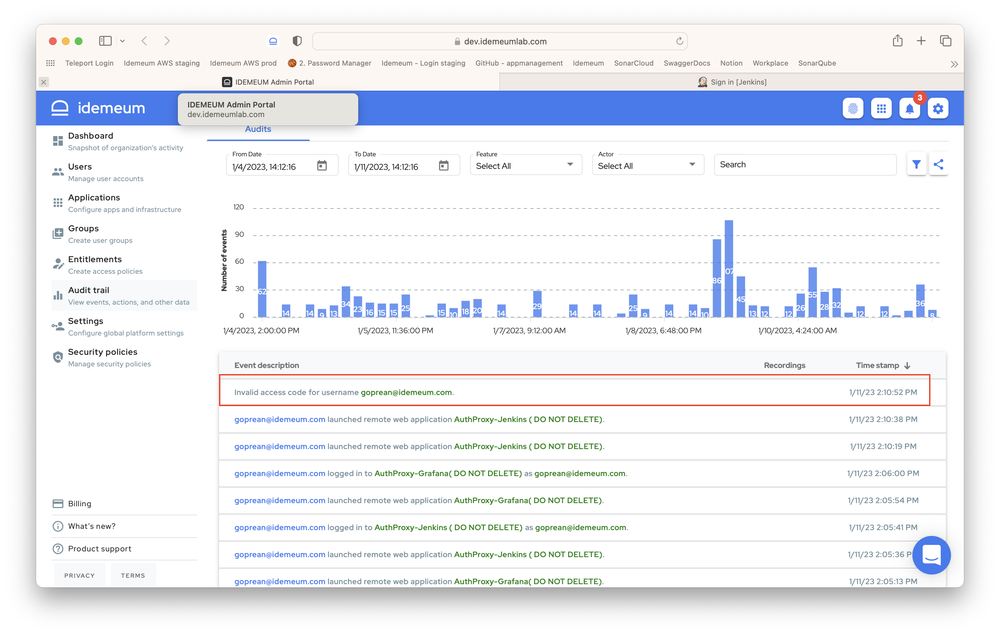

# Authentication Proxy
[[toc]]

## Overview


::: tip What is Authentication Proxy?

Enterprise web applications most of the time stores users and their passwords in some kind of a User Directory service: Microsoft Active Directory, LDAP Server, etc.
idemeum Authentication Proxy solves the password less authentication to this type of web applications. idemeum does have a solution if the enterprise still want to use username/passwords for authentication (see Remote Web Application section), but the users still have to rotate their passwords, then they have to update their password vaults for the application to use the new passwords.

Authentication Proxy sits between your Application and User Directory service and uses a one time access code that has been issue to the user for that application to authenticate users to the application. It will not use the password from the User Directory service so not password rotation or password vault updates required.

:::

Diagram

Authentication Proxy can be used with Remote Web Applications. In this case the idemeum Remote Agent also has to be installed. See (here) how to configure Remote Web Applications with Authentication Proxy.


Authentication Proxy can be used with a new type of application: On Premises. See (here) how to configure On Premises Applications with Auhtentication Proxy.


## How it works

In order to use Authentication Proxy, you need to install the Authentication Proxy Server somewhere on your on premises network.

1. End user logs into the idemeum portal.
2. End user launches an application that was configured with Authentication Proxy.
3. Upon launch, the idemeum cloud creates a one time access token that is only valid for this user for this application for a short duration of time.
4. Our browser extension autofills the username and as the password value, it will use this one time access token.
5. The end user clicks Log In on the web application.
6. The Application was configured to use the Authentication Proxy Server so it will forward the username/password (one time access token) to the Authentication Proxy.
7. The Authentication Proxy checks if the user is a valid user in the User Directory services.
8. If the user is a valid directory user, the the Authentication Proxy will send the one time access code to idemeum Cloud for validation.
9. If the one time access code was issued for this user for this application, then it will consider authentication successful.

By using the Authentication Proxy the user does not have to rotate their passwords.

## Create Authentication Proxy

* Log into idemeum admin portal and navigate to `Applications`
* Select `Authentication Proxy tab`
* Click on `Add Proxy`




* On the `Create Authentication Proxy` tab you will have to provide the following information:
	* **Proxy Name** - This is a friendly name so you can identify this proxy when associating it with Remote Web Applications or On Premises Applications



* Click `SAVE` to save the authentication proxy.

::: warning OAuth2 Credentials

After you create the Authentication Proxy, idemeum will create Oauth2 client id and client secret for this proxy. You need to save in some place safe the client id and client secret as you will need this information when you install the Authentication Proxy Server.

:::


## Regenerate the OAuth2 credentials for an Authentication Proxy
In case you have misplaced or forgot the OAuth2 credentials for your authentication proxy we have a way to generate new pair of cliend id and client secret for you.

::: warning Previous credentials will stop working

When you regenrete the Oauth2 client credentials for an authentication proxy, we will remove the previously created client id and client secret combination. This means that your Authentication Proxy Servers that are using those credentials will stop working at some point.
:::

* Log into idemeum admin portal and navigate to `Applications`
* Select `Authentication Proxy tab`
* Select the Authentication Proxy for which you want to regenerate the credentials and click Edit from the Actions column



* Click on 'Regenerate Credentials'


* Accept the Warning message explaining that the previous credentials will stop working and then copy the newly created credentials.

## Associate Authentication Proxy with the applications

We have 2 types of applications that can be used with Authentication Proxy: Remote Web Applications and On Premises Application.

We will show how to associate the Authentication Proxy with Remote Web Applications and the process is similar for the On Premises Applications.

* Log into idemeum admin portal and navigate to `Applications`
* Select the Remote Web Application that you want to associate an Authentication Proxy.
* In order to use Authentication Proxy you first need to change the Authentication Form to: Authentication proxy
* We also need a username expression for how to resolve the username. In the example below we are resoling the username to the user's email but any of the users attributes can be used or a combination of them.
* Select which Authentication Proxy you want to associate with this Remote Web application.



* Click `Save` to preserve your changes.

## Install Authentication proxy

An idemeum Authentication Proxy server needs to be installed on your private network. Currently we are only supporting Linux as the operating system where the Authentication Proxy can run.

### Download the installer
* Edit any of the Authentication Proxy
* Select the Authentication Proxy Installer tab
* Click on the `Download Link`


* Copy this link on the Linux server where you want to run the Authentication Proxy Server

### Install the Authentication proxy

Prerequisites:
1. unzip application has to be installed
> Ubuntu & Debian: `sudo apt install unzip`  
> CentOS & Fedora: `sudo yum install unzip`

2. Java Runtime Environment installed (minimum version Java 11)     

In the steps bellow we are assuming that the downloaded installer zip file is in the folder: /opt/idemeum/authproxy and the filename is: idemeum-authproxy-1.0.0-installer.zip.

* Extract the zip file (you need to have the unzip application installed):
>  `unzip idemeum-authproxy-1.0.0-installer.zip`

You can find some information on how to run the installer in the README.md file.


* Run the installer script:
>  `sh systemd/installer.sh`  



After the installer has successfully run it will create a folder `/opt/idemeum/authproxy` where the Authentication Proxy will be installed.   

### Configure the Authentication proxy
Once you had finished installing the Authentication Proxy, you need to configure it to your specific needs: to connect to your User Directory service.

The configuration file that you need to modify is `authproxy.properties` and is located under `/opt/idemeum/authproxy/config`.

#### Authentication Proxy configuration options
| Configuration Name | Description |
|--------------------|-------------|
|ldap.server.port| Authproxy server port listening for LDAP requests|
|idemeum.client.id | Authproxy client identifier, which should be retrieved from the  AuthProxy configuration created on idemeum admin portal ([see Authentication Proxy creation](#create-authentication-proxy))|
|idemeum.client.secret| Authproxy client secret, which should be retrieved from the  AuthProxy configuration created on idemeum admin portal ([see Authentication Proxy creation](#create-authentication-proxy))|
|idemeum.tenant.url |	Authproxy tenant url against which the authproxy was registered. For example: https://demo.idemeum.in |


#### User Directory Service configuration
| Configuration Name | Description |
|--------------------|-------------|
| ldap.addresses |	The list of hostnames or IP addresses along with port of your domain controller or directory server separated by “,”. For example: idemeumldapserver1.com:636, idemeumldapserver2.com:636 |
| ldap.service.account.userdn |	The user distinguished name( DN)  of a domain account that has permission to bind to your directory and perform searches. We recommend creating a service account user that has read-only access. <br> For example: `CN=admin,OU=users,DC=idemeumldap,DC=com` |
| ldap.service.account.password	|	The password corresponding to ldap.service.account.userdn <br For example: welcome@1234 |
| ldap.search.dn	 | The LDAP distinguished name (DN) of an Active Directory/LDAP container or organizational unit (OU) containing all of the users you wish to permit to log in. <br> For example: `DC=idemeumldap,DC=com` |
| ldap.lookup.username.attribute | LDAP attribute found on a user entry which will contain the submitted username by application. <br> For example: ”mail” |
| ldap.user.search.filter |	Search filter used to lookup the user in the  LDAP directory server or Active Directory server. It should use standard LDAP filter syntax <br> For example: (mail=%s) |

#### Authentication Proxy advanced configuration
| Configuration Name | Description |
|--------------------|-------------|
|ldap.transport | This option can be used to enable SSL/TLS communication with your LDAP directory server or Active Directory server. The available options are: <br><br> `LDAP` - Do not use SSL or TLS. (Default) <br> `LDAPS` - Wrap the entire LDAP connection in SSL, it encrypts the traffic from application to auth proxy and auth proxy to LDAP server. <br> `STARTTLS` - Open an unencrypted connection, but immediately send a "StartTLS" request to the LDAP directory server or Active Directory server. <br><br> For LDAPS and STARTTLS refer the properties which needs to set. <br> `ldap.server.cert.file` <br> `ldap.server.key.file` <br> `ldap.ca.cert.file` |
|ldap.server.cert.file | Path to PEM-formatted SSL/TLS server certificate. <br> Both `ldap.server.cert.file` and `ldap.server.key.file` must be specified to listen for STARTTLS or LDAPS requests. |
|ldap.server.key.file | Path to PEM-formatted SSL/TLS private key. The key should not be encrypted or require a password. <br> Both `ldap.server.key.file` and `ldap.server.cert.file` must be specified to listen for STARTTLS or LDAPS requests. |

#### User Directory Service advanced configuration
| Configuration Name | Description |
|--------------------|-------------|
| ldap.ca.cert.file | Path to a file containing the CA certificate(s) to be used to validate SSL/TLS connections to your LDAP directory server or Active Directory server. <br> If you enable SSL/TLS connections to your Active Directory or LDAP server, you should specify a value for this option. Certificates should be PEM-formatted. <br><br> If you have intermediate CAs in your certificate issuer chain, export all the certs (such as the root CA and the intermediate CA) in the certification path as PEM files and then combine them into one file using a text editor. |
| ldap.skip.hostname.verification | When establishing an SSL/TLS connection to the directory server, the authproxy will ensure that the common name in the server-provided certificate matches the value specified in the host option (Default: "false"). <br> If your directory server uses a certificate with mismatched common name, or you specified the host as an IP address, set this option to "true". However, this will somewhat reduce the security guarantees otherwise provided by the use of TLS/SSL. |
| ldap.connection.pool.min.size |	Downstream connection pool minimum size, which is used to establish connection to LDAP servers.Default value: 3 |
| ldap.connection.pool.max.size |	Downstream connection pool maximum size, which is used to establish connection to LDAP servers. It should be ≥ ldap.connection.pool.min.size and ≤ 50 |
| ldap.server.auth.allow.dualmode | Enable authproxy server authentication dual mode, which will  the user credentials for authentication against the LDAP servers. <br> Allowed values : true|false |
| ldap.lookup.user.active.attribute.name | LDAP directory user active attribute name which will be used to identify the user active account. <br>``Not required for Active Directory`` |
| ldap.lookup.user.active.attribute.value | LDAP directory user active attribute value which will be used to identify the user active account. <br>``Not required for Active Directory`` |

#### Start Authentication Proxy Server
Once you have configured your authentication proxy to suit your needs, you can start the Authentication Proxy by using the following command:
> `sudo systemctl start idemeum-authproxy.service`

#### Stop Authentication Proxy Server
You can stop the Authentication Server using the following command
> `sudo systemctl stop idemeum-authproxy.service`

#### Other operations on you Authentication Server
| Operation                    | Commands                                          |
|------------------------------|---------------------------------------------------|
| Status                       | `sudo systemctl status idemeum-authproxy.service` |
| Logs (standard output/error) | `sudo journalctl -fu idemeum-authproxy.service`   |
| Logs (files)                 | `tail -f /opt/idemeum/authproxy/logs/*.log`       |

### Uninstall Authentication Proxy
If you want to uninstall the Authentication Proxy from your Linux Server you can run the following commands:
```
sudo systemctl stop idemeum-authproxy.service
sudo rm /etc/systemd/system/idemeum-authproxy.service
sudo systemctl daemon-reload
```

Optionally you can cleanup all files : `sudo rm -rf /opt/idemeum/authproxy`

## Change your target Web Application to point to the Authentication Proxy instead of the User Directory service.
After installing, configuring and starting the Authentication Proxy, you can configure your target application to authenticate to the Authentication Proxy instead of your User Directtory Service (Microsoft Active Directory, LDAP Server, etc). This will be specific for each web application but at most there should be just an URL change to point to Authentication Proxy.

## Audit
### Creating and Deleting the credentials

For Authentication Proxy we are only auditing the creation and deletion of the client credentials.
When an Authentication Proxy is added, then new credentials are created.
When the Authentication Proxy is deleted, the client credentials associated to that Authentication Proxy is also removed.
When [regenerating the credentials](#regenerate-the-oauth2-credentials-for-an-authentication-proxy)) we delete the previous credentials and associate new credentials to the Authentication Proxy.



### Validating the one time access code (OTA)

When launching a Remote Web Application or On Premises application with Authentication Proxy, we are auditing the successful verification of the OTA.



In case the OTA is not valid we are also auditing that event

