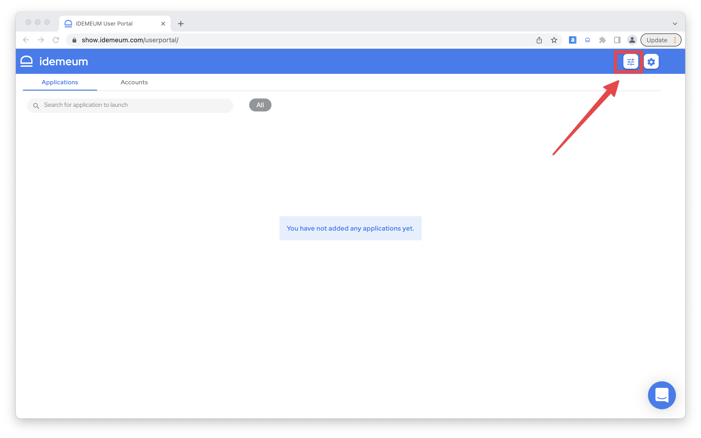
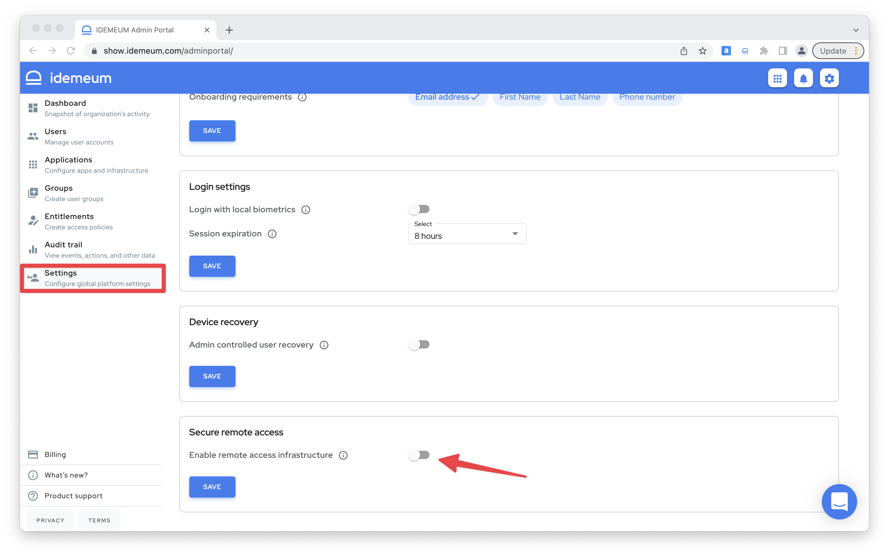
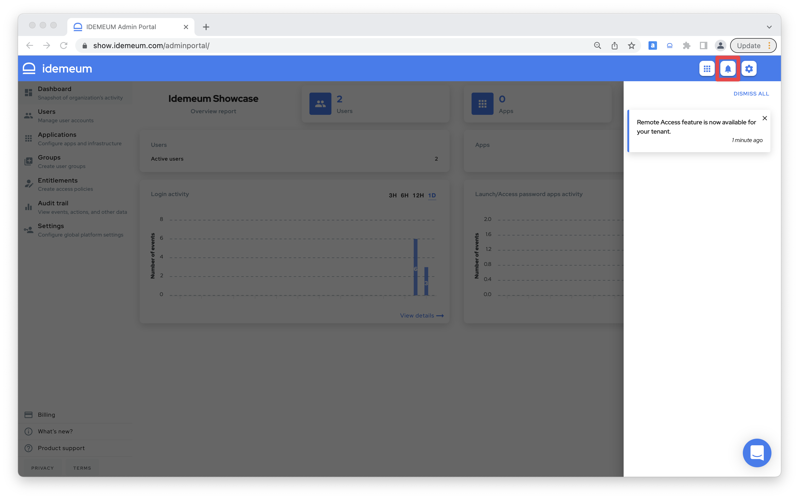
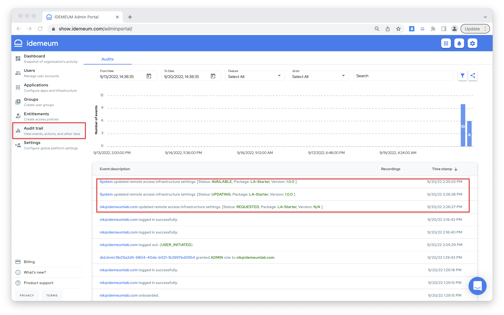

# Enable remote access infrastructure

## Overview

::: warning Enable Remote Access

Remote Access infrastructure is not enabled by default when you sign up for idemeum tenant. You will need to enable remote access in admin portal, so that we can automatically provision cloud proxy infrastructure for your tenant. 

:::

### How to enable remote access

* Navigate to idemeum admin portal by clicking on admin portal icon or directly accessing `tenant-name.idemeum.com/adminportal`

* Choose `Settings` and then toggle `Enable remote access infrastructure` in the `Secure remote access` section

* Click `Save` to trigger automated infrastructure provisioning

::: warning Provisioning time

Typically it will take up to 10 minutes to provision remote access infrastructure for your tenant.

:::

* Once provisioning is complete, we will notify you in the notifications tray in the admin portal

* You can also see audit logs for infrastructure provisioning process

* We will also send an email to idemeum tenant admin when provisioning is complete

::: tip Infrastructure state

We will also be reflecting current remote infrastructure state for your tenant in the settings area. In case infrastructure gets unstable or there are any issues, tenant admin will be notified.

:::