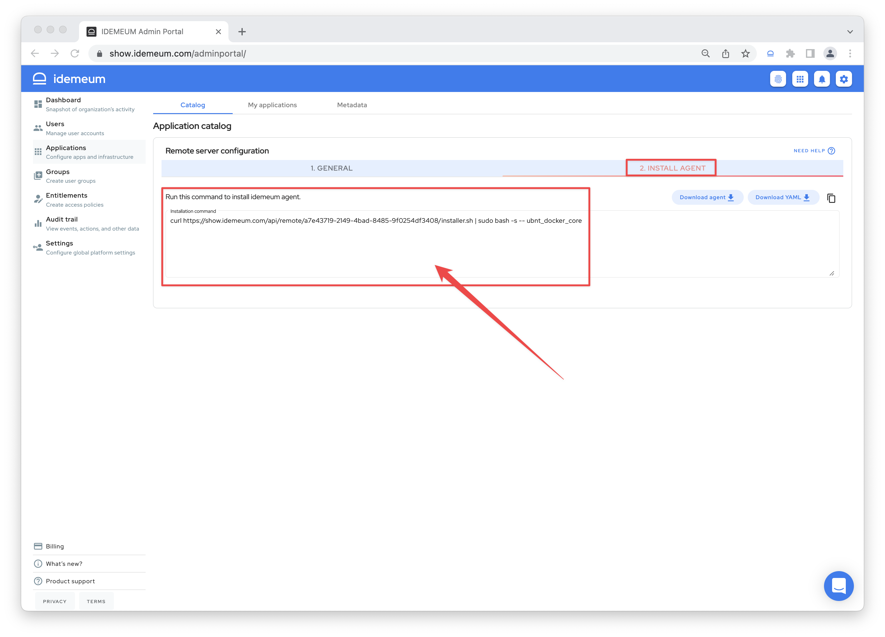
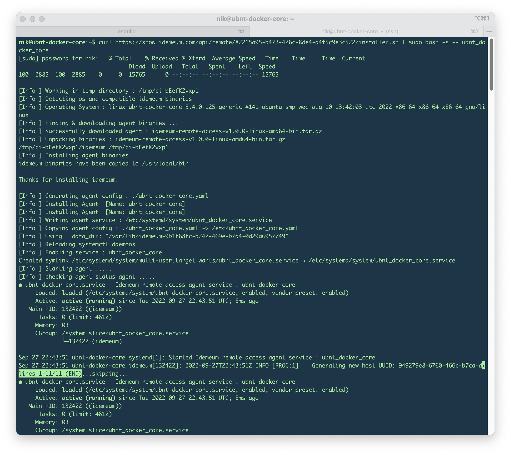
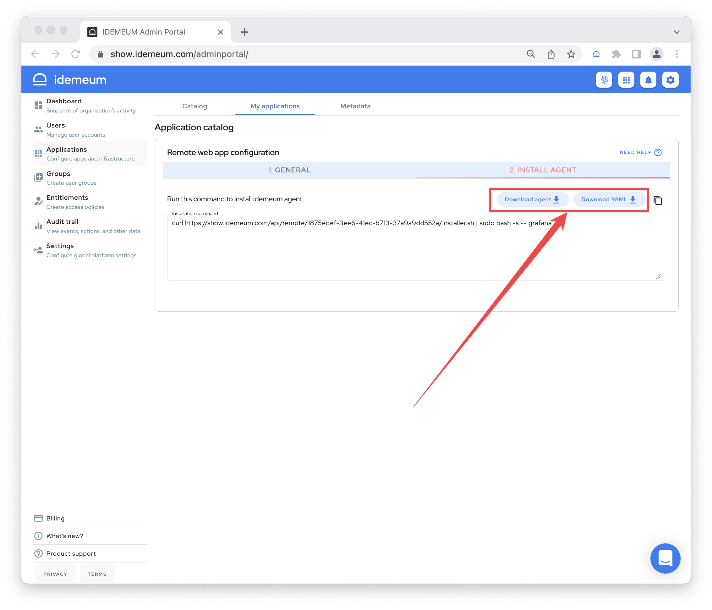

# Install idemeum agent

[[toc]]

## Overview
[idemeum agent](../remote-access/secure-remote-access-overview.html#agent) creates an outbound tunnel from your private network back to idemeum Proxy Service, so that your employees can connect to internal resources from anywhere without VPN. 

## Supported installation options

|    OS                       | Architectures                  |
| :----------------------     |:-------------------------------|
| Amazon Linux 2              | `amd64`          |
| CentOS 7                    | `amd64`           |
| CentOS 8                    | `amd64`           |
| CentOS Stream 9                    | `amd64`           |
| Fedora 36                    | `amd64`           |
| Red Hat Enterprise Linux 9                   | `amd64`           |
| Ubuntu 20.04                | `amd64`           |
| Ubuntu 22.04                   | `amd64`           |
| openSUSE Leap 15.4                  | `amd64`           |

## Where to install idemeum agent
The machine where the idemeum agent is installed needs to have Internet access to communicate with idemeum cloud.

|    Application                       | Location                  |
| :----------------------     |:-------------------------------|
| Remote web application              | Install on any machine in your network as long as it can reach web application over HTTTP protocol           |
| SSH server              | Install on the same server that you want to access over SSH       |


## Install idemeum agent
### Automated script installation
* When you configured and saved remote web application or remote server, the `Install agent` tab becomes active so that you can copy the installation command.



* Run this command on your server and the agent will be automatically installed, configured, and registered with idemeum. 




### Manual tar install

* When you configured and saved remote web application or remote server, the `Install agent` tab becomes active so that you can download both agent and configuration file.



* You can choose which version of the agent to download depending on the operating system and processor architecture of the node where this agent will be installed. You can either click the link from the `Download link` column or copy the link by doing a right click and selecting `Copy Link Address` option.


::: warning About configuration file

Configuration file is application and server specific and can only be used with application that you created it for in idemeum. Each configuration file has necessary parameters for an agent to access your remote resource and correctly register with your idemeum tenant.

:::

* To install tarball on Linux we will execute the following commands:

``` bash
# Pull agent from idemeum using wget
# You can use scp if you downloaded file directly
wget https://asset.idemeum.com/remote-access-releases/idemeum-remote-access-v1.0.0-linux-amd64-bin.tar.gz
# Extract the contents of tarball
tar -xvf idemeum-remote-access-v1.0.0-linux-amd64-bin.tar.gz
# Navigate to idemeum directory
cd idemeum
# Copy contents of YAML file to clipboard and paste to a new yaml file on target machine.
# You can open editor using editor like vim 
vi myagent.yaml
# Install agent using following command
sudo bash agent-setup myagent myagent.yaml
```

* Output will look like this..

``` bash
root@mylinuxmachine:~/idemeum# sudo bash agent-setup myagent myagent.yaml
agent-setup: line 1: !/bin/bash: No such file or directory
[Usage] bash agent-setup <agent-name> <path-to-yaml-config>


*****************  Installing Agent *******************
Agent name : myagent


[sudo] Writing agent service : /etc/systemd/system/myagent.service
[sudo] Copying agent config : saanesh.yaml -> /etc/myagent.yaml
[info] Using   data_dir: "/var/lib/idemeum-c449c0ed-4652-4388-bd1d-a912d9237a10"

[sudo] Reloading systemctl daemons.

[sudo] Enabling service : myagent
Created symlink /etc/systemd/system/multi-user.target.wants/myagent.service → /etc/systemd/system/myagent.service.

[sudo] Starting agent .....

[sudo] checking agent status agent .....
● myagent.service - Idemeum remote access agent service : myagent
     Loaded: loaded (/etc/systemd/system/myagent.service; enabled; vendor preset: enabled)
     Active: active (running) since Sat 2022-09-24 02:59:15 UTC; 39ms ago
   Main PID: 51619 (idemeum)
      Tasks: 6 (limit: 1146)
     Memory: 5.7M
        CPU: 16ms
     CGroup: /system.slice/myagent.service
             └─51619 /usr/local/bin/idemeum start --pid-file=/run/myagent.pid --config=/etc/myagent.yaml

Sep 24 02:59:15 ip-10-2-48-180 systemd[1]: Started Idemeum remote access agent service : myagent.


***********************  Agent commands ***************
sudo systemctl start|stop|status|restart myagent
*******************************************************

***********************  Agent logs *******************
sudo journalctl -fu myagent
*******************************************************
root@mylinuxmachine:~/idemeum#
```

* You now have idemeum agent installed and configured.