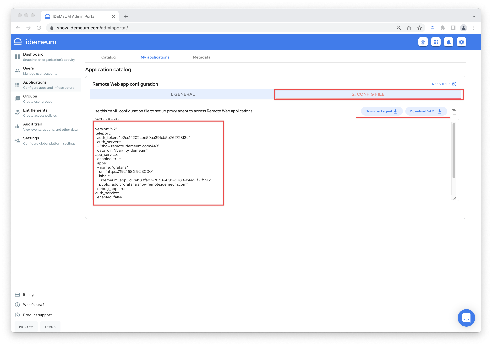
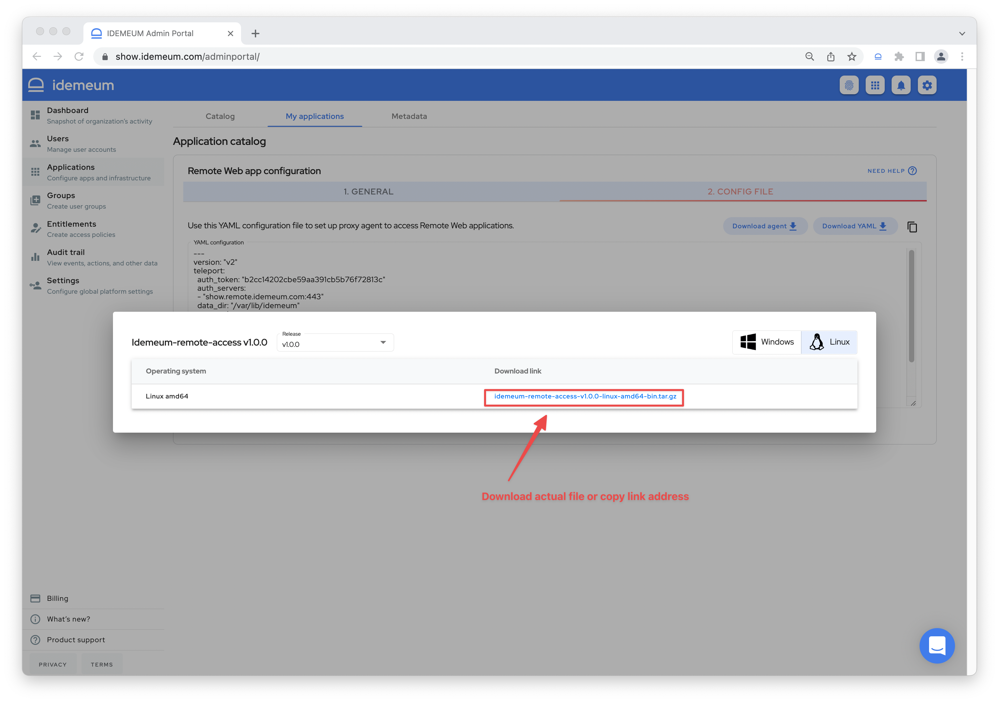
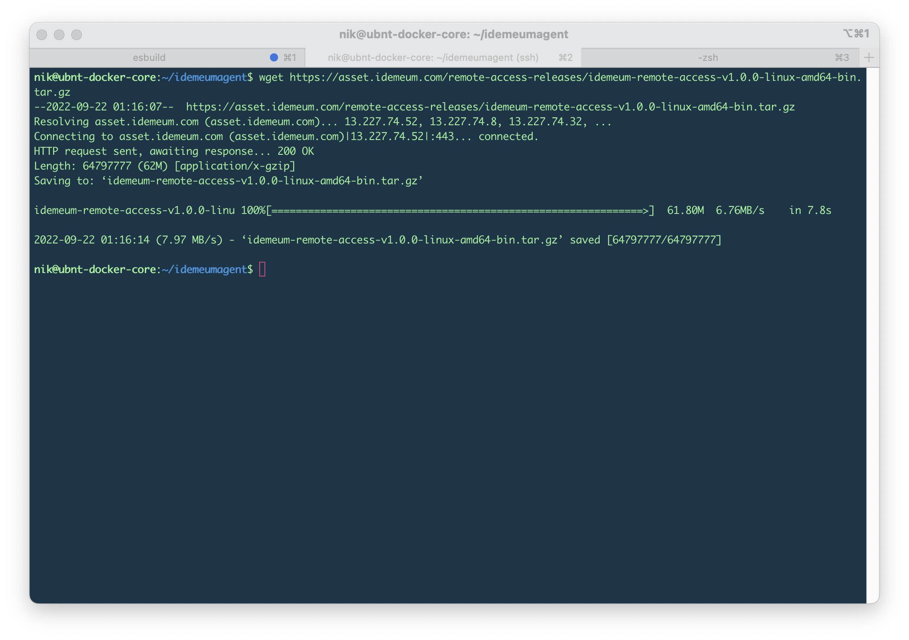
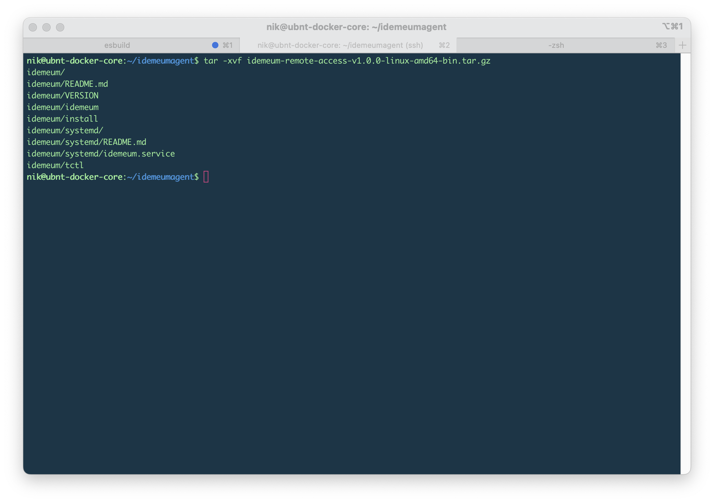
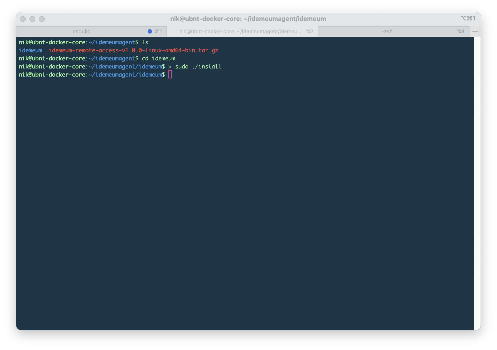

# Install idemeum agent

[[toc]]

## Overview
idemeum agent creates an outbound tunnel from your private network back to idemeum Proxy Service, so that your employees can connect to internal resources from anywhere without VPN. 

We talked about idemeum agent in the [overview](../remote-access/secure-remote-access-overview.html#agent) section.

## Supported installation options

|     Method              | Platform |
| :----------------- |:-------------|
| Linux tar.gz install    | Linux           |


## Where to install idemeum agent

:::tip Where to install agent

* **For Remote Web Application** - install on any machine in your network as long as it can reach web application over HTTTP protocol. 
* **For SSH server** - install on the same server that you want to access over SSH.

The machine where the idemeum agent is installed needs to have Internet access to communicate with idemeum cloud.

:::

## 1. Download agent and configuration file

* When you configured and save remote web application or remote server, the `Config File` tab becomes active so that you can download both agent and configuration file.

::: warning About configuration file

Configuration file is application and server specific and can only be used with application that you created it for in idemeum. Each configuration file has necessary parameters for an agent to access your remote resource and correctly register with your idemeum tenant.

:::



* On the top right corner of the tab there is an option to `Download agent`. When you click this button another dialog box will be open with available versions and flavors of the agent to download.



* You can choose which version of the agent to download depending on the operating system and processor architecture of the node where this agent will be installed. You can either click the link from the `Download link` column or copy the link by doing a right click and selecting `Copy Link Address` option.

* To download YAML configuration file you simply click `Download YAML` button.

## 2. Install agent

### Install agent with tar.gz on Linux
* To install tarball on Linux we will execute the following commands:

``` bash
# Make a directory where agent will be installed
# For example /home/idemeumagent

mkdir idemeumagent
cd idemeumagent

# Pull agent from idemeum using wget
# You can use scp if you downloaded file directly

wget https://asset.idemeum.com/remote-access-releases/idemeum-remote-access-v1.0.0-linux-amd64-bin.tar.gz

# Extract the contents of tarball

tar -xvf idemeum-remote-access-v1.0.0-linux-amd64-bin.tar.gz

# Navigate to idemeum directory

cd idemeum

# Install the files

sudo ./install

```




* Extract the content of this file using the following command `tar -xvf idemeum-remote-access-v1.0.0-linux-amd64-bin.tar.gz`



* After unpacking the compressed file a new `idemeum` directory will be created in the ``/home/idemeumagent`` folder. You can change the directory to this folder so your current working folder is now: ``/home/idemeumagent/idemeum``. You can find more information in the `README.md` file about what commands can be ran.
* To install all the files needed for the agent to run you need to run the following command `> sudo ./install`



* Copy downloaded configuration file to the same folder where you downloaded the agent. You can use `scp` command. For example from Mac to target server `scp /Users/npoturnak/Downloads/Grafana.yaml nik@192.168.2.92:~/idemeumagent/idemeum`


* You now have idemeum agent installed and configuration file ready. You can now start the agent and allow it connect to idemeum Proxy Service.
* Follow Secure Remote Access guides (for [Remote Web Application](../remote-access/remote-web-app.html) and Remote Servers) to complete configuration.
