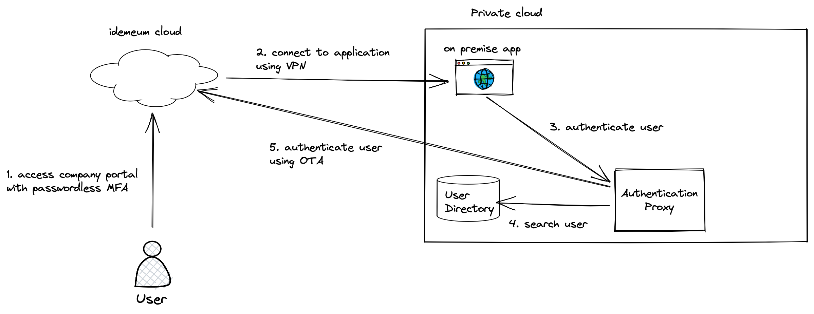
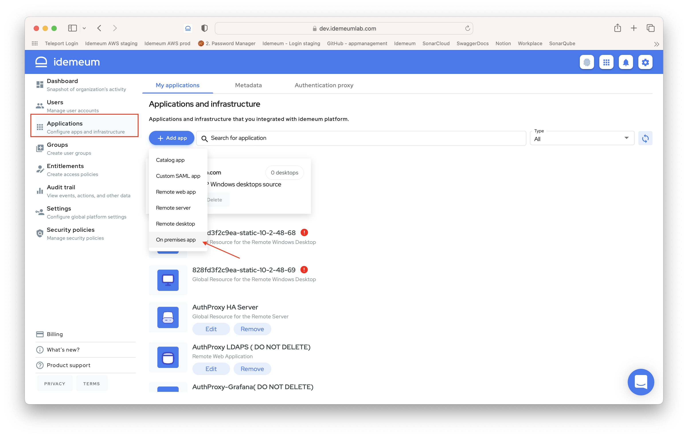
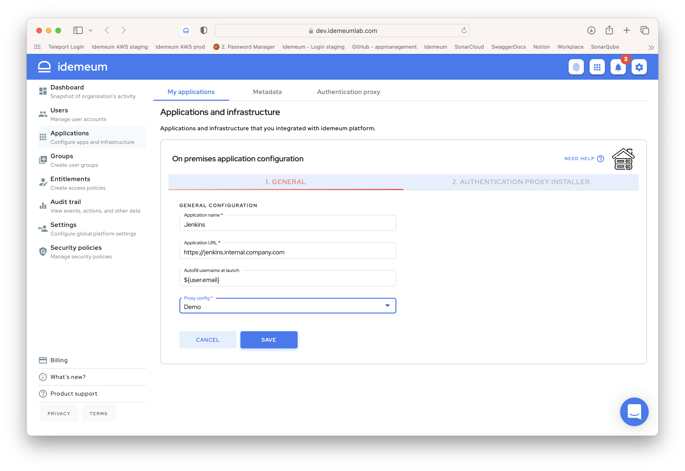
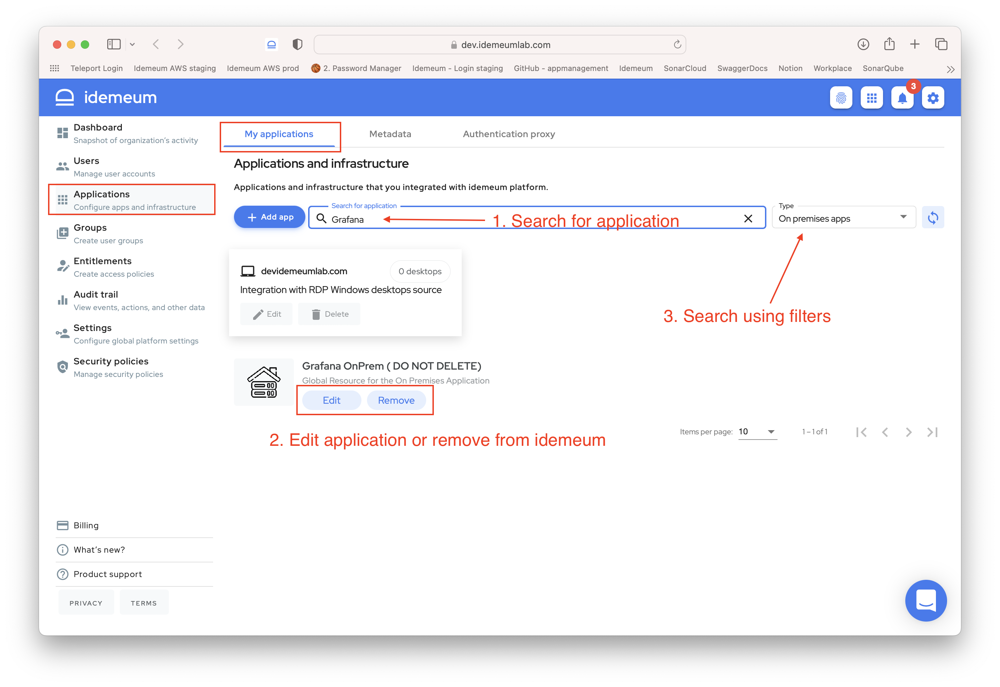
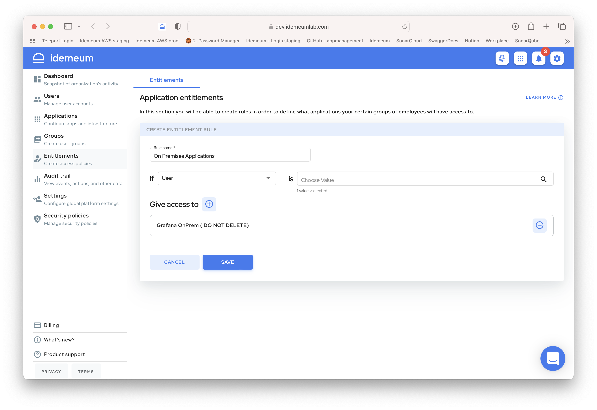
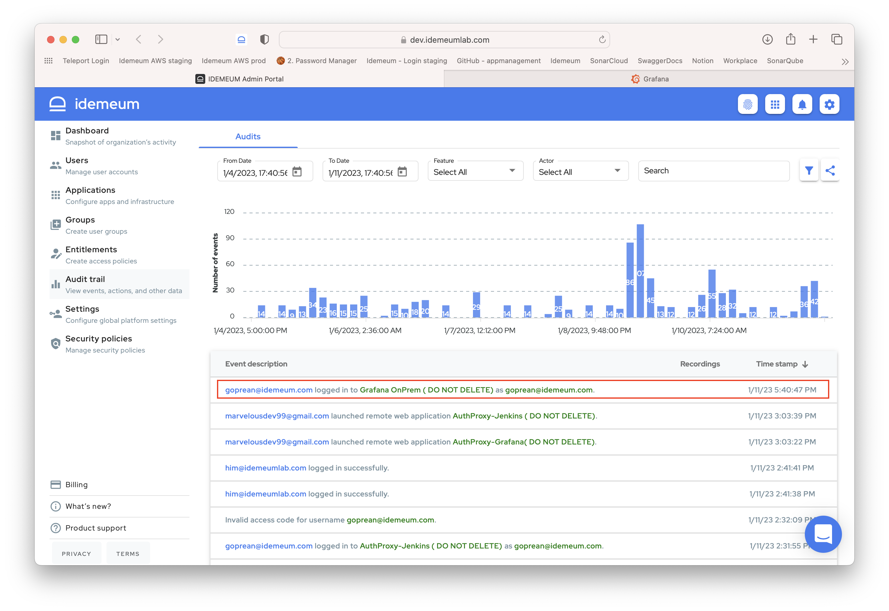

# On Premises Application
[[toc]]

## Overview

::: tip What is On Premises application?

We define the On Premises application as a web application that can be accessed only while on the company's private network (either physically on companies premises or connected remotely using a Virtual Private Network (VPN)).

These On Premises applications use username/password to authenticate the users and they usually store the user credentials in some sort of User Directory Service: Microsoft Active Directory, LDAP Server, or other user directories that support LDAP protocol.

:::

### How does users access the On Premises application?
Users will have to first authenticate using passwordless MFA to the idemeum cloud. From their end user portal they can find and launch the On Premises applications that have been entitled to them.

## Create On Premises Application

::: warning Create an Auhtentication Proxy

You need to have at least one Authentication Proxy created so you can associated it with the On Premises app. See here (add the link to the Auhtentication Proxy create once we know where it will be placed) how to create an Authentication Proxy.

:::

* Log into idemeum admin portal and navigate to `Applications`
* Click `Add app` button and choose `On Premises app`

* On the `General` tab you will have to provide the following information:
	* **Application Name** - This is a friendly name for your application.
	* **Application URL** - This is the URL for the application. It can contain the http or https protocol, hostname, port number and path.
	* **Autofill username at launch** - This is an expression of how to resolve the username to be autofilled in the username field of the application. For example if ${user.email} expression is used, then idemeum will resolve the user's email address and use that one as the username for the application and will autofill it after launch on the login screen.
	* **Proxy Config** - This is a authentication proxy configuration that will be associated with this on premises application

* Click `SAVE` to save the on premises application.

## Manage On Premises Application
* Your on premises application is accessible in the admin portal `My applications` section. You can directly search for it or use filters on the right and choose `On Premises apps`.
* You can `Edit` server configuration or `Remove` web application from idemeum.

## Give access to On Premises Application

* In order for users to access on premises application you need to create an [entitlement rule](../application-entitlements.html) for the users or groups of users that should have access to it.
* Navigate to `Entitlements` and click `Add rule`

* In the example below I am directly entitling user `nik@idemeumlab.com` to access the Grafana application. You can also use groups to perform entitlement.

::: tip More about groups and entitlements

You can learn more about how [groups](../group-management.html) and [entitlements](../application-entitlements.html) work in idemeum.

:::

## Access On Premises Application

* You can launch on premises applications in the same way you would access any other application - from **browser user portal**, from **extension**, and **mobile application**.

## Authenticating users to On Premises Application

Having an Authentication Proxy server installed and configure your web application to use this Authentication Proxy allows users to access on premises web application with a simple click. However, when accessing these applications you need to pass user information to web application as well, so user can log in into her account.

Today we support the following authentication methods:

|     Method        | Description |
| :----------------- |:-----------|
| Credentials autofill    | Automatically fill user credentials in the login form for web application. We will resolve the username and generate a one time access code that will be used as the password.           |

## Audit
* Access admin portal and navigate to `Audit trail` section
* You will be able to see detailed events for who and when accessed the on premises applications

